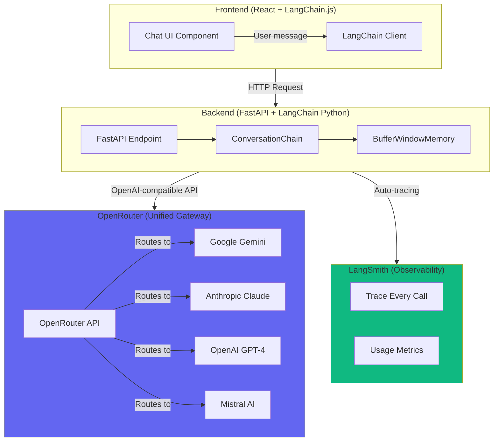

# How LLM APIs Work in This POC

## Architecture Overview



---

## How It Works: Step-by-Step

### 1. **User Sends Message**
- User types in React chat UI
- Frontend sends POST to `/chat/stream` endpoint
- Payload includes: `message`, `session_id`, `model_id`

### 2. **Backend Receives Request**
```python
# FastAPI endpoint receives request
@app.post("/chat/stream")
async def chat_stream(request: ChatRequest):
    # Creates conversation chain with memory
    chain = create_director_chain(session_id, model_id)
    # Streams tokens back to frontend
```

### 3. **LangChain ConversationChain**
- **Memory Management**: Retrieves conversation history from `BufferWindowMemory`
- **Prompt Construction**: Builds full prompt with:
  - System prompt (Director persona)
  - Conversation history (last 10 messages)
  - Current user message
- **Model Invocation**: Calls LangChain's `ChatOpenAI` wrapper

### 4. **LangChain → OpenRouter**
```python
ChatOpenAI(
    model="google/gemini-flash-1.5",  # Model identifier
    openai_api_key="sk-or-v1-...",    # OpenRouter key
    openai_api_base="https://openrouter.ai/api/v1",  # OpenRouter endpoint
)
```

**Key Point**: LangChain uses **OpenAI-compatible API** format, but routes to OpenRouter instead of OpenAI.

### 5. **OpenRouter Gateway**
OpenRouter acts as a **unified proxy** that:
- Receives OpenAI-compatible requests
- Routes to the correct provider (Gemini, Claude, GPT-4, etc.)
- Handles authentication with provider
- Returns standardized response format
- Tracks usage and billing

**Why OpenRouter?**
- ✅ Single API key for all models
- ✅ Easy model switching (just change model ID)
- ✅ Automatic failover if one model is down
- ✅ Unified billing dashboard
- ✅ Rate limit handling

### 6. **LLM Provider (e.g., Google Gemini)**
- Receives the request from OpenRouter
- Processes prompt with the model
- Generates tokens
- Streams back to OpenRouter

### 7. **Streaming Response**
```python
# Async callback receives tokens
async for token in callback.aiter():
    yield token  # Send to frontend immediately
```

### 8. **Frontend Updates UI**
- Receives tokens via Server-Sent Events (SSE)
- Appends each token to message
- User sees text appear in real-time

### 9. **LangSmith Tracing** (Automatic)
- Every LLM call is traced
- Shows: prompt, response, latency, tokens used, cost
- View at: https://smith.langchain.com

---

## Model Routing

When you select a model in the UI, here's what happens:

| UI Selection | OpenRouter Model ID | Actual Provider |
|--------------|-------------------|-----------------|
| Gemini Flash | `google/gemini-flash-1.5` | Google Vertex AI |
| Gemini Pro | `google/gemini-pro-1.5` | Google Vertex AI |
| Claude Sonnet | `anthropic/claude-3-sonnet-20240229` | Anthropic API |
| Claude Opus | `anthropic/claude-3-opus-20240229` | Anthropic API |
| GPT-4 Turbo | `openai/gpt-4-turbo` | OpenAI API |
| GPT-4o | `openai/gpt-4o` | OpenAI API |

**No code changes needed** - just pass different `model_id`!

---

## API Key Flow

```
Your OpenRouter Key: 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
         ↓
Backend .env: OPENROUTER_API_KEY=sk-or-v1-...
         ↓
Python: settings.openrouter_api_key
         ↓
LangChain: ChatOpenAI(openai_api_key=settings.openrouter_api_key)
         ↓
OpenRouter: Validates key, routes request
         ↓
LLM Provider: Processes request (using OpenRouter's provider credentials)
```

**Note**: Your key authenticates with **OpenRouter**, not the LLM providers directly. OpenRouter handles provider authentication internally.

---

## Cost Structure

OpenRouter charges you **per token** based on:
- Model selected (Gemini Flash: $0.075/1M tokens, Claude Opus: $15/1M tokens)
- Tokens in + tokens out
- Usage tracked in OpenRouter dashboard

**LangChain + OpenRouter = Pay only for what you use**

---

## Memory Persistence

```
Session 1: User asks "What is a good video idea?"
           ↓
BufferWindowMemory stores: [(user, "What is..."), (assistant, "Here's...")]
           ↓
Session 1: User asks "Make it more dramatic"
           ↓
Chain includes history: [previous messages] + new message
           ↓
LLM gets full context = better responses
```

Memory is **in-memory** (clears on server restart). In production, use Redis or database.

---

## Benefits of This Architecture

1. **Flexibility**: Switch models without code changes
2. **Unified Interface**: Same API for all providers
3. **Observability**: LangSmith shows every call
4. **Cost Control**: OpenRouter dashboard tracks spending
5. **Reliability**: Automatic failover
6. **Developer Experience**: LangChain handles complexity

---

## Example Flow Diagram

```
User: "Help me brainstorm a video about Hanuman"
  ↓
Frontend: POST /chat/stream {"message": "...", "model_id": "google/gemini-flash-1.5"}
  ↓
Backend: create_director_chain(session_id, "google/gemini-flash-1.5")
  ↓
LangChain: Builds prompt with:
  - System: "You are a creative director..."
  - History: (empty - first message)
  - Human: "Help me brainstorm a video about Hanuman"
  ↓
OpenRouter: POST https://openrouter.ai/api/v1/chat/completions
  Headers: Authorization: Bearer sk-or-v1-...
  Body: {"model": "google/gemini-flash-1.5", "messages": [...]}
  ↓
Google Gemini: Processes request
  ↓
Gemini: Streams tokens: "Here", " are", " some", " creative", ...
  ↓
OpenRouter: Forwards tokens
  ↓
Backend: Yields tokens via SSE
  ↓
Frontend: Updates UI in real-time
  ↓
User sees: "Here are some creative video ideas about Hanuman..."
```

---

## Try It Now!

With your API key configured, you can:
1. Open http://localhost:5173
2. Select any model (Gemini Flash, Claude, GPT-4)
3. Type a message
4. See it route through: Frontend → Backend → LangChain → OpenRouter → LLM Provider
5. Check traces at https://smith.langchain.com (if LangSmith key is set)
