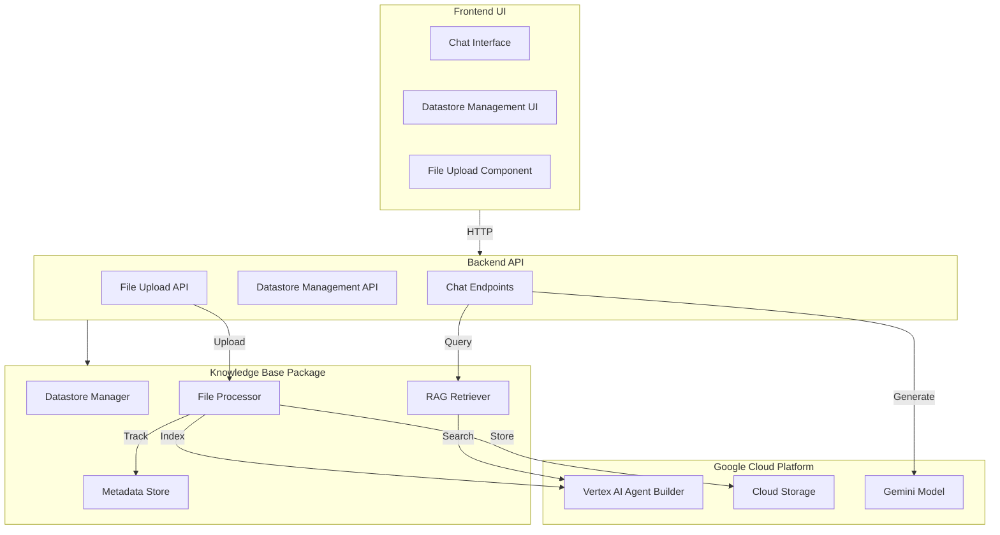

# Vertex AI RAG System Implementation Plan

> **Version**: 2.0 (Revised)  
> **Status**: Ready for Implementation  
> **Last Updated**: January 2026  
> **Prerequisites**: GCP Project with Vertex AI Agent Builder enabled

---

## Overview

Build a complete RAG (Retrieval-Augmented Generation) system using **Vertex AI Agent Builder** (Discovery Engine) to store and retrieve knowledge from uploaded files. The system integrates with the existing chat interface to provide context-aware responses.

### Goals

1. **File Upload** - Accept PDF, DOCX, TXT, MD, HTML files
2. **Knowledge Storage** - Index content in Vertex AI Agent Builder datastore
3. **RAG Retrieval** - Automatically retrieve relevant context for chat
4. **Management UI** - View, search, and manage uploaded files

### Key Decisions

| Decision | Choice | Rationale |
|----------|--------|-----------|
| Search API | Vertex AI Agent Builder (Discovery Engine) | Production-ready, enterprise features |
| File Storage | Google Cloud Storage | Native GCP integration |
| Metadata Storage | JSON file (MVP) → Firestore (Prod) | Simple start, easy migration |
| Chunking | Character-based with sentence boundaries | Balance between context and relevance |

---

## Architecture



---

## Package Structure

```
packages/knowledge_base/
├── README.md
├── requirements.txt
├── src/
│   ├── __init__.py
│   ├── datastore.py      # Vertex AI Agent Builder management
│   ├── processor.py      # File processing & chunking
│   ├── retriever.py      # RAG search & context retrieval
│   ├── metadata.py       # File metadata tracking (NEW)
│   └── models.py         # Data models (NEW)
└── tests/
    ├── __init__.py
    ├── test_datastore.py
    ├── test_processor.py
    ├── test_retriever.py
    └── conftest.py
```

---

## Phase 0: Foundation Fixes (BLOCKING)

> **Duration**: 3-4 days  
> **Priority**: Critical - Must complete before Phase 1

The existing skeleton code uses deprecated APIs. Fix these issues first.

### 0.1 Data Models (`packages/knowledge_base/src/models.py`)

```python
"""
Data models for the knowledge base system.

Team: AI/ML
"""

from dataclasses import dataclass, field
from datetime import datetime
from typing import Optional, List, Dict, Any
from enum import Enum


class FileStatus(Enum):
    """File processing status."""
    PENDING = "pending"
    UPLOADING = "uploading"
    PROCESSING = "processing"
    INDEXING = "indexing"
    INDEXED = "indexed"
    FAILED = "failed"


class FileType(Enum):
    """Supported file types."""
    PDF = "pdf"
    DOCX = "docx"
    TXT = "txt"
    MD = "md"
    HTML = "html"
    CSV = "csv"
    JSON = "json"


@dataclass
class FileMetadata:
    """Metadata for an uploaded file."""
    id: str
    filename: str
    file_type: FileType
    size_bytes: int
    
    # Processing info
    status: FileStatus = FileStatus.PENDING
    error_message: Optional[str] = None
    chunk_count: int = 0
    character_count: int = 0
    
    # Storage references
    gcs_uri: Optional[str] = None
    datastore_document_id: Optional[str] = None
    
    # Metadata
    description: Optional[str] = None
    tags: List[str] = field(default_factory=list)
    
    # Timestamps
    created_at: datetime = field(default_factory=datetime.utcnow)
    updated_at: datetime = field(default_factory=datetime.utcnow)
    indexed_at: Optional[datetime] = None
    
    def to_dict(self) -> Dict[str, Any]:
        """Convert to dictionary for JSON serialization."""
        return {
            "id": self.id,
            "filename": self.filename,
            "file_type": self.file_type.value,
            "size_bytes": self.size_bytes,
            "status": self.status.value,
            "error_message": self.error_message,
            "chunk_count": self.chunk_count,
            "character_count": self.character_count,
            "gcs_uri": self.gcs_uri,
            "datastore_document_id": self.datastore_document_id,
            "description": self.description,
            "tags": self.tags,
            "created_at": self.created_at.isoformat(),
            "updated_at": self.updated_at.isoformat(),
            "indexed_at": self.indexed_at.isoformat() if self.indexed_at else None,
        }
    
    @classmethod
    def from_dict(cls, data: Dict[str, Any]) -> "FileMetadata":
        """Create from dictionary."""
        return cls(
            id=data["id"],
            filename=data["filename"],
            file_type=FileType(data["file_type"]),
            size_bytes=data["size_bytes"],
            status=FileStatus(data.get("status", "pending")),
            error_message=data.get("error_message"),
            chunk_count=data.get("chunk_count", 0),
            character_count=data.get("character_count", 0),
            gcs_uri=data.get("gcs_uri"),
            datastore_document_id=data.get("datastore_document_id"),
            description=data.get("description"),
            tags=data.get("tags", []),
            created_at=datetime.fromisoformat(data["created_at"]) if data.get("created_at") else datetime.utcnow(),
            updated_at=datetime.fromisoformat(data["updated_at"]) if data.get("updated_at") else datetime.utcnow(),
            indexed_at=datetime.fromisoformat(data["indexed_at"]) if data.get("indexed_at") else None,
        )


@dataclass
class SearchResult:
    """A single search result from the datastore."""
    document_id: str
    content: str
    source: str
    relevance_score: float
    metadata: Dict[str, Any] = field(default_factory=dict)


@dataclass
class DatastoreInfo:
    """Information about a datastore."""
    datastore_id: str
    display_name: str
    project: str
    location: str
    document_count: int = 0
    status: str = "unknown"
    created_at: Optional[datetime] = None
```

### 0.2 Metadata Store (`packages/knowledge_base/src/metadata.py`)

```python
"""
File metadata storage and tracking.

MVP: JSON file storage
Production: Migrate to Firestore

Team: AI/ML
"""

import os
import json
import threading
from pathlib import Path
from typing import Optional, List, Dict, Any
from datetime import datetime

from .models import FileMetadata, FileStatus


class MetadataStore:
    """
    Thread-safe file metadata storage.
    
    MVP Implementation: JSON file
    Production: Replace with Firestore client
    
    Usage:
        store = MetadataStore()
        store.save(file_metadata)
        files = store.list_all(status=FileStatus.INDEXED)
    """
    
    def __init__(self, storage_path: Optional[str] = None):
        """
        Initialize metadata store.
        
        Args:
            storage_path: Path to JSON storage file.
                         Defaults to ~/.knowledge_base/metadata.json
        """
        if storage_path is None:
            storage_dir = Path.home() / ".knowledge_base"
            storage_dir.mkdir(exist_ok=True)
            storage_path = str(storage_dir / "metadata.json")
        
        self.storage_path = storage_path
        self._lock = threading.RLock()
        self._cache: Dict[str, FileMetadata] = {}
        self._load()
    
    def _load(self) -> None:
        """Load metadata from storage."""
        if os.path.exists(self.storage_path):
            try:
                with open(self.storage_path, "r", encoding="utf-8") as f:
                    data = json.load(f)
                    self._cache = {
                        k: FileMetadata.from_dict(v)
                        for k, v in data.items()
                    }
            except (json.JSONDecodeError, KeyError) as e:
                print(f"Warning: Failed to load metadata: {e}")
                self._cache = {}
    
    def _persist(self) -> None:
        """Persist metadata to storage."""
        data = {k: v.to_dict() for k, v in self._cache.items()}
        
        # Write atomically
        tmp_path = f"{self.storage_path}.tmp"
        with open(tmp_path, "w", encoding="utf-8") as f:
            json.dump(data, f, indent=2)
        os.replace(tmp_path, self.storage_path)
    
    def save(self, metadata: FileMetadata) -> None:
        """
        Save or update file metadata.
        
        Args:
            metadata: FileMetadata instance to save
        """
        with self._lock:
            metadata.updated_at = datetime.utcnow()
            self._cache[metadata.id] = metadata
            self._persist()
    
    def get(self, file_id: str) -> Optional[FileMetadata]:
        """
        Get metadata by file ID.
        
        Args:
            file_id: Unique file identifier
            
        Returns:
            FileMetadata if found, None otherwise
        """
        with self._lock:
            return self._cache.get(file_id)
    
    def list_all(
        self,
        status: Optional[FileStatus] = None,
        file_type: Optional[str] = None,
        limit: int = 100,
        offset: int = 0,
    ) -> List[FileMetadata]:
        """
        List files with optional filtering.
        
        Args:
            status: Filter by status
            file_type: Filter by file type
            limit: Maximum results
            offset: Skip first N results
            
        Returns:
            List of FileMetadata sorted by created_at (newest first)
        """
        with self._lock:
            items = list(self._cache.values())
        
        # Apply filters
        if status:
            items = [m for m in items if m.status == status]
        if file_type:
            items = [m for m in items if m.file_type.value == file_type]
        
        # Sort by creation date (newest first)
        items.sort(key=lambda x: x.created_at, reverse=True)
        
        # Apply pagination
        return items[offset:offset + limit]
    
    def delete(self, file_id: str) -> bool:
        """
        Delete file metadata.
        
        Args:
            file_id: File to delete
            
        Returns:
            True if deleted, False if not found
        """
        with self._lock:
            if file_id in self._cache:
                del self._cache[file_id]
                self._persist()
                return True
            return False
    
    def update_status(
        self,
        file_id: str,
        status: FileStatus,
        error_message: Optional[str] = None,
    ) -> bool:
        """
        Update file processing status.
        
        Args:
            file_id: File to update
            status: New status
            error_message: Error message if failed
            
        Returns:
            True if updated, False if not found
        """
        with self._lock:
            if file_id in self._cache:
                self._cache[file_id].status = status
                self._cache[file_id].error_message = error_message
                self._cache[file_id].updated_at = datetime.utcnow()
                
                if status == FileStatus.INDEXED:
                    self._cache[file_id].indexed_at = datetime.utcnow()
                
                self._persist()
                return True
            return False
    
    def get_stats(self) -> Dict[str, Any]:
        """Get statistics about stored files."""
        with self._lock:
            items = list(self._cache.values())
        
        by_status = {}
        by_type = {}
        total_size = 0
        total_chunks = 0
        
        for item in items:
            status = item.status.value
            by_status[status] = by_status.get(status, 0) + 1
            
            file_type = item.file_type.value
            by_type[file_type] = by_type.get(file_type, 0) + 1
            
            total_size += item.size_bytes
            total_chunks += item.chunk_count
        
        return {
            "total_files": len(items),
            "total_size_bytes": total_size,
            "total_chunks": total_chunks,
            "by_status": by_status,
            "by_type": by_type,
        }
```

### 0.3 Updated Datastore Manager (`packages/knowledge_base/src/datastore.py`)

```python
"""
Vertex AI Agent Builder (Discovery Engine) Datastore Manager.

Uses the correct production API: google.cloud.discoveryengine_v1

Team: AI/ML
"""

import os
from typing import Optional, Dict, Any, List
from datetime import datetime

from google.cloud import discoveryengine_v1 as discoveryengine
from google.api_core import exceptions as google_exceptions
from google.protobuf import struct_pb2

from packages.core.src import GOOGLE_CLOUD_PROJECT, VERTEX_AI_LOCATION


# Configuration
DATASTORE_ID = os.environ.get('VERTEX_AI_DATASTORE_ID', '')
DATASTORE_LOCATION = os.environ.get('VERTEX_AI_DATASTORE_LOCATION', 'global')
DATASTORE_DISPLAY_NAME = os.environ.get('VERTEX_AI_DATASTORE_NAME', 'knowledge-base')


class DatastoreManager:
    """
    Manages Vertex AI Agent Builder datastores.
    
    Uses Discovery Engine API for:
    - Creating/managing datastores
    - Importing documents
    - Managing document lifecycle
    
    Usage:
        manager = DatastoreManager()
        manager.create_datastore("my-datastore", "My Knowledge Base")
        manager.import_documents("gs://bucket/documents/")
    """
    
    def __init__(
        self,
        project_id: Optional[str] = None,
        location: Optional[str] = None,
        datastore_id: Optional[str] = None,
    ):
        """
        Initialize datastore manager.
        
        Args:
            project_id: GCP project ID (defaults to env var)
            location: Datastore location (defaults to 'global')
            datastore_id: Existing datastore ID (defaults to env var)
        """
        self.project_id = project_id or GOOGLE_CLOUD_PROJECT
        self.location = location or DATASTORE_LOCATION
        self.datastore_id = datastore_id or DATASTORE_ID
        
        if not self.project_id:
            raise ValueError("GOOGLE_CLOUD_PROJECT not configured")
        
        # Initialize clients
        self._datastore_client = None
        self._document_client = None
    
    @property
    def datastore_client(self) -> discoveryengine.DataStoreServiceClient:
        """Lazy-load datastore client."""
        if self._datastore_client is None:
            self._datastore_client = discoveryengine.DataStoreServiceClient()
        return self._datastore_client
    
    @property
    def document_client(self) -> discoveryengine.DocumentServiceClient:
        """Lazy-load document client."""
        if self._document_client is None:
            self._document_client = discoveryengine.DocumentServiceClient()
        return self._document_client
    
    @property
    def parent(self) -> str:
        """Get parent resource path for collections."""
        return f"projects/{self.project_id}/locations/{self.location}/collections/default_collection"
    
    @property
    def datastore_path(self) -> str:
        """Get full datastore resource path."""
        if not self.datastore_id:
            raise ValueError("VERTEX_AI_DATASTORE_ID not configured")
        return f"{self.parent}/dataStores/{self.datastore_id}"
    
    def create_datastore(
        self,
        datastore_id: str,
        display_name: str,
        description: Optional[str] = None,
    ) -> Dict[str, Any]:
        """
        Create a new datastore.
        
        Args:
            datastore_id: Unique ID for the datastore
            display_name: Human-readable name
            description: Optional description
            
        Returns:
            Dictionary with datastore info
            
        Note:
            This is a long-running operation. The datastore may take
            a few minutes to become fully operational.
        """
        datastore = discoveryengine.DataStore(
            display_name=display_name,
            industry_vertical=discoveryengine.IndustryVertical.GENERIC,
            solution_types=[discoveryengine.SolutionType.SOLUTION_TYPE_SEARCH],
            content_config=discoveryengine.DataStore.ContentConfig.CONTENT_REQUIRED,
        )
        
        try:
            operation = self.datastore_client.create_data_store(
                parent=self.parent,
                data_store=datastore,
                data_store_id=datastore_id,
            )
            
            # Wait for operation to complete
            result = operation.result(timeout=300)  # 5 minute timeout
            
            return {
                "datastore_id": datastore_id,
                "display_name": display_name,
                "status": "created",
                "resource_name": result.name,
            }
            
        except google_exceptions.AlreadyExists:
            return {
                "datastore_id": datastore_id,
                "display_name": display_name,
                "status": "already_exists",
            }
        except Exception as e:
            raise RuntimeError(f"Failed to create datastore: {str(e)}")
    
    def get_datastore_info(self) -> Dict[str, Any]:
        """
        Get information about the current datastore.
        
        Returns:
            Dictionary with datastore metadata
        """
        if not self.datastore_id:
            return {
                "configured": False,
                "message": "VERTEX_AI_DATASTORE_ID not set",
            }
        
        try:
            datastore = self.datastore_client.get_data_store(
                name=self.datastore_path
            )
            
            return {
                "configured": True,
                "datastore_id": self.datastore_id,
                "display_name": datastore.display_name,
                "project": self.project_id,
                "location": self.location,
                "resource_name": datastore.name,
                "create_time": datastore.create_time.isoformat() if datastore.create_time else None,
            }
            
        except google_exceptions.NotFound:
            return {
                "configured": True,
                "datastore_id": self.datastore_id,
                "status": "not_found",
                "message": f"Datastore '{self.datastore_id}' does not exist",
            }
        except Exception as e:
            return {
                "configured": True,
                "datastore_id": self.datastore_id,
                "status": "error",
                "message": str(e),
            }
    
    def list_datastores(self) -> List[Dict[str, Any]]:
        """
        List all datastores in the project.
        
        Returns:
            List of datastore info dictionaries
        """
        try:
            datastores = self.datastore_client.list_data_stores(
                parent=self.parent
            )
            
            return [
                {
                    "datastore_id": ds.name.split("/")[-1],
                    "display_name": ds.display_name,
                    "create_time": ds.create_time.isoformat() if ds.create_time else None,
                }
                for ds in datastores
            ]
            
        except Exception as e:
            print(f"Warning: Failed to list datastores: {e}")
            return []
    
    def import_documents(
        self,
        gcs_uri: str,
        reconciliation_mode: str = "INCREMENTAL",
    ) -> Dict[str, Any]:
        """
        Import documents from GCS to the datastore.
        
        Args:
            gcs_uri: GCS URI (gs://bucket/path/) or specific file
            reconciliation_mode: INCREMENTAL or FULL
            
        Returns:
            Import operation status
        """
        request = discoveryengine.ImportDocumentsRequest(
            parent=f"{self.datastore_path}/branches/default_branch",
            gcs_source=discoveryengine.GcsSource(
                input_uris=[gcs_uri],
                data_schema="content",
            ),
            reconciliation_mode=getattr(
                discoveryengine.ImportDocumentsRequest.ReconciliationMode,
                reconciliation_mode,
            ),
        )
        
        try:
            operation = self.document_client.import_documents(request=request)
            
            # Return immediately - import runs async
            return {
                "status": "importing",
                "operation_name": operation.operation.name,
                "gcs_uri": gcs_uri,
                "message": "Document import started. This may take several minutes.",
            }
            
        except Exception as e:
            return {
                "status": "failed",
                "error": str(e),
                "gcs_uri": gcs_uri,
            }
    
    def delete_document(self, document_id: str) -> bool:
        """
        Delete a document from the datastore.
        
        Args:
            document_id: Document ID to delete
            
        Returns:
            True if deleted successfully
        """
        document_name = f"{self.datastore_path}/branches/default_branch/documents/{document_id}"
        
        try:
            self.document_client.delete_document(name=document_name)
            return True
        except google_exceptions.NotFound:
            return False
        except Exception as e:
            raise RuntimeError(f"Failed to delete document: {str(e)}")


# Convenience functions for backward compatibility
def init_datastore() -> None:
    """Initialize datastore connection (deprecated - use DatastoreManager)."""
    manager = DatastoreManager()
    # Just verify connection works
    manager.get_datastore_info()


def get_datastore_info() -> Dict[str, Any]:
    """Get datastore info (convenience function)."""
    manager = DatastoreManager()
    return manager.get_datastore_info()


def list_datastores() -> List[Dict[str, Any]]:
    """List datastores (convenience function)."""
    manager = DatastoreManager()
    return manager.list_datastores()
```

### 0.4 Updated Retriever (`packages/knowledge_base/src/retriever.py`)

```python
"""
RAG Retriever using Vertex AI Agent Builder Search.

Provides semantic search over indexed documents and formats
results for chat context injection.

Team: AI/ML
"""

import os
from typing import List, Dict, Any, Optional

from google.cloud import discoveryengine_v1 as discoveryengine
from google.api_core import exceptions as google_exceptions

from packages.core.src import GOOGLE_CLOUD_PROJECT

from .models import SearchResult


# Configuration
RAG_TOP_K = int(os.environ.get('RAG_TOP_K', '5'))
DATASTORE_ID = os.environ.get('VERTEX_AI_DATASTORE_ID', '')
DATASTORE_LOCATION = os.environ.get('VERTEX_AI_DATASTORE_LOCATION', 'global')


class RAGRetriever:
    """
    Retrieves relevant context from Vertex AI Agent Builder.
    
    Uses Discovery Engine Search API for semantic search
    over indexed documents.
    
    Usage:
        retriever = RAGRetriever()
        results = retriever.retrieve("How do I process payments?")
        context = retriever.format_context(results)
    """
    
    def __init__(
        self,
        project_id: Optional[str] = None,
        datastore_id: Optional[str] = None,
        location: Optional[str] = None,
    ):
        """
        Initialize RAG retriever.
        
        Args:
            project_id: GCP project ID
            datastore_id: Agent Builder datastore ID
            location: Datastore location (default: global)
        """
        self.project_id = project_id or GOOGLE_CLOUD_PROJECT
        self.datastore_id = datastore_id or DATASTORE_ID
        self.location = location or DATASTORE_LOCATION
        
        self._client = None
    
    @property
    def client(self) -> discoveryengine.SearchServiceClient:
        """Lazy-load search client."""
        if self._client is None:
            self._client = discoveryengine.SearchServiceClient()
        return self._client
    
    @property
    def serving_config(self) -> str:
        """Get serving config path for search."""
        return (
            f"projects/{self.project_id}"
            f"/locations/{self.location}"
            f"/collections/default_collection"
            f"/dataStores/{self.datastore_id}"
            f"/servingConfigs/default_search"
        )
    
    @property
    def is_configured(self) -> bool:
        """Check if retriever is properly configured."""
        return bool(self.project_id and self.datastore_id)
    
    def retrieve(
        self,
        query: str,
        top_k: Optional[int] = None,
        filters: Optional[str] = None,
    ) -> List[SearchResult]:
        """
        Retrieve relevant documents for a query.
        
        Args:
            query: Search query
            top_k: Number of results to return
            filters: Optional filter expression
            
        Returns:
            List of SearchResult objects
        """
        if not self.is_configured:
            return []
        
        top_k = top_k or RAG_TOP_K
        
        # Build search request
        request = discoveryengine.SearchRequest(
            serving_config=self.serving_config,
            query=query,
            page_size=top_k,
            content_search_spec=discoveryengine.SearchRequest.ContentSearchSpec(
                # Enable snippets
                snippet_spec=discoveryengine.SearchRequest.ContentSearchSpec.SnippetSpec(
                    return_snippet=True,
                    max_snippet_count=3,
                ),
                # Enable extractive answers
                extractive_content_spec=discoveryengine.SearchRequest.ContentSearchSpec.ExtractiveContentSpec(
                    max_extractive_answer_count=1,
                    max_extractive_segment_count=3,
                ),
                # Enable summary (optional)
                summary_spec=discoveryengine.SearchRequest.ContentSearchSpec.SummarySpec(
                    summary_result_count=3,
                    include_citations=True,
                ),
            ),
            query_expansion_spec=discoveryengine.SearchRequest.QueryExpansionSpec(
                condition=discoveryengine.SearchRequest.QueryExpansionSpec.Condition.AUTO,
            ),
            spell_correction_spec=discoveryengine.SearchRequest.SpellCorrectionSpec(
                mode=discoveryengine.SearchRequest.SpellCorrectionSpec.Mode.AUTO,
            ),
        )
        
        # Add filter if provided
        if filters:
            request.filter = filters
        
        try:
            response = self.client.search(request)
            
            results = []
            for result in response.results:
                doc = result.document
                
                # Extract content from document
                content = self._extract_content(doc, result)
                source = self._extract_source(doc)
                
                results.append(SearchResult(
                    document_id=doc.id,
                    content=content,
                    source=source,
                    relevance_score=getattr(result, 'relevance_score', 0.0) or 0.0,
                    metadata=self._extract_metadata(doc),
                ))
            
            return results
            
        except google_exceptions.NotFound:
            print(f"Warning: Datastore '{self.datastore_id}' not found")
            return []
        except google_exceptions.PermissionDenied as e:
            print(f"Warning: Permission denied for datastore: {e}")
            return []
        except Exception as e:
            print(f"Warning: RAG retrieval failed: {e}")
            return []
    
    def _extract_content(
        self,
        doc: discoveryengine.Document,
        result: Any,
    ) -> str:
        """Extract relevant content from document."""
        parts = []
        
        # Try extractive segments first (most relevant)
        if hasattr(result, 'document') and hasattr(result.document, 'derived_struct_data'):
            derived = result.document.derived_struct_data
            
            # Extractive segments
            if 'extractive_segments' in derived:
                for segment in derived['extractive_segments']:
                    if 'content' in segment:
                        parts.append(segment['content'])
            
            # Snippets
            if 'snippets' in derived:
                for snippet in derived['snippets']:
                    if 'snippet' in snippet:
                        parts.append(snippet['snippet'])
        
        # Fall back to struct_data content
        if not parts and doc.struct_data:
            if 'content' in doc.struct_data:
                parts.append(str(doc.struct_data['content']))
            elif 'text' in doc.struct_data:
                parts.append(str(doc.struct_data['text']))
        
        # Fall back to document content field
        if not parts and doc.content:
            if doc.content.raw_bytes:
                parts.append(doc.content.raw_bytes.decode('utf-8', errors='ignore')[:2000])
        
        return "\n".join(parts) if parts else ""
    
    def _extract_source(self, doc: discoveryengine.Document) -> str:
        """Extract source information from document."""
        if doc.struct_data:
            for key in ['source', 'filename', 'title', 'url']:
                if key in doc.struct_data:
                    return str(doc.struct_data[key])
        return doc.id or "Unknown"
    
    def _extract_metadata(self, doc: discoveryengine.Document) -> Dict[str, Any]:
        """Extract metadata from document."""
        metadata = {}
        
        if doc.struct_data:
            for key in ['title', 'author', 'date', 'tags', 'category']:
                if key in doc.struct_data:
                    metadata[key] = doc.struct_data[key]
        
        return metadata
    
    def format_context(
        self,
        results: List[SearchResult],
        max_length: int = 4000,
    ) -> str:
        """
        Format search results for prompt injection.
        
        Args:
            results: List of search results
            max_length: Maximum context length in characters
            
        Returns:
            Formatted context string
        """
        if not results:
            return ""
        
        parts = ["## Retrieved Knowledge:\n\n"]
        current_length = len(parts[0])
        
        for i, result in enumerate(results, 1):
            # Build entry
            entry_parts = [
                f"### Source {i}: {result.source}\n",
                f"*Relevance: {result.relevance_score:.2f}*\n\n",
                f"{result.content}\n\n",
            ]
            entry = "".join(entry_parts)
            
            # Check length limit
            if current_length + len(entry) > max_length:
                # Truncate content if needed
                available = max_length - current_length - 100
                if available > 200:
                    truncated = result.content[:available] + "..."
                    entry = f"### Source {i}: {result.source}\n{truncated}\n\n"
                    parts.append(entry)
                break
            
            parts.append(entry)
            current_length += len(entry)
        
        return "".join(parts)


# Convenience function for backward compatibility
def retrieve_context(
    query: str,
    top_k: int = None,
    datastore_id: str = None,
) -> str:
    """
    Retrieve and format context for a query.
    
    Args:
        query: Search query
        top_k: Number of results
        datastore_id: Optional datastore ID override
        
    Returns:
        Formatted context string (empty if not configured)
    """
    retriever = RAGRetriever(datastore_id=datastore_id)
    
    if not retriever.is_configured:
        return ""
    
    results = retriever.retrieve(query, top_k=top_k)
    return retriever.format_context(results)
```

### 0.5 Configuration Updates (`packages/core/src/config.py`)

Add these to the existing config:

```python
# =============================================================================
# VERTEX AI AGENT BUILDER / DATASTORE
# =============================================================================
VERTEX_AI_DATASTORE_ID = os.environ.get('VERTEX_AI_DATASTORE_ID', '')
VERTEX_AI_DATASTORE_LOCATION = os.environ.get('VERTEX_AI_DATASTORE_LOCATION', 'global')

# =============================================================================
# GOOGLE CLOUD STORAGE
# =============================================================================
GCS_BUCKET_NAME = os.environ.get('GCS_BUCKET_NAME', '')
GCS_UPLOAD_PREFIX = os.environ.get('GCS_UPLOAD_PREFIX', 'knowledge-base/uploads')

# =============================================================================
# RAG CONFIGURATION
# =============================================================================
RAG_ENABLED = os.environ.get('RAG_ENABLED', 'true').lower() == 'true'
RAG_TOP_K = int(os.environ.get('RAG_TOP_K', '5'))
RAG_CHUNK_SIZE = int(os.environ.get('RAG_CHUNK_SIZE', '1000'))
RAG_CHUNK_OVERLAP = int(os.environ.get('RAG_CHUNK_OVERLAP', '200'))
RAG_MAX_CONTEXT_LENGTH = int(os.environ.get('RAG_MAX_CONTEXT_LENGTH', '4000'))


def validate_rag_config() -> bool:
    """Validate RAG configuration."""
    missing = []
    
    if RAG_ENABLED:
        if not VERTEX_AI_DATASTORE_ID:
            missing.append('VERTEX_AI_DATASTORE_ID')
        if not GCS_BUCKET_NAME:
            missing.append('GCS_BUCKET_NAME')
    
    if missing:
        import warnings
        warnings.warn(f"RAG enabled but missing config: {missing}")
    
    return len(missing) == 0
```

---

## Phase 1: Complete Knowledge Base Package

> **Duration**: 1 week  
> **Depends on**: Phase 0

### 1.1 Update File Processor (`packages/knowledge_base/src/processor.py`)

Add integration with metadata store and improved error handling:

```python
"""
File Processor - Updated with metadata integration.
"""

import os
import uuid
import tempfile
from typing import Optional, Dict, Any
from pathlib import Path

from google.cloud import storage

from packages.core.src import GOOGLE_CLOUD_PROJECT

from .models import FileMetadata, FileStatus, FileType
from .metadata import MetadataStore
from .datastore import DatastoreManager


# Configuration
GCS_BUCKET_NAME = os.environ.get('GCS_BUCKET_NAME', '')
GCS_UPLOAD_PREFIX = os.environ.get('GCS_UPLOAD_PREFIX', 'knowledge-base/uploads')
CHUNK_SIZE = int(os.environ.get('RAG_CHUNK_SIZE', '1000'))
CHUNK_OVERLAP = int(os.environ.get('RAG_CHUNK_OVERLAP', '200'))


class FileProcessor:
    """
    Processes files for knowledge base ingestion.
    
    Pipeline:
    1. Validate file type
    2. Extract text content
    3. Upload to GCS
    4. Trigger datastore import
    5. Track metadata
    
    Usage:
        processor = FileProcessor()
        result = processor.process_upload(file_content, "document.pdf")
    """
    
    def __init__(
        self,
        bucket_name: Optional[str] = None,
        metadata_store: Optional[MetadataStore] = None,
        datastore_manager: Optional[DatastoreManager] = None,
    ):
        self.bucket_name = bucket_name or GCS_BUCKET_NAME
        self.metadata_store = metadata_store or MetadataStore()
        self.datastore_manager = datastore_manager or DatastoreManager()
        
        self._storage_client = None
    
    @property
    def storage_client(self) -> storage.Client:
        """Lazy-load storage client."""
        if self._storage_client is None:
            self._storage_client = storage.Client(project=GOOGLE_CLOUD_PROJECT)
        return self._storage_client
    
    def process_upload(
        self,
        content: bytes,
        filename: str,
        description: Optional[str] = None,
        tags: Optional[list] = None,
    ) -> FileMetadata:
        """
        Process an uploaded file through the full pipeline.
        
        Args:
            content: File content as bytes
            filename: Original filename
            description: Optional description
            tags: Optional tags for filtering
            
        Returns:
            FileMetadata with processing status
        """
        # Generate unique ID
        file_id = str(uuid.uuid4())
        
        # Determine file type
        ext = Path(filename).suffix.lstrip('.').lower()
        try:
            file_type = FileType(ext)
        except ValueError:
            file_type = FileType.TXT  # Default to text
        
        # Create metadata
        metadata = FileMetadata(
            id=file_id,
            filename=filename,
            file_type=file_type,
            size_bytes=len(content),
            description=description,
            tags=tags or [],
            status=FileStatus.PENDING,
        )
        
        self.metadata_store.save(metadata)
        
        try:
            # Update status
            self.metadata_store.update_status(file_id, FileStatus.PROCESSING)
            
            # Save to temp file for processing
            with tempfile.NamedTemporaryFile(
                delete=False,
                suffix=f".{ext}",
            ) as tmp:
                tmp.write(content)
                tmp_path = tmp.name
            
            try:
                # Extract text
                text = self._extract_text(tmp_path, ext)
                metadata.character_count = len(text)
                
                # Chunk document
                chunks = self._chunk_text(text)
                metadata.chunk_count = len(chunks)
                
                # Upload to GCS
                self.metadata_store.update_status(file_id, FileStatus.UPLOADING)
                gcs_uri = self._upload_to_gcs(tmp_path, file_id, filename)
                metadata.gcs_uri = gcs_uri
                
                # Trigger datastore import
                self.metadata_store.update_status(file_id, FileStatus.INDEXING)
                import_result = self.datastore_manager.import_documents(gcs_uri)
                
                if import_result.get("status") == "importing":
                    metadata.status = FileStatus.INDEXED
                else:
                    metadata.status = FileStatus.FAILED
                    metadata.error_message = import_result.get("error", "Import failed")
                
            finally:
                # Clean up temp file
                os.unlink(tmp_path)
            
            # Save final metadata
            self.metadata_store.save(metadata)
            return metadata
            
        except Exception as e:
            self.metadata_store.update_status(
                file_id,
                FileStatus.FAILED,
                error_message=str(e),
            )
            raise
    
    def _extract_text(self, file_path: str, file_type: str) -> str:
        """Extract text from file (existing implementation)."""
        # ... (keep existing extract_text logic)
        return extract_text(file_path, file_type)
    
    def _chunk_text(self, text: str) -> list:
        """Chunk text (existing implementation)."""
        return chunk_document(text, CHUNK_SIZE, CHUNK_OVERLAP)
    
    def _upload_to_gcs(
        self,
        file_path: str,
        file_id: str,
        filename: str,
    ) -> str:
        """Upload file to GCS."""
        if not self.bucket_name:
            raise ValueError("GCS_BUCKET_NAME not configured")
        
        bucket = self.storage_client.bucket(self.bucket_name)
        blob_name = f"{GCS_UPLOAD_PREFIX}/{file_id}/{filename}"
        blob = bucket.blob(blob_name)
        
        blob.upload_from_filename(file_path)
        
        return f"gs://{self.bucket_name}/{blob_name}"


# Keep existing functions for backward compatibility
def extract_text(file_path: str, file_type: str) -> str:
    """Extract text from file (existing implementation)."""
    # ... existing code unchanged
    pass


def chunk_document(text: str, chunk_size: int = None, overlap: int = None) -> list:
    """Chunk document (existing implementation)."""
    # ... existing code unchanged
    pass
```

### 1.2 Requirements Update (`packages/knowledge_base/requirements.txt`)

```
# =============================================================================
# GOOGLE CLOUD - Core
# =============================================================================
google-cloud-storage>=2.18.0
google-cloud-discoveryengine>=0.11.0

# =============================================================================
# FILE PROCESSING
# =============================================================================
PyPDF2>=3.0.0
python-docx>=1.1.0
beautifulsoup4>=4.12.0
markdown>=3.5.0

# =============================================================================
# UTILITIES
# =============================================================================
tenacity>=8.2.0  # Retry logic
```

---

## Phase 2: Backend API

> **Duration**: 1 week  
> **Depends on**: Phase 1

### 2.1 Datastore Routes (`packages/api/src/routes/datastore.py`)

```python
"""
Datastore Management API Routes.

Provides endpoints for:
- File upload and management
- Datastore info and statistics
- Search/test functionality

Team: Backend
"""

import os
import uuid
from typing import Optional, List

from fastapi import APIRouter, HTTPException, UploadFile, File, Form, Query
from fastapi.responses import JSONResponse
from pydantic import BaseModel, Field

router = APIRouter(prefix="/datastore", tags=["Datastore"])


# =============================================================================
# REQUEST/RESPONSE MODELS
# =============================================================================

class DatastoreInfoResponse(BaseModel):
    """Datastore status and metadata."""
    configured: bool
    datastore_id: Optional[str] = None
    display_name: Optional[str] = None
    project: Optional[str] = None
    location: Optional[str] = None
    status: Optional[str] = None
    message: Optional[str] = None


class FileUploadResponse(BaseModel):
    """Response after file upload."""
    file_id: str
    filename: str
    file_type: str
    size_bytes: int
    status: str
    chunk_count: int
    message: str


class FileMetadataResponse(BaseModel):
    """File metadata."""
    id: str
    filename: str
    file_type: str
    size_bytes: int
    status: str
    chunk_count: int
    character_count: int
    created_at: str
    updated_at: str
    gcs_uri: Optional[str] = None
    description: Optional[str] = None
    tags: List[str] = []
    error_message: Optional[str] = None


class FileListResponse(BaseModel):
    """Paginated file list."""
    files: List[FileMetadataResponse]
    total: int
    limit: int
    offset: int


class SearchRequest(BaseModel):
    """Search request."""
    query: str = Field(..., min_length=1, max_length=1000)
    top_k: int = Field(default=5, ge=1, le=20)


class SearchResultItem(BaseModel):
    """Single search result."""
    document_id: str
    content: str
    source: str
    relevance_score: float


class SearchResponse(BaseModel):
    """Search response."""
    query: str
    results: List[SearchResultItem]
    total: int


class StatsResponse(BaseModel):
    """Datastore statistics."""
    total_files: int
    total_size_bytes: int
    total_chunks: int
    by_status: dict
    by_type: dict


# =============================================================================
# ENDPOINTS
# =============================================================================

@router.get("", response_model=DatastoreInfoResponse)
async def get_datastore_info():
    """
    Get datastore configuration and status.
    
    Returns information about the configured Vertex AI Agent Builder datastore.
    """
    from packages.knowledge_base.src.datastore import DatastoreManager
    
    try:
        manager = DatastoreManager()
        info = manager.get_datastore_info()
        return DatastoreInfoResponse(**info)
    except ValueError as e:
        return DatastoreInfoResponse(
            configured=False,
            message=str(e),
        )


@router.get("/stats", response_model=StatsResponse)
async def get_stats():
    """
    Get statistics about uploaded files.
    
    Returns counts by status, file type, and totals.
    """
    from packages.knowledge_base.src.metadata import MetadataStore
    
    store = MetadataStore()
    stats = store.get_stats()
    return StatsResponse(**stats)


@router.post("/files", response_model=FileUploadResponse)
async def upload_file(
    file: UploadFile = File(..., description="File to upload"),
    description: Optional[str] = Form(None, description="File description"),
    tags: Optional[str] = Form(None, description="Comma-separated tags"),
):
    """
    Upload a file to the knowledge base.
    
    Supported formats: PDF, DOCX, TXT, MD, HTML, CSV, JSON
    
    The file will be:
    1. Validated and text extracted
    2. Uploaded to Google Cloud Storage
    3. Indexed in Vertex AI Agent Builder
    
    Note: Indexing is asynchronous and may take a few minutes.
    """
    from packages.knowledge_base.src.processor import FileProcessor
    
    # Validate file type
    allowed_extensions = {'pdf', 'docx', 'txt', 'md', 'html', 'htm', 'csv', 'json'}
    ext = file.filename.split('.')[-1].lower() if file.filename else ''
    
    if ext not in allowed_extensions:
        raise HTTPException(
            status_code=400,
            detail=f"Unsupported file type: {ext}. Allowed: {allowed_extensions}",
        )
    
    # Read file content
    content = await file.read()
    
    # Check file size (max 50MB)
    max_size = 50 * 1024 * 1024
    if len(content) > max_size:
        raise HTTPException(
            status_code=400,
            detail=f"File too large. Maximum size: {max_size // (1024*1024)}MB",
        )
    
    # Parse tags
    tag_list = [t.strip() for t in tags.split(',')] if tags else []
    
    try:
        processor = FileProcessor()
        metadata = processor.process_upload(
            content=content,
            filename=file.filename,
            description=description,
            tags=tag_list,
        )
        
        return FileUploadResponse(
            file_id=metadata.id,
            filename=metadata.filename,
            file_type=metadata.file_type.value,
            size_bytes=metadata.size_bytes,
            status=metadata.status.value,
            chunk_count=metadata.chunk_count,
            message="File uploaded and indexing started",
        )
        
    except Exception as e:
        raise HTTPException(status_code=500, detail=str(e))


@router.get("/files", response_model=FileListResponse)
async def list_files(
    status: Optional[str] = Query(None, description="Filter by status"),
    file_type: Optional[str] = Query(None, description="Filter by file type"),
    limit: int = Query(20, ge=1, le=100),
    offset: int = Query(0, ge=0),
):
    """
    List uploaded files with optional filtering.
    
    Supports pagination and filtering by status or file type.
    """
    from packages.knowledge_base.src.metadata import MetadataStore
    from packages.knowledge_base.src.models import FileStatus
    
    store = MetadataStore()
    
    # Convert status string to enum if provided
    status_enum = None
    if status:
        try:
            status_enum = FileStatus(status)
        except ValueError:
            raise HTTPException(
                status_code=400,
                detail=f"Invalid status: {status}",
            )
    
    files = store.list_all(
        status=status_enum,
        file_type=file_type,
        limit=limit,
        offset=offset,
    )
    
    # Get total count
    all_files = store.list_all(status=status_enum, file_type=file_type, limit=10000)
    
    return FileListResponse(
        files=[
            FileMetadataResponse(
                id=f.id,
                filename=f.filename,
                file_type=f.file_type.value,
                size_bytes=f.size_bytes,
                status=f.status.value,
                chunk_count=f.chunk_count,
                character_count=f.character_count,
                created_at=f.created_at.isoformat(),
                updated_at=f.updated_at.isoformat(),
                gcs_uri=f.gcs_uri,
                description=f.description,
                tags=f.tags,
                error_message=f.error_message,
            )
            for f in files
        ],
        total=len(all_files),
        limit=limit,
        offset=offset,
    )


@router.get("/files/{file_id}", response_model=FileMetadataResponse)
async def get_file(file_id: str):
    """Get metadata for a specific file."""
    from packages.knowledge_base.src.metadata import MetadataStore
    
    store = MetadataStore()
    metadata = store.get(file_id)
    
    if not metadata:
        raise HTTPException(status_code=404, detail="File not found")
    
    return FileMetadataResponse(
        id=metadata.id,
        filename=metadata.filename,
        file_type=metadata.file_type.value,
        size_bytes=metadata.size_bytes,
        status=metadata.status.value,
        chunk_count=metadata.chunk_count,
        character_count=metadata.character_count,
        created_at=metadata.created_at.isoformat(),
        updated_at=metadata.updated_at.isoformat(),
        gcs_uri=metadata.gcs_uri,
        description=metadata.description,
        tags=metadata.tags,
        error_message=metadata.error_message,
    )


@router.delete("/files/{file_id}")
async def delete_file(file_id: str):
    """
    Delete a file from the knowledge base.
    
    Note: This removes the metadata. The document may still exist in the datastore
    until the next full reconciliation.
    """
    from packages.knowledge_base.src.metadata import MetadataStore
    
    store = MetadataStore()
    deleted = store.delete(file_id)
    
    if not deleted:
        raise HTTPException(status_code=404, detail="File not found")
    
    return {"status": "deleted", "file_id": file_id}


@router.post("/search", response_model=SearchResponse)
async def search(request: SearchRequest):
    """
    Search the knowledge base.
    
    Performs semantic search over all indexed documents and returns
    the most relevant results.
    """
    from packages.knowledge_base.src.retriever import RAGRetriever
    
    retriever = RAGRetriever()
    
    if not retriever.is_configured:
        raise HTTPException(
            status_code=503,
            detail="Datastore not configured. Set VERTEX_AI_DATASTORE_ID.",
        )
    
    results = retriever.retrieve(request.query, top_k=request.top_k)
    
    return SearchResponse(
        query=request.query,
        results=[
            SearchResultItem(
                document_id=r.document_id,
                content=r.content,
                source=r.source,
                relevance_score=r.relevance_score,
            )
            for r in results
        ],
        total=len(results),
    )
```

### 2.2 Update App (`packages/api/src/app.py`)

```python
# Add to imports
from .routes import datastore_router  # Add this import

# Add to router includes (after existing routers)
app.include_router(datastore_router)
```

### 2.3 Update Routes Init (`packages/api/src/routes/__init__.py`)

```python
from .health import router as health_router
from .chat import router as chat_router
from .models import router as models_router
from .datastore import router as datastore_router  # Add this

__all__ = [
    "health_router",
    "chat_router", 
    "models_router",
    "datastore_router",  # Add this
]
```

### 2.4 Update Chat with RAG (`packages/langchain_chains/src/director.py`)

```python
"""
Director Chain - with RAG Integration.
"""

from __future__ import annotations
import os
from typing import AsyncGenerator, Optional

from packages.langchain_client.src import create_chat_model
from packages.langchain_memory.src import get_session_memory

from .prompts import DIRECTOR_SYSTEM_PROMPT


# RAG Configuration
RAG_ENABLED = os.environ.get('RAG_ENABLED', 'true').lower() == 'true'


def _build_conversation_prompt(
    system_prompt: str,
    history: list,
    user_message: str,
    rag_context: str = "",
) -> str:
    """
    Build conversation prompt with optional RAG context.
    
    Args:
        system_prompt: System prompt text
        history: List of message dicts
        user_message: Current user message
        rag_context: Retrieved knowledge context
    
    Returns:
        Formatted prompt string
    """
    prompt_parts = [system_prompt]
    
    # Inject RAG context if available
    if rag_context:
        prompt_parts.append("\n\n")
        prompt_parts.append(rag_context)
        prompt_parts.append("\n\nUse the above knowledge when relevant to answer the user's question.")
    
    prompt_parts.append("\n\n## Conversation:\n")
    
    # Add conversation history
    for msg in history:
        role_prefix = "User: " if msg["role"] == "user" else "Assistant: "
        prompt_parts.append(f"{role_prefix}{msg['content']}\n")
    
    # Add current user message
    prompt_parts.append(f"User: {user_message}\n")
    prompt_parts.append("Assistant: ")
    
    return "".join(prompt_parts)


def _get_rag_context(query: str) -> str:
    """
    Retrieve RAG context for a query.
    
    Returns empty string if RAG is disabled or retrieval fails.
    """
    if not RAG_ENABLED:
        return ""
    
    try:
        from packages.knowledge_base.src.retriever import RAGRetriever
        
        retriever = RAGRetriever()
        
        if not retriever.is_configured:
            return ""
        
        results = retriever.retrieve(query, top_k=5)
        return retriever.format_context(results)
        
    except ImportError:
        # knowledge_base package not available
        return ""
    except Exception as e:
        # Graceful degradation - log and continue without RAG
        print(f"Warning: RAG retrieval failed: {e}")
        return ""


async def quick_chat(
    session_id: str,
    message: str,
    system_prompt: str = DIRECTOR_SYSTEM_PROMPT,
    use_rag: bool = True,
) -> str:
    """
    Non-streaming chat with optional RAG.
    
    Args:
        session_id: Session identifier
        message: User message
        system_prompt: Optional custom prompt
        use_rag: Whether to use RAG context
    
    Returns:
        AI response text
    """
    # Get memory
    memory = get_session_memory(session_id)
    history = memory.get_messages()
    
    # Get RAG context if enabled
    rag_context = _get_rag_context(message) if use_rag else ""
    
    # Build prompt
    prompt = _build_conversation_prompt(
        system_prompt, history, message, rag_context
    )
    
    # Generate
    model = create_chat_model(temperature=0.7, streaming=False)
    response = model.generate_content(prompt)
    
    response_text = response.text if hasattr(response, 'text') else str(response)
    
    # Save to memory
    memory.save_context({"input": message}, {"output": response_text})
    
    return response_text


async def stream_chat(
    session_id: str,
    message: str,
    system_prompt: str = DIRECTOR_SYSTEM_PROMPT,
    use_rag: bool = True,
) -> AsyncGenerator[str, None]:
    """
    Streaming chat with optional RAG.
    
    Args:
        session_id: Session identifier
        message: User message
        system_prompt: Optional custom prompt
        use_rag: Whether to use RAG context
    
    Yields:
        Tokens as they are generated
    """
    # Get memory
    memory = get_session_memory(session_id)
    history = memory.get_messages()
    
    # Get RAG context if enabled
    rag_context = _get_rag_context(message) if use_rag else ""
    
    # Build prompt
    prompt = _build_conversation_prompt(
        system_prompt, history, message, rag_context
    )
    
    # Generate with streaming
    model = create_chat_model(temperature=0.7, streaming=True)
    response = model.generate_content(prompt, stream=True)
    
    # Stream tokens
    full_response = ""
    for chunk in response:
        if hasattr(chunk, 'text') and chunk.text:
            token = chunk.text
            full_response += token
            yield token
        elif hasattr(chunk, 'parts'):
            for part in chunk.parts:
                if hasattr(part, 'text') and part.text:
                    token = part.text
                    full_response += token
                    yield token
    
    # Save to memory
    memory.save_context({"input": message}, {"output": full_response})
```

---

## Phase 3: Frontend UI

> **Duration**: 1-2 weeks  
> **Depends on**: Phase 2

### 3.1 Component Structure

```
packages/ui/src/components/
├── Chat/                    # Existing
├── Datastore/               # NEW
│   ├── DatastoreDashboard.tsx
│   ├── FileUpload.tsx
│   ├── FileList.tsx
│   ├── FilePreview.tsx
│   ├── SearchPanel.tsx
│   ├── StatsCard.tsx
│   └── index.ts
└── Layout/                  # Existing
```

### 3.2 API Service (`packages/ui/src/services/datastoreApi.ts`)

```typescript
/**
 * Datastore API client for knowledge base management.
 */

import { API_BASE_URL } from '../config';

export interface DatastoreInfo {
  configured: boolean;
  datastore_id?: string;
  display_name?: string;
  project?: string;
  location?: string;
  status?: string;
  message?: string;
}

export interface FileMetadata {
  id: string;
  filename: string;
  file_type: string;
  size_bytes: number;
  status: string;
  chunk_count: number;
  character_count: number;
  created_at: string;
  updated_at: string;
  gcs_uri?: string;
  description?: string;
  tags: string[];
  error_message?: string;
}

export interface FileListResponse {
  files: FileMetadata[];
  total: number;
  limit: number;
  offset: number;
}

export interface SearchResult {
  document_id: string;
  content: string;
  source: string;
  relevance_score: number;
}

export interface SearchResponse {
  query: string;
  results: SearchResult[];
  total: number;
}

export interface Stats {
  total_files: number;
  total_size_bytes: number;
  total_chunks: number;
  by_status: Record<string, number>;
  by_type: Record<string, number>;
}

class DatastoreApi {
  private baseUrl: string;

  constructor() {
    this.baseUrl = `${API_BASE_URL}/datastore`;
  }

  async getInfo(): Promise<DatastoreInfo> {
    const response = await fetch(this.baseUrl);
    if (!response.ok) throw new Error('Failed to get datastore info');
    return response.json();
  }

  async getStats(): Promise<Stats> {
    const response = await fetch(`${this.baseUrl}/stats`);
    if (!response.ok) throw new Error('Failed to get stats');
    return response.json();
  }

  async uploadFile(
    file: File,
    description?: string,
    tags?: string[],
  ): Promise<FileMetadata> {
    const formData = new FormData();
    formData.append('file', file);
    if (description) formData.append('description', description);
    if (tags?.length) formData.append('tags', tags.join(','));

    const response = await fetch(`${this.baseUrl}/files`, {
      method: 'POST',
      body: formData,
    });

    if (!response.ok) {
      const error = await response.json();
      throw new Error(error.detail || 'Upload failed');
    }

    return response.json();
  }

  async listFiles(params?: {
    status?: string;
    file_type?: string;
    limit?: number;
    offset?: number;
  }): Promise<FileListResponse> {
    const searchParams = new URLSearchParams();
    if (params?.status) searchParams.set('status', params.status);
    if (params?.file_type) searchParams.set('file_type', params.file_type);
    if (params?.limit) searchParams.set('limit', String(params.limit));
    if (params?.offset) searchParams.set('offset', String(params.offset));

    const url = `${this.baseUrl}/files?${searchParams}`;
    const response = await fetch(url);
    if (!response.ok) throw new Error('Failed to list files');
    return response.json();
  }

  async getFile(fileId: string): Promise<FileMetadata> {
    const response = await fetch(`${this.baseUrl}/files/${fileId}`);
    if (!response.ok) throw new Error('File not found');
    return response.json();
  }

  async deleteFile(fileId: string): Promise<void> {
    const response = await fetch(`${this.baseUrl}/files/${fileId}`, {
      method: 'DELETE',
    });
    if (!response.ok) throw new Error('Failed to delete file');
  }

  async search(query: string, topK: number = 5): Promise<SearchResponse> {
    const response = await fetch(`${this.baseUrl}/search`, {
      method: 'POST',
      headers: { 'Content-Type': 'application/json' },
      body: JSON.stringify({ query, top_k: topK }),
    });
    if (!response.ok) throw new Error('Search failed');
    return response.json();
  }
}

export const datastoreApi = new DatastoreApi();
```

### 3.3 Key Components (Simplified)

**FileUpload.tsx** - Drag-and-drop upload with progress
**FileList.tsx** - Table view with sorting/filtering
**SearchPanel.tsx** - Search interface with results
**DatastoreDashboard.tsx** - Main dashboard combining all

---

## Phase 4: Testing Strategy

### 4.1 Unit Tests

```python
# packages/knowledge_base/tests/test_metadata.py
import pytest
from packages.knowledge_base.src.metadata import MetadataStore
from packages.knowledge_base.src.models import FileMetadata, FileStatus, FileType


def test_metadata_save_and_get(tmp_path):
    store = MetadataStore(storage_path=str(tmp_path / "test.json"))
    
    metadata = FileMetadata(
        id="test-123",
        filename="test.pdf",
        file_type=FileType.PDF,
        size_bytes=1024,
    )
    
    store.save(metadata)
    result = store.get("test-123")
    
    assert result is not None
    assert result.filename == "test.pdf"


def test_metadata_list_with_filter(tmp_path):
    store = MetadataStore(storage_path=str(tmp_path / "test.json"))
    
    # Add files with different statuses
    for i, status in enumerate([FileStatus.INDEXED, FileStatus.FAILED, FileStatus.INDEXED]):
        store.save(FileMetadata(
            id=f"file-{i}",
            filename=f"test{i}.pdf",
            file_type=FileType.PDF,
            size_bytes=1024,
            status=status,
        ))
    
    indexed = store.list_all(status=FileStatus.INDEXED)
    assert len(indexed) == 2
```

### 4.2 Integration Tests

```python
# packages/knowledge_base/tests/test_retriever_integration.py
import pytest
from unittest.mock import Mock, patch


@pytest.mark.integration
def test_retriever_with_mock_discovery_engine():
    """Test retriever with mocked Discovery Engine API."""
    with patch('google.cloud.discoveryengine_v1.SearchServiceClient') as mock:
        # Setup mock response
        mock_result = Mock()
        mock_result.document.id = "doc-123"
        mock_result.relevance_score = 0.95
        
        mock.return_value.search.return_value.results = [mock_result]
        
        from packages.knowledge_base.src.retriever import RAGRetriever
        
        retriever = RAGRetriever(
            project_id="test-project",
            datastore_id="test-datastore",
        )
        
        results = retriever.retrieve("test query")
        
        assert len(results) == 1
        assert results[0].relevance_score == 0.95
```

---

## Environment Variables

```bash
# =============================================================================
# REQUIRED - Google Cloud Platform
# =============================================================================
GOOGLE_CLOUD_PROJECT=your-gcp-project-id
GOOGLE_APPLICATION_CREDENTIALS=/path/to/service-account.json

# =============================================================================
# REQUIRED - Vertex AI Agent Builder
# =============================================================================
VERTEX_AI_DATASTORE_ID=your-datastore-id
VERTEX_AI_DATASTORE_LOCATION=global  # or us, eu

# =============================================================================
# REQUIRED - Cloud Storage
# =============================================================================
GCS_BUCKET_NAME=your-bucket-name
GCS_UPLOAD_PREFIX=knowledge-base/uploads

# =============================================================================
# OPTIONAL - RAG Configuration
# =============================================================================
RAG_ENABLED=true
RAG_TOP_K=5
RAG_CHUNK_SIZE=1000
RAG_CHUNK_OVERLAP=200
RAG_MAX_CONTEXT_LENGTH=4000
```

---

## Google Cloud Setup

### 1. Enable APIs

```bash
gcloud services enable \
    discoveryengine.googleapis.com \
    storage.googleapis.com \
    aiplatform.googleapis.com
```

### 2. Create Datastore

```bash
# Via Console: Vertex AI > Agent Builder > Data Stores > Create

# Or via gcloud (if available)
gcloud alpha discovery-engine data-stores create \
    --location=global \
    --collection=default_collection \
    --data-store-id=knowledge-base \
    --display-name="Knowledge Base" \
    --industry-vertical=GENERIC \
    --solution-type=SOLUTION_TYPE_SEARCH
```

### 3. Create GCS Bucket

```bash
gsutil mb -l us-central1 gs://your-bucket-name
```

### 4. IAM Permissions

```bash
# Grant Discovery Engine permissions
gcloud projects add-iam-policy-binding $PROJECT_ID \
    --member="serviceAccount:$SA_EMAIL" \
    --role="roles/discoveryengine.admin"

# Grant Storage permissions
gcloud projects add-iam-policy-binding $PROJECT_ID \
    --member="serviceAccount:$SA_EMAIL" \
    --role="roles/storage.objectAdmin"
```

---

## Implementation Checklist

### Phase 0: Foundation Fixes
- [ ] Create `models.py` with data classes
- [ ] Create `metadata.py` with MetadataStore
- [ ] Update `datastore.py` to use Discovery Engine API
- [ ] Update `retriever.py` with real search
- [ ] Update `config.py` with RAG settings
- [ ] Update `requirements.txt`

### Phase 1: Complete Package
- [ ] Update `processor.py` with metadata integration
- [ ] Add unit tests for all modules
- [ ] Test file extraction for all types
- [ ] Verify GCS upload works

### Phase 2: Backend API
- [ ] Create `datastore.py` routes
- [ ] Update `app.py` to include router
- [ ] Update `director.py` with RAG integration
- [ ] Add API tests
- [ ] Test end-to-end upload flow

### Phase 3: Frontend UI
- [ ] Create `datastoreApi.ts` service
- [ ] Build FileUpload component
- [ ] Build FileList component
- [ ] Build SearchPanel component
- [ ] Build DatastoreDashboard
- [ ] Add navigation/routing

### Phase 4: Testing
- [ ] Unit tests passing
- [ ] Integration tests with mocks
- [ ] E2E test with real datastore
- [ ] Performance testing

---

## References

- [Vertex AI Agent Builder Documentation](https://cloud.google.com/generative-ai-app-builder/docs)
- [Discovery Engine API Reference](https://cloud.google.com/python/docs/reference/discoveryengine/latest)
- [Cloud Storage Python Client](https://cloud.google.com/storage/docs/reference/libraries)
