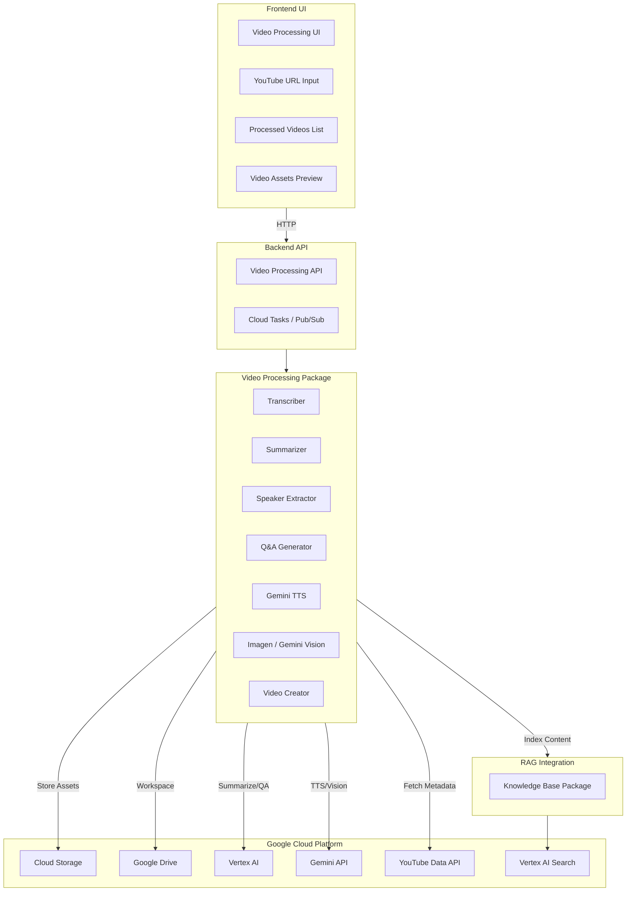

# Video Processing Service Implementation Plan

> Inspired by [youtube-to-docs](https://github.com/DoIT-Artificial-Intelligence/youtube-to-docs) - A tool that converts YouTube videos into structured docs, summaries, audio, and visual assets.

## Overview

Build a Video Processing Service that extracts knowledge from YouTube videos and integrates with the existing RAG system. The service will process videos into transcripts, summaries, Q&A pairs, and multimedia assets for knowledge base enrichment.

**🔵 Google-Only Architecture** - This implementation uses exclusively Google Cloud services for consistency and simplified credential management.

## Architecture



## Key Features

### 🎛️ Customizable Output

Configure exactly what gets generated for each video:

| Output | Description | Default |
|--------|-------------|---------|
| `transcript` | Full transcript text | ✅ On |
| `summary` | Comprehensive summary | ✅ On |
| `one_sentence` | One-line summary | ✅ On |
| `speakers` | Speaker identification | ✅ On |
| `qa` | Q&A pairs extraction | ✅ On |
| `audio_summary` | TTS audio of summary | ⬜ Off |
| `infographic` | Visual summary image | ⬜ Off |
| `video` | Combined image + audio | ⬜ Off |

### 🔄 Iterative Quality Refinement

Regenerate any output with different settings:

```python
# Example: Iterate on summary quality
processor.regenerate(
    video_id="abc123",
    output="summary",
    model="gemini-1.5-pro",  # Upgrade model
    prompt_template="detailed",  # Different prompt style
    temperature=0.3,  # More focused
)
```

**Quality Controls:**
- Switch between model tiers (flash → pro)
- Adjust temperature/creativity
- Use different prompt templates
- Compare multiple generations
- Rate and select best outputs

---

## Package Structure

```
packages/
├── video_processing/           # NEW PACKAGE
│   ├── README.md
│   ├── requirements.txt
│   ├── src/
│   │   ├── __init__.py
│   │   ├── config.py           # Output configuration & presets
│   │   ├── transcript.py       # YouTube metadata & transcript extraction
│   │   ├── audio.py            # Audio extraction with yt-dlp
│   │   ├── llm.py              # Unified Google LLM client
│   │   ├── summarizer.py       # LLM-based summarization
│   │   ├── qa_generator.py     # Q&A extraction from transcripts
│   │   ├── speaker.py          # Speaker identification
│   │   ├── tts.py              # Text-to-Speech generation
│   │   ├── infographic.py      # Image generation from summaries
│   │   ├── video.py            # Video creation (image + audio)
│   │   ├── storage.py          # Storage abstraction (Local/GCS/Drive)
│   │   ├── processor.py        # Main orchestrator
│   │   ├── iterator.py         # Quality iteration & regeneration
│   │   └── models.py           # Data models & configs
│   └── tests/
│       ├── __init__.py
│       ├── test_transcript.py
│       ├── test_summarizer.py
│       └── test_processor.py
```

---

## Phase 1: Core Video Processing Package

### 1.0 Configuration (`packages/video_processing/src/config.py`)

```python
"""
Customizable output configuration and quality presets.
"""

from dataclasses import dataclass, field
from typing import Optional, List, Dict, Any
from enum import Enum


class OutputType(Enum):
    """Available output types."""
    TRANSCRIPT = "transcript"
    SUMMARY = "summary"
    ONE_SENTENCE = "one_sentence"
    SPEAKERS = "speakers"
    QA = "qa"
    AUDIO_SUMMARY = "audio_summary"
    INFOGRAPHIC = "infographic"
    VIDEO = "video"


class PromptStyle(Enum):
    """Prompt template styles for different use cases."""
    CONCISE = "concise"          # Brief, to-the-point
    DETAILED = "detailed"        # Comprehensive, thorough
    TECHNICAL = "technical"      # Focus on technical details
    EDUCATIONAL = "educational"  # Learning-focused
    EXECUTIVE = "executive"      # High-level business summary
    CUSTOM = "custom"            # User-provided template


@dataclass
class OutputConfig:
    """Configuration for a single output type."""
    enabled: bool = True
    model: Optional[str] = None          # Override default model
    temperature: float = 0.7             # Creativity (0.0-1.0)
    prompt_style: PromptStyle = PromptStyle.DETAILED
    custom_prompt: Optional[str] = None  # For CUSTOM style
    max_tokens: Optional[int] = None     # Limit output length
    language: str = "en"


@dataclass
class ProcessingConfig:
    """
    Full processing configuration.
    
    Allows granular control over what gets generated and how.
    """
    
    # Output toggles with individual settings
    outputs: Dict[OutputType, OutputConfig] = field(default_factory=lambda: {
        OutputType.TRANSCRIPT: OutputConfig(enabled=True),
        OutputType.SUMMARY: OutputConfig(enabled=True),
        OutputType.ONE_SENTENCE: OutputConfig(enabled=True),
        OutputType.SPEAKERS: OutputConfig(enabled=True),
        OutputType.QA: OutputConfig(enabled=True),
        OutputType.AUDIO_SUMMARY: OutputConfig(enabled=False),
        OutputType.INFOGRAPHIC: OutputConfig(enabled=False),
        OutputType.VIDEO: OutputConfig(enabled=False),
    })
    
    # Global defaults
    default_model: str = "gemini-2.0-flash-exp"
    default_language: str = "en"
    
    # Storage settings
    storage_type: str = "local"  # local, gcs, drive
    output_dir: str = "video-processing-artifacts"
    gcs_bucket: Optional[str] = None
    
    # Processing behavior
    skip_existing: bool = True      # Skip if output already exists
    save_intermediate: bool = True  # Save after each step
    
    def enable(self, *output_types: OutputType) -> "ProcessingConfig":
        """Enable specific outputs."""
        for ot in output_types:
            if ot in self.outputs:
                self.outputs[ot].enabled = True
        return self
    
    def disable(self, *output_types: OutputType) -> "ProcessingConfig":
        """Disable specific outputs."""
        for ot in output_types:
            if ot in self.outputs:
                self.outputs[ot].enabled = False
        return self
    
    def configure(self, output_type: OutputType, **kwargs) -> "ProcessingConfig":
        """Configure a specific output."""
        if output_type in self.outputs:
            for key, value in kwargs.items():
                if hasattr(self.outputs[output_type], key):
                    setattr(self.outputs[output_type], key, value)
        return self
    
    def with_model(self, model: str) -> "ProcessingConfig":
        """Set default model for all outputs."""
        self.default_model = model
        return self


# Preset configurations
PRESETS = {
    "minimal": ProcessingConfig(
        outputs={
            OutputType.TRANSCRIPT: OutputConfig(enabled=True),
            OutputType.SUMMARY: OutputConfig(enabled=True, prompt_style=PromptStyle.CONCISE),
            OutputType.ONE_SENTENCE: OutputConfig(enabled=True),
            OutputType.SPEAKERS: OutputConfig(enabled=False),
            OutputType.QA: OutputConfig(enabled=False),
            OutputType.AUDIO_SUMMARY: OutputConfig(enabled=False),
            OutputType.INFOGRAPHIC: OutputConfig(enabled=False),
            OutputType.VIDEO: OutputConfig(enabled=False),
        }
    ),
    
    "standard": ProcessingConfig(),  # Default settings
    
    "full": ProcessingConfig(
        outputs={
            OutputType.TRANSCRIPT: OutputConfig(enabled=True),
            OutputType.SUMMARY: OutputConfig(enabled=True, prompt_style=PromptStyle.DETAILED),
            OutputType.ONE_SENTENCE: OutputConfig(enabled=True),
            OutputType.SPEAKERS: OutputConfig(enabled=True),
            OutputType.QA: OutputConfig(enabled=True),
            OutputType.AUDIO_SUMMARY: OutputConfig(enabled=True),
            OutputType.INFOGRAPHIC: OutputConfig(enabled=True),
            OutputType.VIDEO: OutputConfig(enabled=True),
        }
    ),
    
    "high_quality": ProcessingConfig(
        default_model="gemini-1.5-pro",
        outputs={
            OutputType.TRANSCRIPT: OutputConfig(enabled=True),
            OutputType.SUMMARY: OutputConfig(
                enabled=True, 
                model="gemini-1.5-pro",
                temperature=0.3,
                prompt_style=PromptStyle.DETAILED
            ),
            OutputType.ONE_SENTENCE: OutputConfig(enabled=True),
            OutputType.SPEAKERS: OutputConfig(enabled=True),
            OutputType.QA: OutputConfig(enabled=True, model="gemini-1.5-pro"),
            OutputType.AUDIO_SUMMARY: OutputConfig(enabled=False),
            OutputType.INFOGRAPHIC: OutputConfig(enabled=False),
            OutputType.VIDEO: OutputConfig(enabled=False),
        }
    ),
}


def get_preset(name: str) -> ProcessingConfig:
    """Get a preset configuration by name."""
    if name not in PRESETS:
        raise ValueError(f"Unknown preset: {name}. Available: {list(PRESETS.keys())}")
    return PRESETS[name]
```

### 1.1 Data Models (`packages/video_processing/src/models.py`)

```python
from dataclasses import dataclass, field
from typing import Optional, List
from enum import Enum
from datetime import datetime

class ProcessingStatus(Enum):
    PENDING = "pending"
    PROCESSING = "processing"
    COMPLETED = "completed"
    FAILED = "failed"

class TranscriptSource(Enum):
    YOUTUBE_MANUAL = "youtube_manual"
    YOUTUBE_AUTO = "youtube_auto"
    AI_GENERATED = "ai_generated"

@dataclass
class VideoMetadata:
    video_id: str
    url: str
    title: str
    description: str
    channel: str
    published_at: datetime
    duration: str
    tags: List[str] = field(default_factory=list)

@dataclass
class TranscriptResult:
    text: str
    source: TranscriptSource
    language: str
    character_count: int
    file_path: Optional[str] = None

@dataclass
class SummaryResult:
    text: str
    one_sentence: str
    model_name: str
    language: str
    input_tokens: int
    output_tokens: int
    cost: float
    file_path: Optional[str] = None

@dataclass
class QAResult:
    questions: List[dict]  # {questioner, question, responder, answer}
    model_name: str
    file_path: Optional[str] = None

@dataclass
class SpeakerResult:
    speakers: List[dict]  # {name, title/role}
    model_name: str
    file_path: Optional[str] = None

@dataclass
class AudioResult:
    file_path: str
    duration_seconds: float
    format: str  # wav, m4a

@dataclass
class InfographicResult:
    file_path: str
    model_name: str
    cost: float

@dataclass
class VideoAsset:
    """Combined infographic + audio video file"""
    file_path: str
    duration_seconds: float

@dataclass
class ProcessedVideo:
    """Complete processed video with all assets"""
    metadata: VideoMetadata
    transcript: Optional[TranscriptResult] = None
    summary: Optional[SummaryResult] = None
    qa: Optional[QAResult] = None
    speakers: Optional[SpeakerResult] = None
    audio_summary: Optional[AudioResult] = None
    infographic: Optional[InfographicResult] = None
    video_asset: Optional[VideoAsset] = None
    status: ProcessingStatus = ProcessingStatus.PENDING
    error_message: Optional[str] = None
    created_at: datetime = field(default_factory=datetime.utcnow)
    updated_at: datetime = field(default_factory=datetime.utcnow)

# Model Suites (Google-only)
MODEL_SUITES = {
    "gemini-flash": {
        "model": "gemini-2.0-flash-exp",
        "tts": "gemini-2.5-flash-preview-tts-Kore",
        "infographic": "imagen-3.0-generate-001",  # Vertex AI Imagen
        "transcript": "gemini-2.0-flash-exp",
    },
    "gemini-pro": {
        "model": "gemini-1.5-pro",
        "tts": "gemini-2.5-pro-preview-tts-Kore",
        "infographic": "imagen-3.0-generate-001",
        "transcript": "gemini-1.5-pro",
    },
    "vertex-gemini": {
        "model": "gemini-1.5-pro",  # Via Vertex AI
        "tts": "gemini-2.5-flash-preview-tts-Kore",
        "infographic": "imagen-3.0-generate-001",
        "transcript": "gemini-1.5-pro",
    },
}

# Voice options for Gemini TTS
GEMINI_VOICES = [
    "Kore",      # Default, natural
    "Aoede",     # Bright
    "Charon",    # Deep
    "Fenrir",    # Warm
    "Puck",      # Upbeat
]

# Supported languages for TTS
LANGUAGE_CODES = {
    "en": "en-US",
    "es": "es-US", 
    "fr": "fr-FR",
    "de": "de-DE",
    "hi": "hi-IN",
    "pt": "pt-BR",
    "ja": "ja-JP",
    "ko": "ko-KR",
}
```

### 1.2 Transcript Module (`packages/video_processing/src/transcript.py`)

```python
"""
YouTube metadata and transcript extraction.

Uses:
- google-api-python-client for YouTube Data API
- youtube-transcript-api for captions
"""

import os
import re
from typing import Optional, Tuple, List
from googleapiclient.discovery import build
from youtube_transcript_api import YouTubeTranscriptApi

from .models import VideoMetadata, TranscriptResult, TranscriptSource


def get_youtube_service():
    """Initialize YouTube Data API service."""
    api_key = os.environ.get("YOUTUBE_DATA_API_KEY")
    if not api_key:
        raise ValueError("YOUTUBE_DATA_API_KEY environment variable required")
    return build("youtube", "v3", developerKey=api_key)


def extract_video_id(url_or_id: str) -> str:
    """Extract video ID from various YouTube URL formats."""
    if len(url_or_id) == 11 and not url_or_id.startswith("http"):
        return url_or_id
    
    patterns = [
        r"(?:v=|/)([0-9A-Za-z_-]{11})",
        r"youtu\.be/([0-9A-Za-z_-]{11})",
    ]
    for pattern in patterns:
        match = re.search(pattern, url_or_id)
        if match:
            return match.group(1)
    
    raise ValueError(f"Could not extract video ID from: {url_or_id}")


def resolve_playlist_videos(playlist_id: str) -> List[str]:
    """Resolve all video IDs from a playlist."""
    service = get_youtube_service()
    video_ids = []
    
    request = service.playlistItems().list(
        part="contentDetails",
        playlistId=playlist_id,
        maxResults=50
    )
    
    while request:
        response = request.execute()
        for item in response["items"]:
            video_ids.append(item["contentDetails"]["videoId"])
        request = service.playlistItems().list_next(request, response)
    
    return video_ids


def get_video_metadata(video_id: str) -> VideoMetadata:
    """Fetch video metadata from YouTube Data API."""
    import isodate
    
    service = get_youtube_service()
    request = service.videos().list(
        part="snippet,contentDetails",
        id=video_id
    )
    response = request.execute()
    
    if not response["items"]:
        raise ValueError(f"Video not found: {video_id}")
    
    item = response["items"][0]
    snippet = item["snippet"]
    
    return VideoMetadata(
        video_id=video_id,
        url=f"https://www.youtube.com/watch?v={video_id}",
        title=snippet["title"],
        description=snippet["description"],
        channel=snippet["channelTitle"],
        published_at=snippet["publishedAt"],
        duration=str(isodate.parse_duration(item["contentDetails"]["duration"])),
        tags=snippet.get("tags", []),
    )


def fetch_transcript(video_id: str, language: str = "en") -> Optional[TranscriptResult]:
    """
    Fetch transcript from YouTube.
    Tries manual captions first, then auto-generated, then translation.
    """
    try:
        transcript_list = YouTubeTranscriptApi().list(video_id)
        transcript_obj = None
        source = TranscriptSource.YOUTUBE_AUTO
        
        # 1. Try manual transcript in requested language
        try:
            transcript_obj = transcript_list.find_manually_created_transcript([language])
            source = TranscriptSource.YOUTUBE_MANUAL
        except Exception:
            pass
        
        # 2. Try auto-generated in requested language
        if not transcript_obj:
            try:
                transcript_obj = transcript_list.find_generated_transcript([language])
                source = TranscriptSource.YOUTUBE_AUTO
            except Exception:
                pass
        
        # 3. Try translating from English
        if not transcript_obj:
            try:
                en_transcript = transcript_list.find_manually_created_transcript(
                    ["en", "en-US", "en-GB"]
                )
                transcript_obj = en_transcript.translate(language)
                source = TranscriptSource.YOUTUBE_MANUAL
            except Exception:
                pass
        
        if transcript_obj:
            data = transcript_obj.fetch()
            text = " ".join([t.text for t in data])
            return TranscriptResult(
                text=text,
                source=source,
                language=language,
                character_count=len(text),
            )
        
        return None
    
    except Exception as e:
        print(f"Error fetching transcript for {video_id}: {e}")
        return None
```

### 1.3 Audio Extraction (`packages/video_processing/src/audio.py`)

```python
"""
Audio extraction from YouTube videos using yt-dlp.
"""

import os
from typing import Optional

from .models import AudioResult


def extract_audio(video_id: str, output_dir: str) -> Optional[AudioResult]:
    """
    Extract audio from YouTube video using yt-dlp.
    
    Requires: yt-dlp, static-ffmpeg
    """
    import static_ffmpeg
    import yt_dlp
    
    # Ensure ffmpeg is available
    static_ffmpeg.add_paths()
    
    url = f"https://www.youtube.com/watch?v={video_id}"
    os.makedirs(output_dir, exist_ok=True)
    
    ydl_opts = {
        "format": "bestaudio[ext=m4a]",
        "outtmpl": os.path.join(output_dir, "%(id)s.%(ext)s"),
        "quiet": True,
        "no_warnings": True,
    }
    
    try:
        with yt_dlp.YoutubeDL(ydl_opts) as ydl:
            info = ydl.extract_info(url, download=True)
            if info:
                filename = ydl.prepare_filename(info)
                base, _ = os.path.splitext(filename)
                output_path = f"{base}.m4a"
                
                return AudioResult(
                    file_path=os.path.abspath(output_path),
                    duration_seconds=info.get("duration", 0),
                    format="m4a",
                )
    except Exception as e:
        print(f"Error extracting audio for {video_id}: {e}")
    
    return None
```

### 1.4 LLM Services (`packages/video_processing/src/llm.py`)

```python
"""
Google-only LLM services using Vertex AI and Gemini API.

Supports:
- Vertex AI Gemini (for enterprise/VPC)
- Gemini API (for direct access)
"""

from typing import Tuple, Optional
import os
import vertexai
from vertexai.generative_models import GenerativeModel

from packages.core.src.config import GOOGLE_CLOUD_PROJECT, VERTEX_AI_LOCATION
from .models import SummaryResult, TranscriptResult, VideoMetadata


class GeminiClient:
    """Unified client for Gemini via Vertex AI or API."""
    
    def __init__(self, use_vertex: bool = True):
        self.use_vertex = use_vertex
        
        if use_vertex:
            vertexai.init(
                project=GOOGLE_CLOUD_PROJECT, 
                location=VERTEX_AI_LOCATION
            )
    
    def get_model(self, model_name: str = "gemini-2.0-flash-exp"):
        """Get Gemini model instance."""
        if self.use_vertex:
            return GenerativeModel(model_name)
        else:
            # Use google-genai for direct API access
            from google import genai
            api_key = os.environ.get("GEMINI_API_KEY")
            return genai.Client(api_key=api_key).models
    
    def generate(self, model_name: str, prompt: str) -> Tuple[str, int, int]:
        """Generate content and return (text, input_tokens, output_tokens)."""
        if self.use_vertex:
            model = GenerativeModel(model_name)
            response = model.generate_content(prompt)
            usage = response.usage_metadata
            return (
                response.text,
                usage.prompt_token_count if usage else 0,
                usage.candidates_token_count if usage else 0,
            )
        else:
            from google import genai
            from google.genai import types
            
            api_key = os.environ.get("GEMINI_API_KEY")
            client = genai.Client(api_key=api_key)
            
            response = client.models.generate_content(
                model=model_name,
                contents=[types.Content(
                    role="user",
                    parts=[types.Part.from_text(text=prompt)]
                )],
            )
            usage = response.usage_metadata
            return (
                response.text or "",
                usage.prompt_token_count if usage else 0,
                usage.candidates_token_count if usage else 0,
            )


# Default client instance
_client: Optional[GeminiClient] = None


def get_client() -> GeminiClient:
    """Get or create the default Gemini client."""
    global _client
    if _client is None:
        # Prefer Vertex AI if project is configured
        use_vertex = bool(GOOGLE_CLOUD_PROJECT)
        _client = GeminiClient(use_vertex=use_vertex)
    return _client


def generate_summary(
    transcript: TranscriptResult,
    metadata: VideoMetadata,
    model_name: str = "gemini-2.0-flash-exp",
    language: str = "en",
) -> SummaryResult:
    """Generate a comprehensive summary from transcript."""
    
    client = get_client()
    
    prompt = f"""I have included a transcript for {metadata.url} ({metadata.title})

Can you please summarize this in {language}?

{transcript.text}"""
    
    summary_text, input_tokens, output_tokens = client.generate(model_name, prompt)
    
    # Generate one-sentence summary
    one_sentence_prompt = f"""Can you please summarize the following text into one sentence in {language}?

{summary_text}"""
    
    one_sentence_text, os_in, os_out = client.generate(model_name, one_sentence_prompt)
    
    # Gemini pricing (per 1M tokens)
    PRICING = {
        "gemini-2.0-flash-exp": {"input": 0.075, "output": 0.30},
        "gemini-1.5-pro": {"input": 1.25, "output": 5.00},
        "gemini-1.5-flash": {"input": 0.075, "output": 0.30},
    }
    
    pricing = PRICING.get(model_name, {"input": 0.075, "output": 0.30})
    total_in = input_tokens + os_in
    total_out = output_tokens + os_out
    cost = (total_in * pricing["input"] + total_out * pricing["output"]) / 1_000_000
    
    return SummaryResult(
        text=summary_text,
        one_sentence=one_sentence_text,
        model_name=model_name,
        language=language,
        input_tokens=total_in,
        output_tokens=total_out,
        cost=cost,
    )


def extract_speakers(
    transcript: TranscriptResult,
    model_name: str = "gemini-2.0-flash-exp",
) -> Tuple[str, int, int]:
    """Extract speakers from transcript."""
    
    client = get_client()
    
    prompt = """I have included a transcript.

Can you please identify the speakers in the transcript?

The output should be a markdown string in English like:

Speaker 1 (title)
Speaker 2 (title)
etc.

If the speaker is unknown use the placeholder UNKNOWN and if the title is unknown use the placeholder UNKNOWN.

Transcript: """ + transcript.text
    
    return client.generate(model_name, prompt)


def generate_qa(
    transcript: TranscriptResult,
    speakers: str,
    model_name: str = "gemini-2.0-flash-exp",
    language: str = "en",
) -> Tuple[str, int, int]:
    """Extract Q&A pairs from transcript."""
    
    client = get_client()
    
    prompt = f"""I have included a transcript.

Can you please extract the questions and answers from the transcript in {language}?

The output should be a markdown table like:

| questioner(s) | question | responder(s) | answer |
|---|---|---|---|
| Speaker 1 | What is... | Speaker 2 | It is... |

If the questioner or responder is unknown use the placeholder UNKNOWN.
Use people's name and titles in the questioner and responder fields.

Speakers detected: {speakers}

Transcript: {transcript.text}"""
    
    return client.generate(model_name, prompt)


def generate_ai_transcript(
    audio_path: str,
    video_url: str,
    model_name: str = "gemini-2.0-flash-exp",
    language: str = "en",
) -> Tuple[str, int, int]:
    """
    Generate transcript from audio using Gemini's multimodal capabilities.
    
    Note: Requires Gemini API (not Vertex AI) for audio input.
    """
    from google import genai
    from google.genai import types
    
    api_key = os.environ.get("GEMINI_API_KEY")
    if not api_key:
        raise ValueError("GEMINI_API_KEY required for audio transcription")
    
    client = genai.Client(api_key=api_key)
    
    with open(audio_path, "rb") as f:
        audio_bytes = f.read()
    
    prompt = (
        f"Extract the transcript from this audio for {video_url} in {language}. "
        "Start the response immediately with the transcript text."
    )
    
    contents = [
        types.Content(
            role="user",
            parts=[
                types.Part.from_bytes(mime_type="audio/x-m4a", data=audio_bytes),
                types.Part.from_text(text=prompt),
            ],
        ),
    ]
    
    response = client.models.generate_content(
        model=model_name,
        contents=contents,
    )
    
    usage = response.usage_metadata
    return (
        response.text or "",
        usage.prompt_token_count if usage else 0,
        usage.candidates_token_count if usage else 0,
    )
```

### 1.5 Infographic Generator (`packages/video_processing/src/infographic.py`)

```python
"""
Infographic generation using Vertex AI Imagen.

Google-only implementation using:
- Vertex AI Imagen 3 for image generation
- Gemini for image understanding/enhancement
"""

import os
from typing import Optional, Tuple
import vertexai
from vertexai.preview.vision_models import ImageGenerationModel

from packages.core.src.config import GOOGLE_CLOUD_PROJECT, VERTEX_AI_LOCATION
from .models import InfographicResult


def generate_infographic(
    summary_text: str,
    video_title: str,
    model_name: str = "imagen-3.0-generate-001",
    language: str = "en",
) -> Tuple[Optional[bytes], int, int]:
    """
    Generate an infographic image from summary text using Vertex AI Imagen.
    
    Returns: (image_bytes, input_tokens, output_tokens)
    """
    vertexai.init(project=GOOGLE_CLOUD_PROJECT, location=VERTEX_AI_LOCATION)
    
    model = ImageGenerationModel.from_pretrained(model_name)
    
    # Create a prompt optimized for infographic generation
    prompt = f"""Create a professional infographic summarizing this content:

Title: {video_title}

Key Points:
{summary_text[:2000]}

Style: Clean, modern infographic with icons, clear typography, 
professional color scheme. Educational and informative layout."""
    
    try:
        response = model.generate_images(
            prompt=prompt,
            number_of_images=1,
            aspect_ratio="1:1",  # Square format
            safety_filter_level="block_some",
            person_generation="allow_adult",
        )
        
        if response.images:
            image = response.images[0]
            # Imagen doesn't return token counts, estimate based on prompt
            input_tokens = len(prompt) // 4
            output_tokens = 0
            return image._pil_image.tobytes(), input_tokens, output_tokens
        
        return None, 0, 0
    
    except Exception as e:
        print(f"Error generating infographic: {e}")
        return None, 0, 0


def save_infographic(
    summary_text: str,
    video_title: str,
    output_path: str,
    model_name: str = "imagen-3.0-generate-001",
) -> Optional[InfographicResult]:
    """Generate and save infographic to file."""
    
    image_bytes, input_tokens, output_tokens = generate_infographic(
        summary_text, video_title, model_name
    )
    
    if image_bytes:
        # Save as PNG
        from PIL import Image
        import io
        
        # Convert bytes to image and save
        with open(output_path, "wb") as f:
            f.write(image_bytes)
        
        # Estimate cost (Imagen pricing)
        cost = 0.02  # ~$0.02 per image for Imagen 3
        
        return InfographicResult(
            file_path=output_path,
            model_name=model_name,
            cost=cost,
        )
    
    return None
```

### 1.6 TTS Generator (`packages/video_processing/src/tts.py`)

```python
"""
Text-to-Speech generation using Gemini TTS API.
"""

import io
import os
import wave
from typing import Optional, Tuple

from .models import AudioResult


def wave_file(filename, pcm, channels=1, rate=24000, sample_width=2):
    """Write PCM data to WAV file."""
    with wave.open(filename, "wb") as wf:
        wf.setnchannels(channels)
        wf.setsampwidth(sample_width)
        wf.setframerate(rate)
        wf.writeframes(pcm)


def generate_speech(
    text: str,
    model_name: str = "gemini-2.5-flash-preview-tts",
    voice_name: str = "Kore",
    language_code: str = "en-US",
) -> bytes:
    """Generate speech from text using Gemini TTS."""
    from google import genai
    from google.genai import types
    
    api_key = os.environ.get("GEMINI_API_KEY")
    if not api_key:
        raise ValueError("GEMINI_API_KEY environment variable required")
    
    client = genai.Client(api_key=api_key)
    
    response = client.models.generate_content(
        model=model_name,
        contents=text,
        config=types.GenerateContentConfig(
            response_modalities=["AUDIO"],
            speech_config=types.SpeechConfig(
                language_code=language_code,
                voice_config=types.VoiceConfig(
                    prebuilt_voice_config=types.PrebuiltVoiceConfig(
                        voice_name=voice_name,
                    )
                ),
            ),
        ),
    )
    
    if response.candidates and response.candidates[0].content.parts:
        return response.candidates[0].content.parts[0].inline_data.data
    
    return b""


def generate_audio_summary(
    summary_text: str,
    output_path: str,
    model_voice: str = "gemini-2.5-flash-preview-tts-Kore",
    language: str = "en-US",
) -> Optional[AudioResult]:
    """Generate audio file from summary text."""
    
    # Parse model and voice from combined string
    parts = model_voice.rsplit("-", 1)
    model_name = parts[0]
    voice_name = parts[1] if len(parts) > 1 else "Kore"
    
    pcm_data = generate_speech(summary_text, model_name, voice_name, language)
    
    if pcm_data:
        # Write to WAV file
        wav_io = io.BytesIO()
        wave_file(wav_io, pcm_data)
        
        with open(output_path, "wb") as f:
            f.write(wav_io.getvalue())
        
        # Calculate duration (24kHz, 16-bit mono)
        duration_seconds = len(pcm_data) / (24000 * 2)
        
        return AudioResult(
            file_path=output_path,
            duration_seconds=duration_seconds,
            format="wav",
        )
    
    return None
```

### 1.7 Storage Layer (`packages/video_processing/src/storage.py`)

```python
"""
Google-only storage abstraction.

Supports:
- Local filesystem
- Google Cloud Storage (GCS)
- Google Drive (Workspace)
"""

import os
import io
from abc import ABC, abstractmethod
from pathlib import Path
from typing import Optional

import polars as pl


class Storage(ABC):
    """Abstract base class for storage operations."""
    
    @abstractmethod
    def exists(self, path: str) -> bool:
        """Check if file exists."""
        pass
    
    @abstractmethod
    def read_text(self, path: str) -> str:
        """Read text content."""
        pass
    
    @abstractmethod
    def read_bytes(self, path: str) -> bytes:
        """Read binary content."""
        pass
    
    @abstractmethod
    def write_text(self, path: str, content: str) -> str:
        """Write text content. Returns path or URL."""
        pass
    
    @abstractmethod
    def write_bytes(self, path: str, content: bytes) -> str:
        """Write binary content. Returns path or URL."""
        pass
    
    @abstractmethod
    def ensure_directory(self, path: str) -> None:
        """Ensure directory exists."""
        pass


class LocalStorage(Storage):
    """Local filesystem storage."""
    
    def exists(self, path: str) -> bool:
        return os.path.exists(path)
    
    def read_text(self, path: str) -> str:
        with open(path, "r", encoding="utf-8") as f:
            return f.read()
    
    def read_bytes(self, path: str) -> bytes:
        with open(path, "rb") as f:
            return f.read()
    
    def write_text(self, path: str, content: str) -> str:
        with open(path, "w", encoding="utf-8") as f:
            f.write(content)
        return os.path.abspath(path)
    
    def write_bytes(self, path: str, content: bytes) -> str:
        with open(path, "wb") as f:
            f.write(content)
        return os.path.abspath(path)
    
    def ensure_directory(self, path: str) -> None:
        if path:
            os.makedirs(path, exist_ok=True)


class GCSStorage(Storage):
    """Google Cloud Storage implementation."""
    
    def __init__(self, bucket_name: str, prefix: str = ""):
        from google.cloud import storage
        
        self.client = storage.Client()
        self.bucket = self.client.bucket(bucket_name)
        self.prefix = prefix
    
    def _full_path(self, path: str) -> str:
        if self.prefix:
            return f"{self.prefix}/{path}"
        return path
    
    def exists(self, path: str) -> bool:
        blob = self.bucket.blob(self._full_path(path))
        return blob.exists()
    
    def read_text(self, path: str) -> str:
        blob = self.bucket.blob(self._full_path(path))
        return blob.download_as_text()
    
    def read_bytes(self, path: str) -> bytes:
        blob = self.bucket.blob(self._full_path(path))
        return blob.download_as_bytes()
    
    def write_text(self, path: str, content: str) -> str:
        blob = self.bucket.blob(self._full_path(path))
        blob.upload_from_string(content, content_type="text/plain")
        return f"gs://{self.bucket.name}/{self._full_path(path)}"
    
    def write_bytes(self, path: str, content: bytes) -> str:
        blob = self.bucket.blob(self._full_path(path))
        
        # Detect content type
        content_type = "application/octet-stream"
        if path.endswith(".wav"):
            content_type = "audio/wav"
        elif path.endswith(".m4a"):
            content_type = "audio/mp4"
        elif path.endswith(".png"):
            content_type = "image/png"
        elif path.endswith(".mp4"):
            content_type = "video/mp4"
        
        blob.upload_from_string(content, content_type=content_type)
        return f"gs://{self.bucket.name}/{self._full_path(path)}"
    
    def ensure_directory(self, path: str) -> None:
        # GCS doesn't have real directories
        pass
    
    def get_signed_url(self, path: str, expiration_hours: int = 24) -> str:
        """Get a signed URL for temporary access."""
        from datetime import timedelta
        
        blob = self.bucket.blob(self._full_path(path))
        return blob.generate_signed_url(
            version="v4",
            expiration=timedelta(hours=expiration_hours),
            method="GET",
        )


class GoogleDriveStorage(Storage):
    """Google Drive storage for Workspace integration."""
    
    SCOPES = ["https://www.googleapis.com/auth/drive.file"]
    
    def __init__(self, folder_id: Optional[str] = None):
        from google.oauth2.credentials import Credentials
        from google_auth_oauthlib.flow import InstalledAppFlow
        from googleapiclient.discovery import build
        
        self.creds = self._get_credentials()
        self.service = build("drive", "v3", credentials=self.creds)
        self.root_folder_id = folder_id or self._get_or_create_folder(
            "video-processing-artifacts"
        )
        self.folder_cache = {}
    
    def _get_credentials(self):
        """Get Google OAuth credentials."""
        from google.auth.transport.requests import Request
        from google.oauth2.credentials import Credentials
        from google_auth_oauthlib.flow import InstalledAppFlow
        
        token_file = Path.home() / ".google_drive_token.json"
        creds_file = Path.home() / ".google_client_secret.json"
        
        creds = None
        if token_file.exists():
            creds = Credentials.from_authorized_user_file(str(token_file), self.SCOPES)
        
        if not creds or not creds.valid:
            if creds and creds.expired and creds.refresh_token:
                creds.refresh(Request())
            else:
                flow = InstalledAppFlow.from_client_secrets_file(
                    str(creds_file), self.SCOPES
                )
                creds = flow.run_local_server(port=0)
            token_file.write_text(creds.to_json())
        
        return creds
    
    def _get_or_create_folder(self, name: str, parent_id: str = None) -> str:
        """Get or create a folder."""
        query = f"name='{name}' and mimeType='application/vnd.google-apps.folder'"
        if parent_id:
            query += f" and '{parent_id}' in parents"
        
        results = self.service.files().list(q=query, fields="files(id)").execute()
        files = results.get("files", [])
        
        if files:
            return files[0]["id"]
        
        metadata = {
            "name": name,
            "mimeType": "application/vnd.google-apps.folder",
        }
        if parent_id:
            metadata["parents"] = [parent_id]
        
        folder = self.service.files().create(body=metadata, fields="id").execute()
        return folder["id"]
    
    def exists(self, path: str) -> bool:
        if path.startswith("http"):
            return True
        # Implement lookup
        return False
    
    def read_text(self, path: str) -> str:
        # Implement Drive read
        pass
    
    def read_bytes(self, path: str) -> bytes:
        # Implement Drive read
        pass
    
    def write_text(self, path: str, content: str) -> str:
        from googleapiclient.http import MediaIoBaseUpload
        
        parent_id = self._ensure_parent_folders(path)
        filename = Path(path).name
        
        fh = io.BytesIO(content.encode("utf-8"))
        media = MediaIoBaseUpload(fh, mimetype="text/plain", resumable=True)
        
        metadata = {
            "name": filename,
            "parents": [parent_id],
        }
        
        file = self.service.files().create(
            body=metadata,
            media_body=media,
            fields="id, webViewLink"
        ).execute()
        
        return file.get("webViewLink", "")
    
    def write_bytes(self, path: str, content: bytes) -> str:
        from googleapiclient.http import MediaIoBaseUpload
        
        parent_id = self._ensure_parent_folders(path)
        filename = Path(path).name
        
        # Detect mime type
        mime_type = "application/octet-stream"
        if filename.endswith(".wav"):
            mime_type = "audio/wav"
        elif filename.endswith(".png"):
            mime_type = "image/png"
        elif filename.endswith(".mp4"):
            mime_type = "video/mp4"
        
        fh = io.BytesIO(content)
        media = MediaIoBaseUpload(fh, mimetype=mime_type, resumable=True)
        
        metadata = {
            "name": filename,
            "parents": [parent_id],
        }
        
        file = self.service.files().create(
            body=metadata,
            media_body=media,
            fields="id, webViewLink"
        ).execute()
        
        return file.get("webViewLink", "")
    
    def _ensure_parent_folders(self, path: str) -> str:
        """Ensure parent folders exist and return parent ID."""
        parts = Path(path).parts[:-1]  # Exclude filename
        parent_id = self.root_folder_id
        
        for part in parts:
            cache_key = f"{parent_id}/{part}"
            if cache_key in self.folder_cache:
                parent_id = self.folder_cache[cache_key]
            else:
                parent_id = self._get_or_create_folder(part, parent_id)
                self.folder_cache[cache_key] = parent_id
        
        return parent_id
    
    def ensure_directory(self, path: str) -> None:
        self._ensure_parent_folders(os.path.join(path, "dummy"))
```

### 1.8 Quality Iterator (`packages/video_processing/src/iterator.py`)

```python
"""
Quality iteration and regeneration system.

Allows:
- Regenerating specific outputs with different settings
- Comparing multiple generations
- Rating and selecting best outputs
- A/B testing different models/prompts
"""

from dataclasses import dataclass, field
from typing import Optional, List, Dict, Any, Callable
from datetime import datetime
from enum import Enum
import json

from .models import ProcessedVideo, OutputType
from .config import OutputConfig, PromptStyle
from .storage import Storage


class Rating(Enum):
    """Quality rating for outputs."""
    POOR = 1
    FAIR = 2
    GOOD = 3
    EXCELLENT = 4
    PERFECT = 5


@dataclass
class Generation:
    """A single generation attempt for an output."""
    id: str
    output_type: OutputType
    content: str
    model: str
    temperature: float
    prompt_style: PromptStyle
    custom_prompt: Optional[str]
    created_at: datetime
    tokens_in: int = 0
    tokens_out: int = 0
    cost: float = 0.0
    rating: Optional[Rating] = None
    notes: Optional[str] = None
    is_selected: bool = False


@dataclass
class IterationHistory:
    """Track all generations for a video output."""
    video_id: str
    output_type: OutputType
    generations: List[Generation] = field(default_factory=list)
    selected_generation_id: Optional[str] = None
    
    def add(self, generation: Generation) -> None:
        self.generations.append(generation)
    
    def select(self, generation_id: str) -> None:
        """Select a generation as the best one."""
        for gen in self.generations:
            gen.is_selected = (gen.id == generation_id)
        self.selected_generation_id = generation_id
    
    def get_selected(self) -> Optional[Generation]:
        """Get the currently selected generation."""
        for gen in self.generations:
            if gen.is_selected:
                return gen
        return self.generations[-1] if self.generations else None
    
    def compare(self) -> List[Dict[str, Any]]:
        """Get comparison data for all generations."""
        return [
            {
                "id": gen.id,
                "model": gen.model,
                "temperature": gen.temperature,
                "prompt_style": gen.prompt_style.value,
                "rating": gen.rating.value if gen.rating else None,
                "cost": gen.cost,
                "preview": gen.content[:200] + "..." if len(gen.content) > 200 else gen.content,
                "is_selected": gen.is_selected,
            }
            for gen in self.generations
        ]


class QualityIterator:
    """
    Manages quality iteration for video processing outputs.
    
    Usage:
        iterator = QualityIterator(storage)
        
        # Regenerate with different settings
        new_gen = iterator.regenerate(
            video_id="abc123",
            output_type=OutputType.SUMMARY,
            model="gemini-1.5-pro",
            temperature=0.3,
        )
        
        # Compare generations
        comparison = iterator.compare(video_id, OutputType.SUMMARY)
        
        # Rate and select best
        iterator.rate(video_id, OutputType.SUMMARY, gen_id, Rating.EXCELLENT)
        iterator.select(video_id, OutputType.SUMMARY, gen_id)
    """
    
    def __init__(self, storage: Storage, processor: "VideoProcessor"):
        self.storage = storage
        self.processor = processor
        self.histories: Dict[str, Dict[OutputType, IterationHistory]] = {}
    
    def _get_history(self, video_id: str, output_type: OutputType) -> IterationHistory:
        """Get or create iteration history."""
        if video_id not in self.histories:
            self.histories[video_id] = {}
        if output_type not in self.histories[video_id]:
            self.histories[video_id][output_type] = IterationHistory(
                video_id=video_id,
                output_type=output_type,
            )
        return self.histories[video_id][output_type]
    
    def regenerate(
        self,
        video_id: str,
        output_type: OutputType,
        model: Optional[str] = None,
        temperature: float = 0.7,
        prompt_style: PromptStyle = PromptStyle.DETAILED,
        custom_prompt: Optional[str] = None,
    ) -> Generation:
        """
        Regenerate a specific output with new settings.
        """
        import uuid
        
        # Get the processed video data
        video = self.processor.get_video(video_id)
        if not video:
            raise ValueError(f"Video not found: {video_id}")
        
        # Create output config
        config = OutputConfig(
            enabled=True,
            model=model,
            temperature=temperature,
            prompt_style=prompt_style,
            custom_prompt=custom_prompt,
        )
        
        # Regenerate based on output type
        content, tokens_in, tokens_out = self._generate_output(
            video, output_type, config
        )
        
        # Calculate cost
        cost = self._calculate_cost(model or "gemini-2.0-flash-exp", tokens_in, tokens_out)
        
        # Create generation record
        generation = Generation(
            id=str(uuid.uuid4()),
            output_type=output_type,
            content=content,
            model=model or "gemini-2.0-flash-exp",
            temperature=temperature,
            prompt_style=prompt_style,
            custom_prompt=custom_prompt,
            created_at=datetime.utcnow(),
            tokens_in=tokens_in,
            tokens_out=tokens_out,
            cost=cost,
        )
        
        # Add to history
        history = self._get_history(video_id, output_type)
        history.add(generation)
        
        return generation
    
    def _generate_output(
        self,
        video: ProcessedVideo,
        output_type: OutputType,
        config: OutputConfig,
    ) -> tuple[str, int, int]:
        """Generate specific output type."""
        from .llm import get_client
        from .prompts import get_prompt
        
        client = get_client()
        
        # Build prompt based on output type and style
        prompt = get_prompt(
            output_type=output_type,
            style=config.prompt_style,
            custom=config.custom_prompt,
            video=video,
        )
        
        # Generate
        model = config.model or "gemini-2.0-flash-exp"
        content, tokens_in, tokens_out = client.generate(
            model_name=model,
            prompt=prompt,
            temperature=config.temperature,
        )
        
        return content, tokens_in, tokens_out
    
    def _calculate_cost(self, model: str, tokens_in: int, tokens_out: int) -> float:
        """Calculate generation cost."""
        PRICING = {
            "gemini-2.0-flash-exp": {"input": 0.075, "output": 0.30},
            "gemini-1.5-pro": {"input": 1.25, "output": 5.00},
            "gemini-1.5-flash": {"input": 0.075, "output": 0.30},
        }
        pricing = PRICING.get(model, {"input": 0.075, "output": 0.30})
        return (tokens_in * pricing["input"] + tokens_out * pricing["output"]) / 1_000_000
    
    def compare(self, video_id: str, output_type: OutputType) -> List[Dict[str, Any]]:
        """Compare all generations for an output."""
        history = self._get_history(video_id, output_type)
        return history.compare()
    
    def rate(
        self,
        video_id: str,
        output_type: OutputType,
        generation_id: str,
        rating: Rating,
        notes: Optional[str] = None,
    ) -> None:
        """Rate a generation."""
        history = self._get_history(video_id, output_type)
        for gen in history.generations:
            if gen.id == generation_id:
                gen.rating = rating
                gen.notes = notes
                break
    
    def select(
        self,
        video_id: str,
        output_type: OutputType,
        generation_id: str,
    ) -> None:
        """Select a generation as the best/final one."""
        history = self._get_history(video_id, output_type)
        history.select(generation_id)
        
        # Update the processed video with selected content
        selected = history.get_selected()
        if selected:
            self.processor.update_output(video_id, output_type, selected.content)
    
    def auto_improve(
        self,
        video_id: str,
        output_type: OutputType,
        max_iterations: int = 3,
        quality_threshold: Rating = Rating.GOOD,
        evaluator: Optional[Callable[[str], Rating]] = None,
    ) -> Generation:
        """
        Automatically iterate to improve quality.
        
        Uses progressively better models/settings until quality threshold is met.
        """
        PROGRESSION = [
            {"model": "gemini-2.0-flash-exp", "temperature": 0.7},
            {"model": "gemini-2.0-flash-exp", "temperature": 0.3},
            {"model": "gemini-1.5-pro", "temperature": 0.5},
            {"model": "gemini-1.5-pro", "temperature": 0.2},
        ]
        
        best_generation = None
        
        for i, settings in enumerate(PROGRESSION[:max_iterations]):
            generation = self.regenerate(
                video_id=video_id,
                output_type=output_type,
                **settings,
            )
            
            # Evaluate quality
            if evaluator:
                rating = evaluator(generation.content)
                generation.rating = rating
            
            if best_generation is None or (
                generation.rating and 
                (best_generation.rating is None or generation.rating.value > best_generation.rating.value)
            ):
                best_generation = generation
            
            # Check if threshold met
            if generation.rating and generation.rating.value >= quality_threshold.value:
                break
        
        # Select the best generation
        if best_generation:
            self.select(video_id, output_type, best_generation.id)
        
        return best_generation
    
    def export_history(self, video_id: str) -> Dict[str, Any]:
        """Export full iteration history for a video."""
        if video_id not in self.histories:
            return {}
        
        return {
            output_type.value: {
                "generations": history.compare(),
                "selected_id": history.selected_generation_id,
            }
            for output_type, history in self.histories[video_id].items()
        }
```

### 1.9 Prompt Templates (`packages/video_processing/src/prompts.py`)

```python
"""
Customizable prompt templates for different output styles.
"""

from typing import Optional
from .models import ProcessedVideo, OutputType
from .config import PromptStyle


SUMMARY_PROMPTS = {
    PromptStyle.CONCISE: """
Summarize this video transcript in 2-3 paragraphs. Be brief and focus on key points.

Title: {title}
Transcript: {transcript}
""",
    
    PromptStyle.DETAILED: """
Create a comprehensive summary of this video transcript. Include:
- Main topics covered
- Key insights and takeaways
- Important details and examples
- Conclusions or recommendations

Title: {title}
URL: {url}
Transcript: {transcript}
""",
    
    PromptStyle.TECHNICAL: """
Provide a technical summary of this video focusing on:
- Technical concepts explained
- Methodologies or approaches discussed
- Tools, technologies, or frameworks mentioned
- Technical recommendations or best practices

Title: {title}
Transcript: {transcript}
""",
    
    PromptStyle.EDUCATIONAL: """
Create an educational summary of this video suitable for learning. Include:
- Learning objectives (what viewers will learn)
- Key concepts explained simply
- Examples and illustrations used
- Summary of main lessons

Title: {title}
Transcript: {transcript}
""",
    
    PromptStyle.EXECUTIVE: """
Create a brief executive summary (1 paragraph) of this video covering:
- Main purpose/topic
- Key findings or conclusions
- Business implications or action items

Title: {title}
Transcript: {transcript}
""",
}


QA_PROMPTS = {
    PromptStyle.CONCISE: """
Extract the top 5 most important questions and answers from this transcript.

Format as a markdown table:
| Question | Answer |
|----------|--------|

Transcript: {transcript}
""",
    
    PromptStyle.DETAILED: """
Extract all questions and answers discussed in this transcript.

Include:
- Who asked each question (if identifiable)
- Who answered
- Full context of both question and answer

Format as a markdown table:
| Questioner | Question | Responder | Answer |
|------------|----------|-----------|--------|

Speakers: {speakers}
Transcript: {transcript}
""",
}


def get_prompt(
    output_type: OutputType,
    style: PromptStyle,
    video: ProcessedVideo,
    custom: Optional[str] = None,
) -> str:
    """Get the appropriate prompt for an output type and style."""
    
    if style == PromptStyle.CUSTOM and custom:
        return custom.format(
            title=video.metadata.title,
            url=video.metadata.url,
            transcript=video.transcript.text if video.transcript else "",
            speakers=video.speakers.get("text", "") if video.speakers else "",
        )
    
    prompts = {
        OutputType.SUMMARY: SUMMARY_PROMPTS,
        OutputType.QA: QA_PROMPTS,
    }
    
    template = prompts.get(output_type, {}).get(style, SUMMARY_PROMPTS[PromptStyle.DETAILED])
    
    return template.format(
        title=video.metadata.title,
        url=video.metadata.url,
        transcript=video.transcript.text if video.transcript else "",
        speakers=video.speakers.get("text", "") if video.speakers else "",
    )
```

### 1.10 Video Creator (`packages/video_processing/src/video.py`)

```python
"""
Video creation by combining image and audio using ffmpeg.
"""

import os
import subprocess
from typing import Optional

from .models import VideoAsset


def create_video(
    image_path: str,
    audio_path: str,
    output_path: str,
) -> Optional[VideoAsset]:
    """
    Create MP4 video from image and audio file.
    
    Requires: static-ffmpeg
    """
    from static_ffmpeg import run
    
    try:
        ffmpeg_path, _ = run.get_or_fetch_platform_executables_else_raise()
    except Exception as e:
        print(f"Error fetching ffmpeg: {e}")
        return None
    
    command = [
        ffmpeg_path,
        "-y",  # Overwrite output
        "-loop", "1",
        "-i", image_path,
        "-i", audio_path,
        "-c:v", "libx264",
        "-tune", "stillimage",
        "-c:a", "aac",
        "-b:a", "192k",
        "-pix_fmt", "yuv420p",
        "-shortest",
        output_path,
    ]
    
    try:
        subprocess.run(
            command,
            check=True,
            stdout=subprocess.DEVNULL,
            stderr=subprocess.DEVNULL,
        )
        
        # Get duration from audio
        import wave
        with wave.open(audio_path, "rb") as wf:
            frames = wf.getnframes()
            rate = wf.getframerate()
            duration = frames / float(rate)
        
        return VideoAsset(
            file_path=output_path,
            duration_seconds=duration,
        )
    
    except subprocess.CalledProcessError as e:
        print(f"Error creating video: {e}")
        return None
```

### 1.7 Main Processor (`packages/video_processing/src/processor.py`)

```python
"""
Main orchestrator for video processing pipeline.
"""

import os
from typing import Optional, List
from datetime import datetime

from .models import (
    ProcessedVideo,
    ProcessingStatus,
    MODEL_SUITES,
    VideoMetadata,
)
from .transcript import extract_video_id, get_video_metadata, fetch_transcript
from .audio import extract_audio
from .summarizer import generate_summary, extract_speakers, generate_qa
from .tts import generate_audio_summary
from .video import create_video
from .storage import Storage, LocalStorage


class VideoProcessor:
    """Main video processing orchestrator."""
    
    def __init__(
        self,
        output_dir: str = "video-processing-artifacts",
        storage: Optional[Storage] = None,
        model_suite: str = "gemini-flash",
    ):
        self.output_dir = output_dir
        self.storage = storage or LocalStorage()
        self.model_suite = MODEL_SUITES.get(model_suite, MODEL_SUITES["gemini-flash"])
        
        # Setup directories
        self.transcripts_dir = os.path.join(output_dir, "transcripts")
        self.summaries_dir = os.path.join(output_dir, "summaries")
        self.audio_dir = os.path.join(output_dir, "audio")
        self.video_dir = os.path.join(output_dir, "videos")
        self.infographics_dir = os.path.join(output_dir, "infographics")
        
        for d in [
            self.transcripts_dir,
            self.summaries_dir,
            self.audio_dir,
            self.video_dir,
            self.infographics_dir,
        ]:
            self.storage.ensure_directory(d)
    
    def process_video(
        self,
        video_url_or_id: str,
        language: str = "en",
        generate_audio: bool = True,
        generate_video: bool = False,
    ) -> ProcessedVideo:
        """
        Process a single video through the full pipeline.
        """
        result = ProcessedVideo(
            metadata=VideoMetadata(
                video_id="",
                url="",
                title="",
                description="",
                channel="",
                published_at=datetime.utcnow(),
                duration="",
            ),
            status=ProcessingStatus.PROCESSING,
        )
        
        try:
            # 1. Extract video ID and metadata
            video_id = extract_video_id(video_url_or_id)
            result.metadata = get_video_metadata(video_id)
            
            # 2. Fetch transcript
            transcript = fetch_transcript(video_id, language)
            if transcript:
                # Save transcript
                transcript_path = os.path.join(
                    self.transcripts_dir,
                    f"{video_id}_{language}.txt"
                )
                self.storage.write_text(transcript_path, transcript.text)
                transcript.file_path = transcript_path
                result.transcript = transcript
            else:
                # Try AI transcription from audio
                audio_result = extract_audio(video_id, self.audio_dir)
                if audio_result:
                    # TODO: Implement AI transcription
                    pass
            
            if not result.transcript:
                result.status = ProcessingStatus.FAILED
                result.error_message = "Could not obtain transcript"
                return result
            
            # 3. Generate summary
            summary = generate_summary(
                result.transcript,
                result.metadata,
                self.model_suite["model"],
                language,
            )
            summary_path = os.path.join(
                self.summaries_dir,
                f"{video_id}_{language}_summary.md"
            )
            self.storage.write_text(summary_path, summary.text)
            summary.file_path = summary_path
            result.summary = summary
            
            # 4. Extract speakers
            speakers_text, _, _ = extract_speakers(
                result.transcript,
                self.model_suite["model"],
            )
            result.speakers = {
                "text": speakers_text,
                "model_name": self.model_suite["model"],
            }
            
            # 5. Generate Q&A
            qa_text, _, _ = generate_qa(
                result.transcript,
                speakers_text,
                self.model_suite["model"],
                language,
            )
            qa_path = os.path.join(
                self.summaries_dir,
                f"{video_id}_{language}_qa.md"
            )
            self.storage.write_text(qa_path, qa_text)
            result.qa = {
                "text": qa_text,
                "model_name": self.model_suite["model"],
                "file_path": qa_path,
            }
            
            # 6. Generate audio summary (TTS)
            if generate_audio and result.summary:
                audio_path = os.path.join(
                    self.audio_dir,
                    f"{video_id}_{language}_summary.wav"
                )
                result.audio_summary = generate_audio_summary(
                    result.summary.text,
                    audio_path,
                    self.model_suite["tts"],
                    language,
                )
            
            # 7. Generate video (optional)
            if generate_video and result.infographic and result.audio_summary:
                video_path = os.path.join(
                    self.video_dir,
                    f"{video_id}_{language}_summary.mp4"
                )
                result.video_asset = create_video(
                    result.infographic.file_path,
                    result.audio_summary.file_path,
                    video_path,
                )
            
            result.status = ProcessingStatus.COMPLETED
            result.updated_at = datetime.utcnow()
            
        except Exception as e:
            result.status = ProcessingStatus.FAILED
            result.error_message = str(e)
        
        return result
    
    def process_playlist(
        self,
        playlist_id: str,
        language: str = "en",
        **kwargs,
    ) -> List[ProcessedVideo]:
        """Process all videos in a playlist."""
        from .transcript import resolve_playlist_videos
        
        video_ids = resolve_playlist_videos(playlist_id)
        results = []
        
        for video_id in video_ids:
            result = self.process_video(video_id, language, **kwargs)
            results.append(result)
        
        return results
```

---

## Phase 2: Backend API Integration

### 2.1 Video Routes (`packages/api/src/routes/video.py`)

```python
"""
Video processing API endpoints with customizable outputs and quality iteration.
"""

from fastapi import APIRouter, HTTPException, BackgroundTasks
from pydantic import BaseModel, Field
from typing import Optional, List, Dict, Any
from enum import Enum

router = APIRouter(prefix="/video", tags=["video"])


# =============================================================================
# REQUEST/RESPONSE MODELS
# =============================================================================

class OutputSettings(BaseModel):
    """Settings for a specific output type."""
    enabled: bool = True
    model: Optional[str] = None
    temperature: float = 0.7
    prompt_style: str = "detailed"  # concise, detailed, technical, educational, executive, custom
    custom_prompt: Optional[str] = None


class ProcessingConfig(BaseModel):
    """Full processing configuration."""
    preset: Optional[str] = None  # minimal, standard, full, high_quality
    language: str = "en"
    default_model: str = "gemini-2.0-flash-exp"
    
    # Individual output settings (override preset)
    transcript: Optional[OutputSettings] = None
    summary: Optional[OutputSettings] = None
    one_sentence: Optional[OutputSettings] = None
    speakers: Optional[OutputSettings] = None
    qa: Optional[OutputSettings] = None
    audio_summary: Optional[OutputSettings] = None
    infographic: Optional[OutputSettings] = None
    video: Optional[OutputSettings] = None


class VideoProcessRequest(BaseModel):
    url: str
    config: Optional[ProcessingConfig] = None


class RegenerateRequest(BaseModel):
    """Request to regenerate a specific output."""
    output_type: str  # summary, qa, speakers, etc.
    model: Optional[str] = None
    temperature: float = 0.7
    prompt_style: str = "detailed"
    custom_prompt: Optional[str] = None


class RateRequest(BaseModel):
    """Rate a generation."""
    generation_id: str
    rating: int = Field(ge=1, le=5)  # 1-5 stars
    notes: Optional[str] = None


class SelectRequest(BaseModel):
    """Select a generation as the best one."""
    generation_id: str


class JobStatus(str, Enum):
    PENDING = "pending"
    PROCESSING = "processing"
    COMPLETED = "completed"
    FAILED = "failed"


class JobResponse(BaseModel):
    job_id: str
    status: JobStatus
    video_id: Optional[str] = None
    message: Optional[str] = None
    outputs_enabled: Optional[List[str]] = None


class GenerationResponse(BaseModel):
    id: str
    content: str
    model: str
    temperature: float
    prompt_style: str
    tokens_in: int
    tokens_out: int
    cost: float
    rating: Optional[int] = None
    is_selected: bool = False


# In-memory storage (use Redis/Firestore in production)
_jobs: Dict[str, Any] = {}
_processors: Dict[str, Any] = {}


# =============================================================================
# PROCESSING ENDPOINTS
# =============================================================================

@router.post("/process", response_model=JobResponse)
async def process_video(
    request: VideoProcessRequest,
    background_tasks: BackgroundTasks,
):
    """
    Queue a video for processing with customizable outputs.
    
    Use `config.preset` for quick setup:
    - `minimal`: transcript + summary only
    - `standard`: transcript + summary + speakers + Q&A
    - `full`: all outputs including audio/video
    - `high_quality`: uses gemini-1.5-pro for better results
    
    Or customize individual outputs via the config object.
    """
    import uuid
    from packages.video_processing.src.processor import VideoProcessor
    from packages.video_processing.src.config import get_preset, ProcessingConfig as PConfig
    
    job_id = str(uuid.uuid4())
    config = request.config or ProcessingConfig()
    
    # Build processing config
    if config.preset:
        proc_config = get_preset(config.preset)
    else:
        proc_config = PConfig()
    
    # Apply overrides
    proc_config.default_model = config.default_model
    proc_config.default_language = config.language
    
    # Track enabled outputs
    outputs_enabled = [
        name for name, settings in [
            ("transcript", config.transcript),
            ("summary", config.summary),
            ("qa", config.qa),
            ("speakers", config.speakers),
            ("audio_summary", config.audio_summary),
            ("infographic", config.infographic),
            ("video", config.video),
        ]
        if settings is None or settings.enabled
    ]
    
    _jobs[job_id] = {
        "status": JobStatus.PENDING,
        "url": request.url,
        "config": config.dict(),
        "outputs_enabled": outputs_enabled,
    }
    
    async def process_task():
        _jobs[job_id]["status"] = JobStatus.PROCESSING
        try:
            processor = VideoProcessor(config=proc_config)
            result = processor.process_video(request.url)
            
            _jobs[job_id]["status"] = JobStatus.COMPLETED
            _jobs[job_id]["result"] = result
            _jobs[job_id]["video_id"] = result.metadata.video_id
            
            # Store processor for iteration
            _processors[result.metadata.video_id] = processor
            
        except Exception as e:
            _jobs[job_id]["status"] = JobStatus.FAILED
            _jobs[job_id]["error"] = str(e)
    
    background_tasks.add_task(process_task)
    
    return JobResponse(
        job_id=job_id,
        status=JobStatus.PENDING,
        message="Video queued for processing",
        outputs_enabled=outputs_enabled,
    )


@router.get("/jobs/{job_id}")
async def get_job_status(job_id: str):
    """Get processing job status and results."""
    if job_id not in _jobs:
        raise HTTPException(status_code=404, detail="Job not found")
    
    job = _jobs[job_id]
    return {
        "job_id": job_id,
        "status": job["status"],
        "video_id": job.get("video_id"),
        "outputs_enabled": job.get("outputs_enabled"),
        "error": job.get("error"),
    }


@router.get("/processed/{video_id}")
async def get_processed_video(video_id: str):
    """Get processed video with all outputs."""
    if video_id not in _processors:
        raise HTTPException(status_code=404, detail="Video not found")
    
    processor = _processors[video_id]
    video = processor.get_video(video_id)
    
    return {
        "video_id": video_id,
        "metadata": video.metadata.__dict__,
        "outputs": {
            "transcript": video.transcript.__dict__ if video.transcript else None,
            "summary": video.summary.__dict__ if video.summary else None,
            "speakers": video.speakers,
            "qa": video.qa,
            "audio_summary": video.audio_summary.__dict__ if video.audio_summary else None,
            "infographic": video.infographic.__dict__ if video.infographic else None,
            "video": video.video_asset.__dict__ if video.video_asset else None,
        },
        "status": video.status.value,
    }


# =============================================================================
# QUALITY ITERATION ENDPOINTS
# =============================================================================

@router.post("/processed/{video_id}/regenerate/{output_type}")
async def regenerate_output(
    video_id: str,
    output_type: str,
    request: RegenerateRequest,
) -> GenerationResponse:
    """
    Regenerate a specific output with different settings.
    
    Use this to iterate on quality:
    - Try different models (gemini-2.0-flash-exp → gemini-1.5-pro)
    - Adjust temperature (lower = more focused, higher = more creative)
    - Use different prompt styles (concise, detailed, technical, etc.)
    - Provide a custom prompt
    """
    if video_id not in _processors:
        raise HTTPException(status_code=404, detail="Video not found")
    
    from packages.video_processing.src.iterator import QualityIterator
    from packages.video_processing.src.config import OutputType, PromptStyle
    
    processor = _processors[video_id]
    iterator = QualityIterator(processor.storage, processor)
    
    try:
        output_enum = OutputType[output_type.upper()]
        prompt_enum = PromptStyle[request.prompt_style.upper()]
    except KeyError:
        raise HTTPException(status_code=400, detail=f"Invalid output_type or prompt_style")
    
    generation = iterator.regenerate(
        video_id=video_id,
        output_type=output_enum,
        model=request.model,
        temperature=request.temperature,
        prompt_style=prompt_enum,
        custom_prompt=request.custom_prompt,
    )
    
    return GenerationResponse(
        id=generation.id,
        content=generation.content,
        model=generation.model,
        temperature=generation.temperature,
        prompt_style=generation.prompt_style.value,
        tokens_in=generation.tokens_in,
        tokens_out=generation.tokens_out,
        cost=generation.cost,
        rating=generation.rating.value if generation.rating else None,
        is_selected=generation.is_selected,
    )


@router.get("/processed/{video_id}/compare/{output_type}")
async def compare_generations(video_id: str, output_type: str):
    """
    Compare all generations for an output type.
    
    Returns a list of all attempts with their settings and ratings
    for side-by-side comparison.
    """
    if video_id not in _processors:
        raise HTTPException(status_code=404, detail="Video not found")
    
    from packages.video_processing.src.iterator import QualityIterator
    from packages.video_processing.src.config import OutputType
    
    processor = _processors[video_id]
    iterator = QualityIterator(processor.storage, processor)
    
    try:
        output_enum = OutputType[output_type.upper()]
    except KeyError:
        raise HTTPException(status_code=400, detail=f"Invalid output_type")
    
    comparison = iterator.compare(video_id, output_enum)
    return {"generations": comparison}


@router.post("/processed/{video_id}/rate/{output_type}")
async def rate_generation(
    video_id: str,
    output_type: str,
    request: RateRequest,
):
    """Rate a generation (1-5 stars)."""
    if video_id not in _processors:
        raise HTTPException(status_code=404, detail="Video not found")
    
    from packages.video_processing.src.iterator import QualityIterator, Rating
    from packages.video_processing.src.config import OutputType
    
    processor = _processors[video_id]
    iterator = QualityIterator(processor.storage, processor)
    
    output_enum = OutputType[output_type.upper()]
    rating_enum = Rating(request.rating)
    
    iterator.rate(
        video_id=video_id,
        output_type=output_enum,
        generation_id=request.generation_id,
        rating=rating_enum,
        notes=request.notes,
    )
    
    return {"status": "rated", "rating": request.rating}


@router.post("/processed/{video_id}/select/{output_type}")
async def select_generation(
    video_id: str,
    output_type: str,
    request: SelectRequest,
):
    """Select a generation as the final/best output."""
    if video_id not in _processors:
        raise HTTPException(status_code=404, detail="Video not found")
    
    from packages.video_processing.src.iterator import QualityIterator
    from packages.video_processing.src.config import OutputType
    
    processor = _processors[video_id]
    iterator = QualityIterator(processor.storage, processor)
    
    output_enum = OutputType[output_type.upper()]
    
    iterator.select(
        video_id=video_id,
        output_type=output_enum,
        generation_id=request.generation_id,
    )
    
    return {"status": "selected", "generation_id": request.generation_id}


@router.post("/processed/{video_id}/auto-improve/{output_type}")
async def auto_improve_output(
    video_id: str,
    output_type: str,
    max_iterations: int = 3,
    quality_threshold: int = 3,
):
    """
    Automatically iterate to improve output quality.
    
    Progressively uses better models/settings until the quality
    threshold is met or max iterations reached.
    """
    if video_id not in _processors:
        raise HTTPException(status_code=404, detail="Video not found")
    
    from packages.video_processing.src.iterator import QualityIterator, Rating
    from packages.video_processing.src.config import OutputType
    
    processor = _processors[video_id]
    iterator = QualityIterator(processor.storage, processor)
    
    output_enum = OutputType[output_type.upper()]
    threshold_enum = Rating(quality_threshold)
    
    best = iterator.auto_improve(
        video_id=video_id,
        output_type=output_enum,
        max_iterations=max_iterations,
        quality_threshold=threshold_enum,
    )
    
    return {
        "status": "improved",
        "best_generation": {
            "id": best.id,
            "model": best.model,
            "rating": best.rating.value if best.rating else None,
            "cost": best.cost,
        } if best else None,
    }
```

### 2.2 Update App (`packages/api/src/app.py`)

```python
# Add to existing imports
from .routes import video

# Add to router includes
app.include_router(video.router)
```

---

## Phase 3: RAG Integration

### 3.1 Knowledge Base Ingestion

Connect video transcripts and summaries to the Vertex AI Datastore for RAG:

```python
# packages/video_processing/src/rag_integration.py

from typing import Optional
from packages.knowledge_base.src.processor import FileProcessor
from packages.knowledge_base.src.datastore import DatastoreManager

from .models import ProcessedVideo


async def ingest_video_to_knowledge_base(
    video: ProcessedVideo,
    datastore_id: str,
) -> bool:
    """
    Ingest processed video content into knowledge base.
    
    Ingests:
    - Transcript (full text)
    - Summary (structured)
    - Q&A pairs (structured)
    """
    processor = FileProcessor()
    manager = DatastoreManager(datastore_id)
    
    documents = []
    
    # Add transcript
    if video.transcript:
        documents.append({
            "content": video.transcript.text,
            "metadata": {
                "type": "transcript",
                "video_id": video.metadata.video_id,
                "title": video.metadata.title,
                "url": video.metadata.url,
                "language": video.transcript.language,
            }
        })
    
    # Add summary
    if video.summary:
        documents.append({
            "content": video.summary.text,
            "metadata": {
                "type": "summary",
                "video_id": video.metadata.video_id,
                "title": video.metadata.title,
                "url": video.metadata.url,
                "one_sentence": video.summary.one_sentence,
            }
        })
    
    # Add Q&A
    if video.qa:
        documents.append({
            "content": video.qa.get("text", ""),
            "metadata": {
                "type": "qa",
                "video_id": video.metadata.video_id,
                "title": video.metadata.title,
            }
        })
    
    # Ingest to datastore
    for doc in documents:
        await manager.add_document(doc["content"], doc["metadata"])
    
    return True
```

---

## Phase 4: Frontend UI

### 4.1 Video Processing Components

```
packages/ui/src/components/Video/
├── VideoProcessor.tsx      # Main video processing UI
├── VideoUrlInput.tsx       # URL input with validation
├── ProcessingStatus.tsx    # Job status display
├── VideoAssets.tsx         # Display processed assets
├── VideoList.tsx           # List of processed videos
└── index.ts
```

### 4.2 Sample Component (`VideoProcessor.tsx`)

```tsx
import React, { useState } from 'react';
import { VideoUrlInput } from './VideoUrlInput';
import { ProcessingStatus } from './ProcessingStatus';
import { VideoAssets } from './VideoAssets';

interface ProcessingOptions {
  language: string;
  generateAudio: boolean;
  generateVideo: boolean;
  modelSuite: 'gemini-flash' | 'gemini-pro';
}

export const VideoProcessor: React.FC = () => {
  const [jobId, setJobId] = useState<string | null>(null);
  const [options, setOptions] = useState<ProcessingOptions>({
    language: 'en',
    generateAudio: true,
    generateVideo: false,
    modelSuite: 'gemini-flash',
  });

  const handleSubmit = async (url: string) => {
    const response = await fetch('/api/video/process', {
      method: 'POST',
      headers: { 'Content-Type': 'application/json' },
      body: JSON.stringify({ url, options }),
    });
    const data = await response.json();
    setJobId(data.job_id);
  };

  return (
    <div className="video-processor">
      <h2>Process YouTube Video</h2>
      
      <VideoUrlInput onSubmit={handleSubmit} />
      
      <div className="options">
        <label>
          Language:
          <select 
            value={options.language}
            onChange={(e) => setOptions({...options, language: e.target.value})}
          >
            <option value="en">English</option>
            <option value="es">Spanish</option>
            <option value="fr">French</option>
          </select>
        </label>
        
        <label>
          <input
            type="checkbox"
            checked={options.generateAudio}
            onChange={(e) => setOptions({...options, generateAudio: e.target.checked})}
          />
          Generate Audio Summary
        </label>
      </div>
      
      {jobId && <ProcessingStatus jobId={jobId} />}
    </div>
  );
};
```

---

## Phase 5: Configuration

### 5.1 Update Core Config (`packages/core/src/config.py`)

```python
# =============================================================================
# GOOGLE CLOUD CONFIGURATION (extends existing)
# =============================================================================
# Already defined: GOOGLE_CLOUD_PROJECT, VERTEX_AI_LOCATION

# =============================================================================
# YOUTUBE API CONFIGURATION
# =============================================================================
YOUTUBE_DATA_API_KEY = os.environ.get('YOUTUBE_DATA_API_KEY', '')

# =============================================================================
# GEMINI API CONFIGURATION  
# =============================================================================
GEMINI_API_KEY = os.environ.get('GEMINI_API_KEY', '')

# =============================================================================
# GOOGLE CLOUD STORAGE
# =============================================================================
GCS_BUCKET_NAME = os.environ.get('GCS_BUCKET_NAME', '')

# =============================================================================
# VIDEO PROCESSING DEFAULTS
# =============================================================================
VIDEO_PROCESSING_MODEL_SUITE = os.environ.get('VIDEO_PROCESSING_MODEL_SUITE', 'gemini-flash')
VIDEO_PROCESSING_OUTPUT_DIR = os.environ.get('VIDEO_PROCESSING_OUTPUT_DIR', 'video-processing-artifacts')

# Available model suites (all Google-based)
VIDEO_MODEL_SUITES = {
    "gemini-flash": "Fast processing with Gemini 2.0 Flash",
    "gemini-pro": "Higher quality with Gemini 1.5 Pro",
    "vertex-gemini": "Enterprise via Vertex AI",
}

# =============================================================================
# TTS SETTINGS (Gemini TTS)
# =============================================================================
TTS_DEFAULT_VOICE = os.environ.get('TTS_DEFAULT_VOICE', 'Kore')
TTS_DEFAULT_LANGUAGE = os.environ.get('TTS_DEFAULT_LANGUAGE', 'en-US')

# Available Gemini TTS voices
TTS_VOICES = ['Kore', 'Aoede', 'Charon', 'Fenrir', 'Puck']

# =============================================================================
# VALIDATION
# =============================================================================
def validate_video_processing_config() -> bool:
    """Validate video processing configuration."""
    missing = []
    
    if not YOUTUBE_DATA_API_KEY:
        missing.append('YOUTUBE_DATA_API_KEY')
    
    # Either Gemini API key or Vertex AI project needed
    if not GEMINI_API_KEY and not GOOGLE_CLOUD_PROJECT:
        missing.append('GEMINI_API_KEY or GOOGLE_CLOUD_PROJECT')
    
    if missing:
        import warnings
        warnings.warn(f"Video processing config missing: {missing}")
    
    return len(missing) == 0
```

### 5.2 Requirements (`packages/video_processing/requirements.txt`)

```
# =============================================================================
# GOOGLE SERVICES - Core
# =============================================================================
google-api-python-client>=2.187.0      # YouTube Data API, Drive API
google-cloud-storage>=2.18.0           # Google Cloud Storage
google-auth>=2.35.0                    # Authentication
google-auth-oauthlib>=1.2.0            # OAuth for Drive

# =============================================================================
# GOOGLE AI - Vertex AI & Gemini
# =============================================================================
vertexai>=1.70.0                       # Vertex AI SDK (Gemini, Imagen)
google-genai>=0.4.0                    # Gemini API direct access

# =============================================================================
# YOUTUBE PROCESSING
# =============================================================================
youtube-transcript-api>=1.2.3          # Fetch YouTube captions
isodate>=0.7.2                         # Parse ISO 8601 durations

# =============================================================================
# AUDIO/VIDEO PROCESSING (Optional)
# =============================================================================
yt-dlp>=2025.1.0                       # Audio extraction from YouTube
static-ffmpeg>=2.13                    # FFmpeg for video creation
Pillow>=10.4.0                         # Image processing

# =============================================================================
# DATA & UTILITIES
# =============================================================================
polars>=1.36.0                         # DataFrame operations
rich>=14.2.0                           # Rich console output
pydantic>=2.9.0                        # Data validation
```

### 5.3 Optional Extras (pyproject.toml style)

```toml
[project.optional-dependencies]
audio = [
    "yt-dlp>=2025.1.0",
]
video = [
    "static-ffmpeg>=2.13",
    "Pillow>=10.4.0",
]
drive = [
    "google-auth-oauthlib>=1.2.0",
]
all = [
    "youtube-to-docs[audio,video,drive]",
]
```

---

## Implementation Roadmap

| Phase | Duration | Tasks |
|-------|----------|-------|
| **Phase 1** | 1-2 weeks | Core video processing package (transcript, summary, Q&A) |
| **Phase 1.5** | 3-4 days | Output configuration & quality iteration system |
| **Phase 2** | 1 week | Backend API with customization endpoints |
| **Phase 3** | 1 week | RAG integration with knowledge base |
| **Phase 4** | 1-2 weeks | Frontend UI with iteration controls |
| **Phase 5** | 2-3 days | Configuration, presets, and testing |

### MVP Milestones

1. **v0.1** - Basic processing: transcript + summary only
2. **v0.2** - Add Q&A, speakers, output configuration
3. **v0.3** - Quality iteration API (regenerate, compare, select)
4. **v0.4** - Full multimedia (TTS, infographic, video)
5. **v1.0** - RAG integration + production storage

---

## Usage Examples

### Example 1: Quick Processing with Preset

```python
# Python SDK
from video_processing import VideoProcessor, get_preset

processor = VideoProcessor(config=get_preset("standard"))
result = processor.process_video("https://youtube.com/watch?v=abc123")

print(result.summary.text)
print(result.summary.one_sentence)
```

```bash
# API Call
curl -X POST http://localhost:8000/video/process \
  -H "Content-Type: application/json" \
  -d '{
    "url": "https://youtube.com/watch?v=abc123",
    "config": {"preset": "standard"}
  }'
```

### Example 2: Custom Output Configuration

```python
from video_processing import VideoProcessor, ProcessingConfig, OutputConfig, PromptStyle

config = ProcessingConfig()
config.enable(OutputType.TRANSCRIPT, OutputType.SUMMARY)
config.disable(OutputType.QA, OutputType.SPEAKERS)
config.configure(
    OutputType.SUMMARY,
    model="gemini-1.5-pro",
    temperature=0.3,
    prompt_style=PromptStyle.EXECUTIVE,
)

processor = VideoProcessor(config=config)
result = processor.process_video(url)
```

```bash
# API Call with custom config
curl -X POST http://localhost:8000/video/process \
  -H "Content-Type: application/json" \
  -d '{
    "url": "https://youtube.com/watch?v=abc123",
    "config": {
      "default_model": "gemini-1.5-pro",
      "summary": {
        "enabled": true,
        "temperature": 0.3,
        "prompt_style": "executive"
      },
      "qa": {"enabled": false},
      "speakers": {"enabled": false}
    }
  }'
```

### Example 3: Iterate on Summary Quality

```python
from video_processing import QualityIterator, PromptStyle, Rating

iterator = QualityIterator(storage, processor)

# Try different approaches
gen1 = iterator.regenerate(
    video_id="abc123",
    output_type=OutputType.SUMMARY,
    model="gemini-2.0-flash-exp",
    temperature=0.7,
    prompt_style=PromptStyle.DETAILED,
)

gen2 = iterator.regenerate(
    video_id="abc123",
    output_type=OutputType.SUMMARY,
    model="gemini-1.5-pro",
    temperature=0.3,
    prompt_style=PromptStyle.DETAILED,
)

# Compare them
comparison = iterator.compare("abc123", OutputType.SUMMARY)
for gen in comparison:
    print(f"{gen['id']}: {gen['model']} @ {gen['temperature']}")
    print(f"Preview: {gen['preview']}")
    print()

# Rate and select the best
iterator.rate("abc123", OutputType.SUMMARY, gen2.id, Rating.EXCELLENT)
iterator.select("abc123", OutputType.SUMMARY, gen2.id)
```

```bash
# API: Regenerate with different settings
curl -X POST http://localhost:8000/video/processed/abc123/regenerate/summary \
  -H "Content-Type: application/json" \
  -d '{
    "model": "gemini-1.5-pro",
    "temperature": 0.3,
    "prompt_style": "detailed"
  }'

# API: Compare all generations
curl http://localhost:8000/video/processed/abc123/compare/summary

# API: Select the best generation
curl -X POST http://localhost:8000/video/processed/abc123/select/summary \
  -H "Content-Type: application/json" \
  -d '{"generation_id": "gen-uuid-here"}'
```

### Example 4: Auto-Improve Quality

```python
# Automatically iterate until quality threshold is met
best = iterator.auto_improve(
    video_id="abc123",
    output_type=OutputType.SUMMARY,
    max_iterations=3,
    quality_threshold=Rating.GOOD,
)

print(f"Best generation: {best.model} with rating {best.rating}")
```

```bash
# API: Auto-improve
curl -X POST "http://localhost:8000/video/processed/abc123/auto-improve/summary?max_iterations=3&quality_threshold=3"
```

### Example 5: Custom Prompt

```python
config = ProcessingConfig()
config.configure(
    OutputType.SUMMARY,
    prompt_style=PromptStyle.CUSTOM,
    custom_prompt="""
    Create a summary focused on actionable insights for a product manager.
    
    Title: {title}
    
    Include:
    1. Key user problems discussed
    2. Proposed solutions
    3. Metrics mentioned
    4. Next steps
    
    Transcript: {transcript}
    """,
)
```

## Key Dependencies (Google-Only Stack)

| Package | Purpose | Google Service | Optional |
|---------|---------|----------------|----------|
| `google-api-python-client` | YouTube Data API, Drive API | YouTube, Drive | No |
| `google-cloud-storage` | Cloud Storage operations | GCS | Yes |
| `vertexai` | Vertex AI (Gemini, Imagen) | Vertex AI | No |
| `google-genai` | Direct Gemini API (TTS) | Gemini API | No |
| `youtube-transcript-api` | Fetch captions | YouTube | No |
| `yt-dlp` | Audio extraction | - | Yes |
| `static-ffmpeg` | Video creation | - | Yes |
| `polars` | Data processing | - | No |

## Environment Variables

```bash
# =============================================================================
# REQUIRED - Google Cloud Platform
# =============================================================================
GOOGLE_CLOUD_PROJECT=your-gcp-project-id
GOOGLE_APPLICATION_CREDENTIALS=/path/to/service-account.json  # Or use gcloud auth

# =============================================================================
# REQUIRED - API Keys
# =============================================================================
YOUTUBE_DATA_API_KEY=your-youtube-data-api-key    # For metadata/playlists
GEMINI_API_KEY=your-gemini-api-key                # For TTS/direct API access

# =============================================================================
# OPTIONAL - Vertex AI
# =============================================================================
VERTEX_AI_LOCATION=us-central1                    # Vertex AI region

# =============================================================================
# OPTIONAL - Storage
# =============================================================================
GCS_BUCKET_NAME=your-bucket-name                  # For Cloud Storage
VIDEO_PROCESSING_OUTPUT_DIR=video-processing-artifacts  # Local output

# =============================================================================
# OPTIONAL - Processing Defaults
# =============================================================================
VIDEO_PROCESSING_MODEL_SUITE=gemini-flash         # gemini-flash or gemini-pro
TTS_DEFAULT_VOICE=Kore                            # Kore, Aoede, Charon, Fenrir, Puck
TTS_DEFAULT_LANGUAGE=en-US                        # BCP-47 language code
```

---

## Google Cloud Setup

### 1. Enable Required APIs

```bash
gcloud services enable \
    youtube.googleapis.com \
    aiplatform.googleapis.com \
    storage.googleapis.com \
    drive.googleapis.com \
    generativelanguage.googleapis.com
```

### 2. Create API Keys

```bash
# YouTube Data API Key (restricted to YouTube Data API v3)
# Create at: https://console.cloud.google.com/apis/credentials

# Gemini API Key
# Create at: https://aistudio.google.com/apikey
```

### 3. Service Account (for Vertex AI)

```bash
# Create service account
gcloud iam service-accounts create video-processor \
    --display-name="Video Processor"

# Grant permissions
gcloud projects add-iam-policy-binding $PROJECT_ID \
    --member="serviceAccount:video-processor@$PROJECT_ID.iam.gserviceaccount.com" \
    --role="roles/aiplatform.user"

gcloud projects add-iam-policy-binding $PROJECT_ID \
    --member="serviceAccount:video-processor@$PROJECT_ID.iam.gserviceaccount.com" \
    --role="roles/storage.objectAdmin"
```

---

## References

### Google Services Used

| Service | Purpose | Documentation |
|---------|---------|---------------|
| YouTube Data API v3 | Video metadata, playlists | [Link](https://developers.google.com/youtube/v3) |
| Vertex AI Gemini | Summarization, Q&A, transcription | [Link](https://cloud.google.com/vertex-ai/generative-ai/docs/gemini-v2) |
| Gemini API | TTS, direct model access | [Link](https://ai.google.dev/) |
| Vertex AI Imagen | Infographic generation | [Link](https://cloud.google.com/vertex-ai/generative-ai/docs/image/overview) |
| Cloud Storage | Asset storage | [Link](https://cloud.google.com/storage/docs) |
| Google Drive API | Workspace integration | [Link](https://developers.google.com/drive) |

### External Libraries

- [youtube-to-docs](https://github.com/DoIT-Artificial-Intelligence/youtube-to-docs) - Original inspiration
- [youtube-transcript-api](https://github.com/jdepoix/youtube-transcript-api) - Caption fetching
- [yt-dlp](https://github.com/yt-dlp/yt-dlp) - Audio extraction
