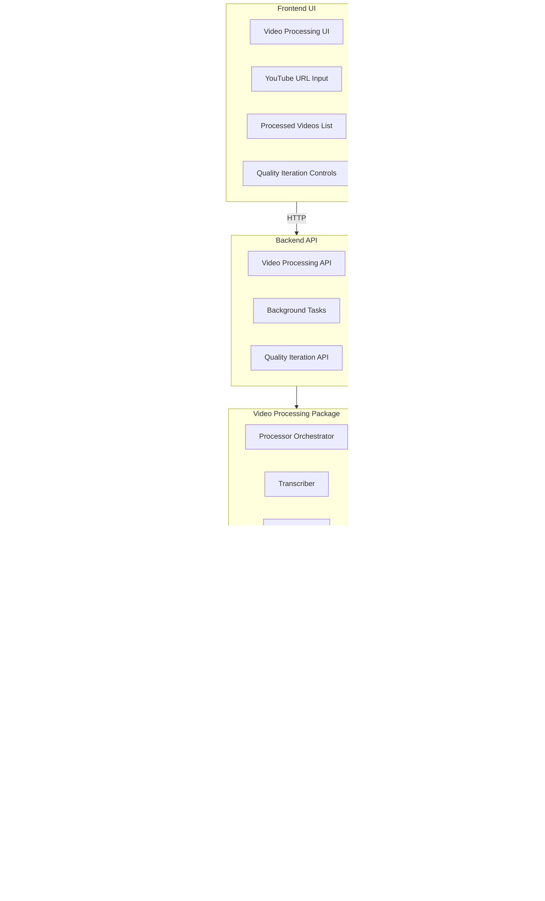

# Video Processing Service Implementation Plan

> **Version**: 2.0 (Revised)  
> **Status**: Ready for Implementation  
> **Last Updated**: January 2026  
> **Prerequisites**: RAG System Phase 0-1 completed  
> **Inspired by**: [youtube-to-docs](https://github.com/DoIT-Artificial-Intelligence/youtube-to-docs)

---

## Overview

Build a Video Processing Service that extracts knowledge from YouTube videos and integrates with the existing RAG system. The service processes videos into transcripts, summaries, Q&A pairs, and multimedia assets for knowledge base enrichment.

### Goals

1. **Extract Knowledge** - Transcripts, summaries, Q&A from YouTube videos
2. **Generate Assets** - Audio summaries (TTS), infographics, video clips
3. **Quality Iteration** - Regenerate outputs with different models/settings
4. **RAG Integration** - Automatically ingest content into knowledge base

### Key Design Decisions

| Decision | Choice | Rationale |
|----------|--------|-----------|
| LLM Provider | Google (Vertex AI + Gemini API) | Unified credentials, TTS support |
| TTS | Gemini TTS API | Native Google, high quality voices |
| Image Gen | Vertex AI Imagen 3 | Enterprise-grade, safe outputs |
| Storage | GCS + Local | Flexible deployment options |
| Processing | Async with background tasks | Long-running operations |

---

## Architecture



---

## Package Structure

```
packages/video_processing/
├── README.md
├── requirements.txt
├── pyproject.toml
├── src/
│   ├── __init__.py
│   ├── models.py           # Data models & type definitions
│   ├── config.py           # Output configuration & presets
│   ├── prompts.py          # Prompt templates for different styles
│   ├── transcript.py       # YouTube metadata & transcript extraction
│   ├── audio.py            # Audio extraction with yt-dlp
│   ├── llm.py              # Unified Google LLM client with retry
│   ├── summarizer.py       # LLM-based summarization
│   ├── qa_generator.py     # Q&A extraction from transcripts
│   ├── speaker.py          # Speaker identification
│   ├── tts.py              # Gemini Text-to-Speech
│   ├── infographic.py      # Imagen image generation
│   ├── video.py            # Video creation (image + audio)
│   ├── storage.py          # Storage abstraction (Local/GCS)
│   ├── processor.py        # Main orchestrator
│   ├── iterator.py         # Quality iteration & regeneration
│   ├── rag_integration.py  # Knowledge base ingestion
│   └── cost.py             # Cost tracking & limits
└── tests/
    ├── __init__.py
    ├── conftest.py
    ├── test_transcript.py
    ├── test_summarizer.py
    ├── test_processor.py
    └── test_iterator.py
```

---

## Prerequisites

Before implementing this service, ensure:

- [ ] **RAG System Phase 0-1 completed** - Knowledge base package working
- [ ] **YouTube Data API quota allocated** - Request increased quota if needed
- [ ] **Gemini API key with TTS access** - Verify TTS is enabled
- [ ] **GCS bucket created** - For asset storage
- [ ] **Vertex AI enabled** - For Imagen and Gemini models

---

## Phase 1: Core Data Models

### 1.1 Models (`packages/video_processing/src/models.py`)

```python
"""
Data models for video processing.

Team: AI/ML
"""

from dataclasses import dataclass, field
from datetime import datetime
from typing import Optional, List, Dict, Any
from enum import Enum


class ProcessingStatus(Enum):
    """Video processing status."""
    PENDING = "pending"
    PROCESSING = "processing"
    COMPLETED = "completed"
    FAILED = "failed"
    CANCELLED = "cancelled"


class TranscriptSource(Enum):
    """Source of transcript."""
    YOUTUBE_MANUAL = "youtube_manual"
    YOUTUBE_AUTO = "youtube_auto"
    AI_GENERATED = "ai_generated"


class OutputType(Enum):
    """Available output types."""
    TRANSCRIPT = "transcript"
    SUMMARY = "summary"
    ONE_SENTENCE = "one_sentence"
    SPEAKERS = "speakers"
    QA = "qa"
    AUDIO_SUMMARY = "audio_summary"
    INFOGRAPHIC = "infographic"
    VIDEO = "video"


class PromptStyle(Enum):
    """Prompt template styles."""
    CONCISE = "concise"
    DETAILED = "detailed"
    TECHNICAL = "technical"
    EDUCATIONAL = "educational"
    EXECUTIVE = "executive"
    CUSTOM = "custom"


@dataclass
class VideoMetadata:
    """YouTube video metadata."""
    video_id: str
    url: str
    title: str
    description: str
    channel: str
    published_at: datetime
    duration: str
    duration_seconds: int = 0
    tags: List[str] = field(default_factory=list)
    thumbnail_url: Optional[str] = None
    view_count: Optional[int] = None


@dataclass
class TranscriptResult:
    """Transcript extraction result."""
    text: str
    source: TranscriptSource
    language: str
    character_count: int
    word_count: int = 0
    file_path: Optional[str] = None
    
    def __post_init__(self):
        if not self.word_count:
            self.word_count = len(self.text.split())


@dataclass
class SummaryResult:
    """Summary generation result."""
    text: str
    one_sentence: str
    model_name: str
    language: str
    prompt_style: PromptStyle
    input_tokens: int
    output_tokens: int
    cost: float
    file_path: Optional[str] = None


@dataclass
class QAResult:
    """Q&A extraction result."""
    questions: List[Dict[str, str]]  # {questioner, question, responder, answer}
    model_name: str
    count: int = 0
    file_path: Optional[str] = None
    
    def __post_init__(self):
        self.count = len(self.questions)


@dataclass
class SpeakerResult:
    """Speaker identification result."""
    speakers: List[Dict[str, str]]  # {name, title/role}
    model_name: str
    count: int = 0
    file_path: Optional[str] = None
    
    def __post_init__(self):
        self.count = len(self.speakers)


@dataclass
class AudioResult:
    """Audio file result."""
    file_path: str
    duration_seconds: float
    format: str  # wav, m4a, mp3
    size_bytes: int = 0


@dataclass
class InfographicResult:
    """Generated infographic."""
    file_path: str
    model_name: str
    prompt_used: str
    cost: float
    width: int = 0
    height: int = 0


@dataclass
class VideoAsset:
    """Combined video file (image + audio)."""
    file_path: str
    duration_seconds: float
    format: str = "mp4"
    size_bytes: int = 0


@dataclass
class ProcessedVideo:
    """Complete processed video with all assets."""
    metadata: VideoMetadata
    
    # Core outputs
    transcript: Optional[TranscriptResult] = None
    summary: Optional[SummaryResult] = None
    qa: Optional[QAResult] = None
    speakers: Optional[SpeakerResult] = None
    
    # Multimedia outputs
    audio_summary: Optional[AudioResult] = None
    infographic: Optional[InfographicResult] = None
    video_asset: Optional[VideoAsset] = None
    
    # Processing info
    status: ProcessingStatus = ProcessingStatus.PENDING
    error_message: Optional[str] = None
    progress: float = 0.0
    
    # Cost tracking
    total_cost: float = 0.0
    total_input_tokens: int = 0
    total_output_tokens: int = 0
    
    # Timestamps
    created_at: datetime = field(default_factory=datetime.utcnow)
    updated_at: datetime = field(default_factory=datetime.utcnow)
    completed_at: Optional[datetime] = None
    
    def to_dict(self) -> Dict[str, Any]:
        """Convert to dictionary for serialization."""
        return {
            "video_id": self.metadata.video_id,
            "title": self.metadata.title,
            "status": self.status.value,
            "progress": self.progress,
            "has_transcript": self.transcript is not None,
            "has_summary": self.summary is not None,
            "has_qa": self.qa is not None,
            "has_audio": self.audio_summary is not None,
            "has_infographic": self.infographic is not None,
            "total_cost": self.total_cost,
            "created_at": self.created_at.isoformat(),
            "error": self.error_message,
        }


# =============================================================================
# MODEL CONFIGURATIONS
# =============================================================================

MODEL_SUITES = {
    "gemini-flash": {
        "text": "gemini-2.0-flash-exp",
        "tts": "gemini-2.5-flash-preview-tts",
        "image": "imagen-3.0-generate-001",
        "transcript": "gemini-2.0-flash-exp",
    },
    "gemini-pro": {
        "text": "gemini-1.5-pro",
        "tts": "gemini-2.5-pro-preview-tts",
        "image": "imagen-3.0-generate-001",
        "transcript": "gemini-1.5-pro",
    },
}

# Gemini TTS voices
GEMINI_VOICES = {
    "Kore": "Natural, balanced",
    "Aoede": "Bright, energetic",
    "Charon": "Deep, authoritative",
    "Fenrir": "Warm, friendly",
    "Puck": "Upbeat, cheerful",
}

# Language codes for TTS
LANGUAGE_CODES = {
    "en": "en-US",
    "es": "es-US",
    "fr": "fr-FR",
    "de": "de-DE",
    "hi": "hi-IN",
    "pt": "pt-BR",
    "ja": "ja-JP",
    "ko": "ko-KR",
    "zh": "zh-CN",
}

# Pricing (per 1M tokens)
MODEL_PRICING = {
    "gemini-2.0-flash-exp": {"input": 0.075, "output": 0.30},
    "gemini-1.5-pro": {"input": 1.25, "output": 5.00},
    "gemini-1.5-flash": {"input": 0.075, "output": 0.30},
    "imagen-3.0-generate-001": {"per_image": 0.02},
}
```

### 1.2 Configuration (`packages/video_processing/src/config.py`)

```python
"""
Processing configuration and presets.

Team: AI/ML
"""

import os
from dataclasses import dataclass, field
from typing import Optional, Dict

from .models import OutputType, PromptStyle


@dataclass
class OutputConfig:
    """Configuration for a single output type."""
    enabled: bool = True
    model: Optional[str] = None
    temperature: float = 0.7
    prompt_style: PromptStyle = PromptStyle.DETAILED
    custom_prompt: Optional[str] = None
    max_tokens: Optional[int] = None
    language: str = "en"


@dataclass
class ProcessingConfig:
    """Full processing configuration."""
    
    # Output configurations
    outputs: Dict[OutputType, OutputConfig] = field(default_factory=lambda: {
        OutputType.TRANSCRIPT: OutputConfig(enabled=True),
        OutputType.SUMMARY: OutputConfig(enabled=True),
        OutputType.ONE_SENTENCE: OutputConfig(enabled=True),
        OutputType.SPEAKERS: OutputConfig(enabled=True),
        OutputType.QA: OutputConfig(enabled=True),
        OutputType.AUDIO_SUMMARY: OutputConfig(enabled=False),
        OutputType.INFOGRAPHIC: OutputConfig(enabled=False),
        OutputType.VIDEO: OutputConfig(enabled=False),
    })
    
    # Global defaults
    default_model: str = "gemini-2.0-flash-exp"
    default_language: str = "en"
    model_suite: str = "gemini-flash"
    
    # Storage settings
    storage_type: str = "local"  # local, gcs
    output_dir: str = "video-processing-artifacts"
    gcs_bucket: Optional[str] = None
    
    # Processing behavior
    skip_existing: bool = True
    save_intermediate: bool = True
    max_cost_limit: float = 10.0  # $10 default limit
    
    # TTS settings
    tts_voice: str = "Kore"
    
    def enable(self, *output_types: OutputType) -> "ProcessingConfig":
        """Enable specific outputs."""
        for ot in output_types:
            if ot in self.outputs:
                self.outputs[ot].enabled = True
        return self
    
    def disable(self, *output_types: OutputType) -> "ProcessingConfig":
        """Disable specific outputs."""
        for ot in output_types:
            if ot in self.outputs:
                self.outputs[ot].enabled = False
        return self
    
    def configure(self, output_type: OutputType, **kwargs) -> "ProcessingConfig":
        """Configure a specific output."""
        if output_type in self.outputs:
            for key, value in kwargs.items():
                if hasattr(self.outputs[output_type], key):
                    setattr(self.outputs[output_type], key, value)
        return self
    
    def with_model(self, model: str) -> "ProcessingConfig":
        """Set default model for all outputs."""
        self.default_model = model
        return self
    
    def with_language(self, language: str) -> "ProcessingConfig":
        """Set default language."""
        self.default_language = language
        return self
    
    def is_enabled(self, output_type: OutputType) -> bool:
        """Check if output type is enabled."""
        return self.outputs.get(output_type, OutputConfig(enabled=False)).enabled


# =============================================================================
# PRESETS
# =============================================================================

def _create_preset(
    name: str,
    enabled_outputs: list,
    model: str = "gemini-2.0-flash-exp",
    prompt_style: PromptStyle = PromptStyle.DETAILED,
) -> ProcessingConfig:
    """Create a preset configuration."""
    config = ProcessingConfig(default_model=model)
    
    # Disable all first
    for ot in OutputType:
        config.outputs[ot] = OutputConfig(enabled=False)
    
    # Enable specified
    for ot in enabled_outputs:
        config.outputs[ot] = OutputConfig(
            enabled=True,
            prompt_style=prompt_style,
        )
    
    return config


PRESETS = {
    "minimal": _create_preset(
        "minimal",
        [OutputType.TRANSCRIPT, OutputType.SUMMARY, OutputType.ONE_SENTENCE],
        prompt_style=PromptStyle.CONCISE,
    ),
    
    "standard": ProcessingConfig(),  # Default settings
    
    "full": _create_preset(
        "full",
        list(OutputType),  # All outputs
    ),
    
    "high_quality": _create_preset(
        "high_quality",
        [OutputType.TRANSCRIPT, OutputType.SUMMARY, OutputType.ONE_SENTENCE,
         OutputType.SPEAKERS, OutputType.QA],
        model="gemini-1.5-pro",
        prompt_style=PromptStyle.DETAILED,
    ),
    
    "multimedia": _create_preset(
        "multimedia",
        [OutputType.TRANSCRIPT, OutputType.SUMMARY, OutputType.AUDIO_SUMMARY,
         OutputType.INFOGRAPHIC, OutputType.VIDEO],
    ),
}


def get_preset(name: str) -> ProcessingConfig:
    """Get a preset configuration by name."""
    if name not in PRESETS:
        available = list(PRESETS.keys())
        raise ValueError(f"Unknown preset: {name}. Available: {available}")
    
    # Return a copy to avoid mutation
    import copy
    return copy.deepcopy(PRESETS[name])


# =============================================================================
# ENVIRONMENT CONFIGURATION
# =============================================================================

# YouTube API
YOUTUBE_DATA_API_KEY = os.environ.get('YOUTUBE_DATA_API_KEY', '')

# Gemini API (for TTS and direct access)
GEMINI_API_KEY = os.environ.get('GEMINI_API_KEY', '')

# Storage
GCS_BUCKET_NAME = os.environ.get('GCS_BUCKET_NAME', '')
VIDEO_OUTPUT_DIR = os.environ.get('VIDEO_PROCESSING_OUTPUT_DIR', 'video-processing-artifacts')

# Defaults
DEFAULT_MODEL_SUITE = os.environ.get('VIDEO_PROCESSING_MODEL_SUITE', 'gemini-flash')
DEFAULT_TTS_VOICE = os.environ.get('TTS_DEFAULT_VOICE', 'Kore')
DEFAULT_LANGUAGE = os.environ.get('TTS_DEFAULT_LANGUAGE', 'en')

# Limits
MAX_COST_LIMIT = float(os.environ.get('VIDEO_PROCESSING_MAX_COST', '10.0'))
MAX_VIDEO_DURATION = int(os.environ.get('MAX_VIDEO_DURATION_SECONDS', '7200'))  # 2 hours


def validate_config() -> bool:
    """Validate video processing configuration."""
    missing = []
    
    if not YOUTUBE_DATA_API_KEY:
        missing.append('YOUTUBE_DATA_API_KEY')
    
    if not GEMINI_API_KEY:
        missing.append('GEMINI_API_KEY')
    
    if missing:
        import warnings
        warnings.warn(f"Video processing config missing: {missing}")
    
    return len(missing) == 0
```

---

## Phase 2: Core Processing Modules

### 2.1 LLM Client with Retry (`packages/video_processing/src/llm.py`)

```python
"""
Unified Google LLM client with retry logic and cost tracking.

Supports both Vertex AI and direct Gemini API.

Team: AI/ML
"""

import os
from typing import Tuple, Optional
from dataclasses import dataclass

import vertexai
from vertexai.generative_models import GenerativeModel
from tenacity import retry, stop_after_attempt, wait_exponential, retry_if_exception_type
from google.api_core import exceptions as google_exceptions

from packages.core.src import GOOGLE_CLOUD_PROJECT, VERTEX_AI_LOCATION
from .models import MODEL_PRICING


@dataclass
class GenerationResult:
    """Result of text generation."""
    text: str
    input_tokens: int
    output_tokens: int
    cost: float
    model: str


class CostTracker:
    """Tracks API costs and enforces limits."""
    
    def __init__(self, max_cost: float = 10.0):
        self.max_cost = max_cost
        self.total_cost = 0.0
        self.total_input_tokens = 0
        self.total_output_tokens = 0
        self.generations = 0
    
    def add(self, cost: float, input_tokens: int, output_tokens: int) -> None:
        """Add a generation to tracking."""
        self.total_cost += cost
        self.total_input_tokens += input_tokens
        self.total_output_tokens += output_tokens
        self.generations += 1
        
        if self.total_cost > self.max_cost:
            raise RuntimeError(
                f"Cost limit exceeded: ${self.total_cost:.4f} > ${self.max_cost:.2f}. "
                f"Increase limit or use a cheaper model."
            )
    
    def get_summary(self) -> dict:
        """Get cost summary."""
        return {
            "total_cost": round(self.total_cost, 4),
            "total_input_tokens": self.total_input_tokens,
            "total_output_tokens": self.total_output_tokens,
            "generations": self.generations,
            "remaining_budget": round(self.max_cost - self.total_cost, 4),
        }


class GeminiClient:
    """
    Unified client for Gemini via Vertex AI or direct API.
    
    Features:
    - Automatic retry on transient failures
    - Cost tracking and limits
    - Support for both Vertex AI and Gemini API
    
    Usage:
        client = GeminiClient()
        result = client.generate("gemini-2.0-flash-exp", "Summarize this...")
        print(f"Cost: ${result.cost:.4f}")
    """
    
    def __init__(
        self,
        use_vertex: bool = True,
        cost_tracker: Optional[CostTracker] = None,
    ):
        self.use_vertex = use_vertex and bool(GOOGLE_CLOUD_PROJECT)
        self.cost_tracker = cost_tracker or CostTracker()
        
        if self.use_vertex:
            vertexai.init(
                project=GOOGLE_CLOUD_PROJECT,
                location=VERTEX_AI_LOCATION,
            )
    
    @retry(
        stop=stop_after_attempt(3),
        wait=wait_exponential(multiplier=1, min=4, max=60),
        retry=retry_if_exception_type((
            google_exceptions.ServiceUnavailable,
            google_exceptions.DeadlineExceeded,
            google_exceptions.ResourceExhausted,
        )),
        reraise=True,
    )
    def generate(
        self,
        model_name: str,
        prompt: str,
        temperature: float = 0.7,
        max_tokens: Optional[int] = None,
    ) -> GenerationResult:
        """
        Generate text with automatic retry and cost tracking.
        
        Args:
            model_name: Gemini model name
            prompt: Input prompt
            temperature: Creativity (0.0-1.0)
            max_tokens: Maximum output tokens
            
        Returns:
            GenerationResult with text and cost info
        """
        if self.use_vertex:
            return self._generate_vertex(model_name, prompt, temperature, max_tokens)
        else:
            return self._generate_api(model_name, prompt, temperature, max_tokens)
    
    def _generate_vertex(
        self,
        model_name: str,
        prompt: str,
        temperature: float,
        max_tokens: Optional[int],
    ) -> GenerationResult:
        """Generate using Vertex AI."""
        from vertexai.generative_models import GenerationConfig
        
        model = GenerativeModel(model_name)
        
        config = GenerationConfig(
            temperature=temperature,
            max_output_tokens=max_tokens,
        )
        
        response = model.generate_content(prompt, generation_config=config)
        
        # Extract usage
        usage = response.usage_metadata
        input_tokens = usage.prompt_token_count if usage else 0
        output_tokens = usage.candidates_token_count if usage else 0
        
        # Calculate cost
        cost = self._calculate_cost(model_name, input_tokens, output_tokens)
        
        # Track cost
        self.cost_tracker.add(cost, input_tokens, output_tokens)
        
        return GenerationResult(
            text=response.text,
            input_tokens=input_tokens,
            output_tokens=output_tokens,
            cost=cost,
            model=model_name,
        )
    
    def _generate_api(
        self,
        model_name: str,
        prompt: str,
        temperature: float,
        max_tokens: Optional[int],
    ) -> GenerationResult:
        """Generate using direct Gemini API."""
        from google import genai
        from google.genai import types
        
        api_key = os.environ.get("GEMINI_API_KEY")
        if not api_key:
            raise ValueError("GEMINI_API_KEY required for direct API access")
        
        client = genai.Client(api_key=api_key)
        
        config = types.GenerateContentConfig(
            temperature=temperature,
            max_output_tokens=max_tokens,
        )
        
        response = client.models.generate_content(
            model=model_name,
            contents=[types.Content(
                role="user",
                parts=[types.Part.from_text(text=prompt)],
            )],
            config=config,
        )
        
        # Extract usage
        usage = response.usage_metadata
        input_tokens = usage.prompt_token_count if usage else 0
        output_tokens = usage.candidates_token_count if usage else 0
        
        # Calculate cost
        cost = self._calculate_cost(model_name, input_tokens, output_tokens)
        
        # Track cost
        self.cost_tracker.add(cost, input_tokens, output_tokens)
        
        return GenerationResult(
            text=response.text or "",
            input_tokens=input_tokens,
            output_tokens=output_tokens,
            cost=cost,
            model=model_name,
        )
    
    def _calculate_cost(
        self,
        model: str,
        input_tokens: int,
        output_tokens: int,
    ) -> float:
        """Calculate generation cost."""
        pricing = MODEL_PRICING.get(model, {"input": 0.075, "output": 0.30})
        
        input_cost = (input_tokens * pricing["input"]) / 1_000_000
        output_cost = (output_tokens * pricing["output"]) / 1_000_000
        
        return input_cost + output_cost


# Global client instance
_client: Optional[GeminiClient] = None


def get_client(cost_tracker: Optional[CostTracker] = None) -> GeminiClient:
    """Get or create the default Gemini client."""
    global _client
    if _client is None or cost_tracker is not None:
        _client = GeminiClient(cost_tracker=cost_tracker)
    return _client
```

### 2.2 Transcript Extraction (`packages/video_processing/src/transcript.py`)

```python
"""
YouTube metadata and transcript extraction.

Uses:
- google-api-python-client for YouTube Data API
- youtube-transcript-api for captions

Team: AI/ML
"""

import os
import re
from typing import Optional, List
from datetime import datetime

from googleapiclient.discovery import build
from youtube_transcript_api import YouTubeTranscriptApi
from ratelimit import limits, sleep_and_retry

from .models import VideoMetadata, TranscriptResult, TranscriptSource
from .config import YOUTUBE_DATA_API_KEY, MAX_VIDEO_DURATION


def get_youtube_service():
    """Initialize YouTube Data API service."""
    api_key = YOUTUBE_DATA_API_KEY
    if not api_key:
        raise ValueError("YOUTUBE_DATA_API_KEY environment variable required")
    return build("youtube", "v3", developerKey=api_key)


def extract_video_id(url_or_id: str) -> str:
    """
    Extract video ID from various YouTube URL formats.
    
    Supports:
    - Full URLs: https://www.youtube.com/watch?v=VIDEO_ID
    - Short URLs: https://youtu.be/VIDEO_ID
    - Embed URLs: https://www.youtube.com/embed/VIDEO_ID
    - Direct IDs: VIDEO_ID
    """
    if len(url_or_id) == 11 and not url_or_id.startswith("http"):
        return url_or_id
    
    patterns = [
        r"(?:v=|/)([0-9A-Za-z_-]{11})(?:[&?]|$)",
        r"youtu\.be/([0-9A-Za-z_-]{11})",
        r"embed/([0-9A-Za-z_-]{11})",
    ]
    
    for pattern in patterns:
        match = re.search(pattern, url_or_id)
        if match:
            return match.group(1)
    
    raise ValueError(f"Could not extract video ID from: {url_or_id}")


def parse_duration(duration_str: str) -> int:
    """Parse ISO 8601 duration to seconds."""
    import isodate
    try:
        duration = isodate.parse_duration(duration_str)
        return int(duration.total_seconds())
    except Exception:
        return 0


@sleep_and_retry
@limits(calls=100, period=100)  # YouTube API rate limit
def get_video_metadata(video_id: str) -> VideoMetadata:
    """
    Fetch video metadata from YouTube Data API.
    
    Rate limited to respect YouTube API quotas.
    """
    service = get_youtube_service()
    
    request = service.videos().list(
        part="snippet,contentDetails,statistics",
        id=video_id
    )
    response = request.execute()
    
    if not response.get("items"):
        raise ValueError(f"Video not found: {video_id}")
    
    item = response["items"][0]
    snippet = item["snippet"]
    content = item["contentDetails"]
    stats = item.get("statistics", {})
    
    # Parse duration
    duration_str = content["duration"]
    duration_seconds = parse_duration(duration_str)
    
    # Check duration limit
    if duration_seconds > MAX_VIDEO_DURATION:
        raise ValueError(
            f"Video too long: {duration_seconds}s > {MAX_VIDEO_DURATION}s limit"
        )
    
    # Parse published date
    published_at = datetime.fromisoformat(
        snippet["publishedAt"].replace("Z", "+00:00")
    )
    
    return VideoMetadata(
        video_id=video_id,
        url=f"https://www.youtube.com/watch?v={video_id}",
        title=snippet["title"],
        description=snippet.get("description", ""),
        channel=snippet["channelTitle"],
        published_at=published_at,
        duration=duration_str,
        duration_seconds=duration_seconds,
        tags=snippet.get("tags", []),
        thumbnail_url=snippet.get("thumbnails", {}).get("high", {}).get("url"),
        view_count=int(stats.get("viewCount", 0)),
    )


def fetch_transcript(
    video_id: str,
    language: str = "en",
) -> Optional[TranscriptResult]:
    """
    Fetch transcript from YouTube.
    
    Tries in order:
    1. Manual captions in requested language
    2. Auto-generated captions in requested language
    3. Manual English captions (translated)
    4. Auto-generated English (translated)
    
    Returns None if no transcript available.
    """
    try:
        api = YouTubeTranscriptApi()
        transcript_list = api.list_transcripts(video_id)
        
        transcript_obj = None
        source = TranscriptSource.YOUTUBE_AUTO
        
        # 1. Try manual in requested language
        try:
            transcript_obj = transcript_list.find_manually_created_transcript([language])
            source = TranscriptSource.YOUTUBE_MANUAL
        except Exception:
            pass
        
        # 2. Try auto-generated in requested language
        if not transcript_obj:
            try:
                transcript_obj = transcript_list.find_generated_transcript([language])
                source = TranscriptSource.YOUTUBE_AUTO
            except Exception:
                pass
        
        # 3. Try translating from English
        if not transcript_obj and language != "en":
            try:
                en_transcript = transcript_list.find_manually_created_transcript(
                    ["en", "en-US", "en-GB"]
                )
                transcript_obj = en_transcript.translate(language)
                source = TranscriptSource.YOUTUBE_MANUAL
            except Exception:
                pass
        
        # 4. Try auto-generated English translated
        if not transcript_obj and language != "en":
            try:
                en_transcript = transcript_list.find_generated_transcript(["en"])
                transcript_obj = en_transcript.translate(language)
                source = TranscriptSource.YOUTUBE_AUTO
            except Exception:
                pass
        
        if transcript_obj:
            data = transcript_obj.fetch()
            text = " ".join([segment.text for segment in data])
            
            return TranscriptResult(
                text=text,
                source=source,
                language=language,
                character_count=len(text),
            )
        
        return None
    
    except Exception as e:
        print(f"Error fetching transcript for {video_id}: {e}")
        return None


def resolve_playlist_videos(playlist_id: str) -> List[str]:
    """
    Resolve all video IDs from a YouTube playlist.
    
    Handles pagination for large playlists.
    """
    service = get_youtube_service()
    video_ids = []
    
    request = service.playlistItems().list(
        part="contentDetails",
        playlistId=playlist_id,
        maxResults=50
    )
    
    while request:
        response = request.execute()
        
        for item in response.get("items", []):
            video_id = item["contentDetails"]["videoId"]
            video_ids.append(video_id)
        
        request = service.playlistItems().list_next(request, response)
    
    return video_ids
```

### 2.3 Summarizer (`packages/video_processing/src/summarizer.py`)

```python
"""
LLM-based summarization with multiple prompt styles.

Team: AI/ML
"""

from typing import Optional

from .models import (
    TranscriptResult,
    VideoMetadata,
    SummaryResult,
    PromptStyle,
)
from .llm import GeminiClient, get_client, CostTracker
from .prompts import get_summary_prompt


def generate_summary(
    transcript: TranscriptResult,
    metadata: VideoMetadata,
    model_name: str = "gemini-2.0-flash-exp",
    language: str = "en",
    prompt_style: PromptStyle = PromptStyle.DETAILED,
    custom_prompt: Optional[str] = None,
    temperature: float = 0.7,
    client: Optional[GeminiClient] = None,
) -> SummaryResult:
    """
    Generate a comprehensive summary from transcript.
    
    Args:
        transcript: Video transcript
        metadata: Video metadata
        model_name: Gemini model to use
        language: Output language
        prompt_style: Style of summary
        custom_prompt: Custom prompt template (overrides style)
        temperature: Generation temperature
        client: Optional pre-configured client
    
    Returns:
        SummaryResult with summary and one-sentence version
    """
    client = client or get_client()
    
    # Build summary prompt
    prompt = get_summary_prompt(
        style=prompt_style if not custom_prompt else PromptStyle.CUSTOM,
        custom=custom_prompt,
        title=metadata.title,
        url=metadata.url,
        transcript=transcript.text,
        language=language,
    )
    
    # Generate main summary
    result = client.generate(
        model_name=model_name,
        prompt=prompt,
        temperature=temperature,
    )
    
    summary_text = result.text
    total_cost = result.cost
    total_in = result.input_tokens
    total_out = result.output_tokens
    
    # Generate one-sentence summary
    one_sentence_prompt = f"""Summarize the following text in exactly one sentence in {language}:

{summary_text}"""
    
    one_result = client.generate(
        model_name=model_name,
        prompt=one_sentence_prompt,
        temperature=0.3,  # More focused for one-liner
    )
    
    one_sentence = one_result.text.strip()
    total_cost += one_result.cost
    total_in += one_result.input_tokens
    total_out += one_result.output_tokens
    
    return SummaryResult(
        text=summary_text,
        one_sentence=one_sentence,
        model_name=model_name,
        language=language,
        prompt_style=prompt_style,
        input_tokens=total_in,
        output_tokens=total_out,
        cost=total_cost,
    )


def extract_speakers(
    transcript: TranscriptResult,
    model_name: str = "gemini-2.0-flash-exp",
    client: Optional[GeminiClient] = None,
) -> dict:
    """
    Extract speaker information from transcript.
    
    Returns:
        Dictionary with speakers list and metadata
    """
    client = client or get_client()
    
    prompt = """Analyze this transcript and identify the speakers.

For each speaker, provide:
1. Name (or "Unknown" if not mentioned)
2. Title/Role (or "Unknown" if not mentioned)

Format as a markdown list:
- **Speaker Name** - Title/Role

Transcript:
""" + transcript.text[:10000]  # Limit context
    
    result = client.generate(
        model_name=model_name,
        prompt=prompt,
        temperature=0.3,
    )
    
    # Parse speakers from response
    speakers = []
    for line in result.text.split("\n"):
        if line.strip().startswith("-"):
            # Parse "- **Name** - Role" format
            parts = line.strip("- ").split(" - ", 1)
            name = parts[0].strip("*").strip()
            role = parts[1].strip() if len(parts) > 1 else "Unknown"
            speakers.append({"name": name, "role": role})
    
    return {
        "speakers": speakers,
        "model_name": model_name,
        "raw_response": result.text,
    }


def generate_qa(
    transcript: TranscriptResult,
    speakers: Optional[dict] = None,
    model_name: str = "gemini-2.0-flash-exp",
    language: str = "en",
    client: Optional[GeminiClient] = None,
) -> dict:
    """
    Extract Q&A pairs from transcript.
    
    Returns:
        Dictionary with Q&A list and metadata
    """
    client = client or get_client()
    
    speakers_text = ""
    if speakers and speakers.get("speakers"):
        speakers_text = "\n".join(
            f"- {s['name']} ({s['role']})"
            for s in speakers["speakers"]
        )
    
    prompt = f"""Analyze this transcript and extract all questions and answers.

Output as a markdown table in {language}:

| Questioner | Question | Responder | Answer |
|------------|----------|-----------|--------|
| Name | The question asked | Name | The answer given |

If the questioner or responder is unknown, use "Unknown".

{f"Known speakers: {speakers_text}" if speakers_text else ""}

Transcript:
{transcript.text[:15000]}"""
    
    result = client.generate(
        model_name=model_name,
        prompt=prompt,
        temperature=0.3,
    )
    
    # Parse Q&A from markdown table
    questions = []
    lines = result.text.split("\n")
    
    for line in lines:
        if "|" in line and not line.strip().startswith("|--"):
            parts = [p.strip() for p in line.split("|")[1:-1]]
            if len(parts) >= 4 and parts[0] not in ["Questioner", ""]:
                questions.append({
                    "questioner": parts[0],
                    "question": parts[1],
                    "responder": parts[2],
                    "answer": parts[3],
                })
    
    return {
        "questions": questions,
        "model_name": model_name,
        "count": len(questions),
        "raw_response": result.text,
    }
```

### 2.4 TTS Generator (`packages/video_processing/src/tts.py`)

```python
"""
Text-to-Speech generation using Gemini TTS API.

Team: AI/ML
"""

import os
import io
import wave
from typing import Optional

from .models import AudioResult
from .config import GEMINI_API_KEY, DEFAULT_TTS_VOICE, LANGUAGE_CODES


def wave_file(pcm_data: bytes, sample_rate: int = 24000) -> bytes:
    """Convert PCM data to WAV format."""
    buffer = io.BytesIO()
    
    with wave.open(buffer, "wb") as wf:
        wf.setnchannels(1)  # Mono
        wf.setsampwidth(2)  # 16-bit
        wf.setframerate(sample_rate)
        wf.writeframes(pcm_data)
    
    return buffer.getvalue()


def generate_speech(
    text: str,
    model_name: str = "gemini-2.5-flash-preview-tts",
    voice_name: str = None,
    language_code: str = "en-US",
) -> bytes:
    """
    Generate speech from text using Gemini TTS.
    
    Args:
        text: Text to synthesize
        model_name: TTS model name
        voice_name: Voice to use
        language_code: BCP-47 language code
    
    Returns:
        PCM audio data as bytes
    """
    from google import genai
    from google.genai import types
    
    api_key = GEMINI_API_KEY
    if not api_key:
        raise ValueError("GEMINI_API_KEY environment variable required")
    
    voice_name = voice_name or DEFAULT_TTS_VOICE
    
    client = genai.Client(api_key=api_key)
    
    response = client.models.generate_content(
        model=model_name,
        contents=text,
        config=types.GenerateContentConfig(
            response_modalities=["AUDIO"],
            speech_config=types.SpeechConfig(
                language_code=language_code,
                voice_config=types.VoiceConfig(
                    prebuilt_voice_config=types.PrebuiltVoiceConfig(
                        voice_name=voice_name,
                    )
                ),
            ),
        ),
    )
    
    if response.candidates and response.candidates[0].content.parts:
        return response.candidates[0].content.parts[0].inline_data.data
    
    return b""


def generate_audio_summary(
    summary_text: str,
    output_path: str,
    voice_name: str = None,
    language: str = "en",
) -> Optional[AudioResult]:
    """
    Generate audio file from summary text.
    
    Args:
        summary_text: Text to synthesize
        output_path: Path for output WAV file
        voice_name: Voice to use
        language: Language code (en, es, fr, etc.)
    
    Returns:
        AudioResult if successful
    """
    # Convert language code
    language_code = LANGUAGE_CODES.get(language, "en-US")
    voice_name = voice_name or DEFAULT_TTS_VOICE
    
    # Generate PCM audio
    pcm_data = generate_speech(
        text=summary_text,
        voice_name=voice_name,
        language_code=language_code,
    )
    
    if not pcm_data:
        return None
    
    # Convert to WAV
    wav_data = wave_file(pcm_data)
    
    # Write to file
    with open(output_path, "wb") as f:
        f.write(wav_data)
    
    # Calculate duration (24kHz, 16-bit mono)
    duration_seconds = len(pcm_data) / (24000 * 2)
    
    return AudioResult(
        file_path=output_path,
        duration_seconds=duration_seconds,
        format="wav",
        size_bytes=len(wav_data),
    )
```

### 2.5 Prompts (`packages/video_processing/src/prompts.py`)

```python
"""
Prompt templates for different output styles.

Team: AI/ML
"""

from typing import Optional
from .models import PromptStyle


SUMMARY_PROMPTS = {
    PromptStyle.CONCISE: """Summarize this video in 2-3 brief paragraphs. Focus only on the key points.

Title: {title}
Transcript: {transcript}

Summary in {language}:""",

    PromptStyle.DETAILED: """Create a comprehensive summary of this video. Include:
- Main topics and themes
- Key insights and takeaways
- Important details and examples
- Conclusions or recommendations

Title: {title}
URL: {url}
Transcript: {transcript}

Detailed summary in {language}:""",

    PromptStyle.TECHNICAL: """Provide a technical summary focusing on:
- Technical concepts and terminology
- Methodologies and approaches
- Tools, technologies, and frameworks
- Technical recommendations and best practices

Title: {title}
Transcript: {transcript}

Technical summary in {language}:""",

    PromptStyle.EDUCATIONAL: """Create an educational summary suitable for learning:
- Learning objectives (what viewers will learn)
- Key concepts explained simply
- Examples and illustrations
- Summary of main lessons
- Review questions (optional)

Title: {title}
Transcript: {transcript}

Educational summary in {language}:""",

    PromptStyle.EXECUTIVE: """Create a brief executive summary (2-3 paragraphs max):
- Main purpose and topic
- Key findings or conclusions
- Business implications or action items
- Bottom line

Title: {title}
Transcript: {transcript}

Executive summary in {language}:""",
}


def get_summary_prompt(
    style: PromptStyle,
    title: str,
    transcript: str,
    url: str = "",
    language: str = "English",
    custom: Optional[str] = None,
) -> str:
    """
    Get the appropriate prompt for a summary style.
    
    Args:
        style: Prompt style
        title: Video title
        transcript: Video transcript
        url: Video URL
        language: Output language
        custom: Custom prompt template
    
    Returns:
        Formatted prompt string
    """
    if style == PromptStyle.CUSTOM and custom:
        return custom.format(
            title=title,
            url=url,
            transcript=transcript,
            language=language,
        )
    
    template = SUMMARY_PROMPTS.get(style, SUMMARY_PROMPTS[PromptStyle.DETAILED])
    
    return template.format(
        title=title,
        url=url,
        transcript=transcript[:50000],  # Limit transcript length
        language=language,
    )
```

---

## Phase 3: Orchestration

### 3.1 Main Processor (`packages/video_processing/src/processor.py`)

```python
"""
Main orchestrator for video processing pipeline.

Team: AI/ML
"""

import os
from typing import Optional, Callable, List
from datetime import datetime

from .models import (
    ProcessedVideo,
    ProcessingStatus,
    VideoMetadata,
    OutputType,
)
from .config import ProcessingConfig, get_preset
from .transcript import extract_video_id, get_video_metadata, fetch_transcript
from .summarizer import generate_summary, extract_speakers, generate_qa
from .tts import generate_audio_summary
from .llm import GeminiClient, CostTracker
from .storage import Storage, LocalStorage


class VideoProcessor:
    """
    Main video processing orchestrator.
    
    Coordinates the full processing pipeline:
    1. Fetch metadata and transcript
    2. Generate summaries and Q&A
    3. Create multimedia assets
    4. Track progress and costs
    
    Usage:
        processor = VideoProcessor(config=get_preset("standard"))
        result = processor.process_video("https://youtube.com/watch?v=...")
        print(f"Total cost: ${result.total_cost:.4f}")
    """
    
    def __init__(
        self,
        config: Optional[ProcessingConfig] = None,
        storage: Optional[Storage] = None,
        on_progress: Optional[Callable[[str, float], None]] = None,
    ):
        """
        Initialize processor.
        
        Args:
            config: Processing configuration
            storage: Storage backend
            on_progress: Progress callback (step_name, progress_0_to_1)
        """
        self.config = config or ProcessingConfig()
        self.storage = storage or LocalStorage(self.config.output_dir)
        self.on_progress = on_progress
        
        # Initialize cost tracker
        self.cost_tracker = CostTracker(max_cost=self.config.max_cost_limit)
        
        # Initialize LLM client with cost tracking
        self.client = GeminiClient(cost_tracker=self.cost_tracker)
        
        # Ensure output directories exist
        self._setup_directories()
    
    def _setup_directories(self) -> None:
        """Create output directories."""
        dirs = ["transcripts", "summaries", "audio", "infographics", "videos"]
        for d in dirs:
            self.storage.ensure_directory(d)
    
    def _report_progress(self, step: str, progress: float) -> None:
        """Report progress to callback."""
        if self.on_progress:
            self.on_progress(step, progress)
    
    def process_video(
        self,
        video_url_or_id: str,
        language: Optional[str] = None,
    ) -> ProcessedVideo:
        """
        Process a single video through the full pipeline.
        
        Args:
            video_url_or_id: YouTube URL or video ID
            language: Override language (defaults to config)
        
        Returns:
            ProcessedVideo with all generated outputs
        """
        language = language or self.config.default_language
        
        # Initialize result
        result = ProcessedVideo(
            metadata=VideoMetadata(
                video_id="",
                url="",
                title="Processing...",
                description="",
                channel="",
                published_at=datetime.utcnow(),
                duration="",
            ),
            status=ProcessingStatus.PROCESSING,
        )
        
        try:
            # Step 1: Extract video ID and metadata
            self._report_progress("metadata", 0.05)
            video_id = extract_video_id(video_url_or_id)
            result.metadata = get_video_metadata(video_id)
            result.progress = 0.1
            
            # Step 2: Fetch transcript
            self._report_progress("transcript", 0.1)
            if self.config.is_enabled(OutputType.TRANSCRIPT):
                transcript = fetch_transcript(video_id, language)
                
                if transcript:
                    # Save transcript
                    path = f"transcripts/{video_id}_{language}.txt"
                    self.storage.write_text(path, transcript.text)
                    transcript.file_path = path
                    result.transcript = transcript
                else:
                    # No transcript available
                    result.status = ProcessingStatus.FAILED
                    result.error_message = "No transcript available for this video"
                    return result
            
            result.progress = 0.25
            
            # Step 3: Generate summary
            self._report_progress("summary", 0.25)
            if self.config.is_enabled(OutputType.SUMMARY) and result.transcript:
                output_config = self.config.outputs[OutputType.SUMMARY]
                
                summary = generate_summary(
                    transcript=result.transcript,
                    metadata=result.metadata,
                    model_name=output_config.model or self.config.default_model,
                    language=language,
                    prompt_style=output_config.prompt_style,
                    custom_prompt=output_config.custom_prompt,
                    temperature=output_config.temperature,
                    client=self.client,
                )
                
                # Save summary
                path = f"summaries/{video_id}_{language}_summary.md"
                self.storage.write_text(path, summary.text)
                summary.file_path = path
                result.summary = summary
            
            result.progress = 0.4
            
            # Step 4: Extract speakers
            self._report_progress("speakers", 0.4)
            if self.config.is_enabled(OutputType.SPEAKERS) and result.transcript:
                speakers = extract_speakers(
                    transcript=result.transcript,
                    model_name=self.config.default_model,
                    client=self.client,
                )
                result.speakers = speakers
            
            result.progress = 0.5
            
            # Step 5: Generate Q&A
            self._report_progress("qa", 0.5)
            if self.config.is_enabled(OutputType.QA) and result.transcript:
                qa = generate_qa(
                    transcript=result.transcript,
                    speakers=result.speakers,
                    model_name=self.config.default_model,
                    language=language,
                    client=self.client,
                )
                
                # Save Q&A
                path = f"summaries/{video_id}_{language}_qa.md"
                self.storage.write_text(path, qa.get("raw_response", ""))
                result.qa = qa
            
            result.progress = 0.65
            
            # Step 6: Generate audio summary
            self._report_progress("audio", 0.65)
            if self.config.is_enabled(OutputType.AUDIO_SUMMARY) and result.summary:
                audio_path = os.path.join(
                    self.config.output_dir,
                    "audio",
                    f"{video_id}_{language}_summary.wav"
                )
                
                result.audio_summary = generate_audio_summary(
                    summary_text=result.summary.text,
                    output_path=audio_path,
                    voice_name=self.config.tts_voice,
                    language=language,
                )
            
            result.progress = 0.85
            
            # Step 7: Generate infographic (if enabled)
            self._report_progress("infographic", 0.85)
            if self.config.is_enabled(OutputType.INFOGRAPHIC) and result.summary:
                # TODO: Implement infographic generation
                pass
            
            result.progress = 0.95
            
            # Finalize
            self._report_progress("complete", 1.0)
            result.status = ProcessingStatus.COMPLETED
            result.progress = 1.0
            result.completed_at = datetime.utcnow()
            
            # Update cost tracking
            cost_summary = self.cost_tracker.get_summary()
            result.total_cost = cost_summary["total_cost"]
            result.total_input_tokens = cost_summary["total_input_tokens"]
            result.total_output_tokens = cost_summary["total_output_tokens"]
            
        except Exception as e:
            result.status = ProcessingStatus.FAILED
            result.error_message = str(e)
            
            # Still track partial costs
            cost_summary = self.cost_tracker.get_summary()
            result.total_cost = cost_summary["total_cost"]
        
        result.updated_at = datetime.utcnow()
        return result
    
    def process_playlist(
        self,
        playlist_id: str,
        language: Optional[str] = None,
        max_videos: int = 50,
    ) -> List[ProcessedVideo]:
        """Process all videos in a playlist."""
        from .transcript import resolve_playlist_videos
        
        video_ids = resolve_playlist_videos(playlist_id)[:max_videos]
        results = []
        
        for i, video_id in enumerate(video_ids):
            self._report_progress(f"video_{i+1}/{len(video_ids)}", i / len(video_ids))
            
            try:
                result = self.process_video(video_id, language)
                results.append(result)
            except Exception as e:
                # Create failed result for this video
                results.append(ProcessedVideo(
                    metadata=VideoMetadata(
                        video_id=video_id,
                        url=f"https://youtube.com/watch?v={video_id}",
                        title="Failed to process",
                        description="",
                        channel="",
                        published_at=datetime.utcnow(),
                        duration="",
                    ),
                    status=ProcessingStatus.FAILED,
                    error_message=str(e),
                ))
        
        return results
```

---

## Phase 4: API Integration

### 4.1 Video Routes (`packages/api/src/routes/video.py`)

```python
"""
Video Processing API Routes.

Team: Backend
"""

from fastapi import APIRouter, HTTPException, BackgroundTasks
from pydantic import BaseModel, Field
from typing import Optional, List, Dict, Any
import uuid

router = APIRouter(prefix="/video", tags=["Video Processing"])


# Request/Response Models
class ProcessingConfigRequest(BaseModel):
    preset: Optional[str] = None
    language: str = "en"
    default_model: str = "gemini-2.0-flash-exp"
    
    # Individual output settings
    transcript: bool = True
    summary: bool = True
    qa: bool = True
    speakers: bool = True
    audio_summary: bool = False
    infographic: bool = False


class ProcessVideoRequest(BaseModel):
    url: str = Field(..., description="YouTube URL or video ID")
    config: Optional[ProcessingConfigRequest] = None


class JobResponse(BaseModel):
    job_id: str
    status: str
    video_id: Optional[str] = None
    message: Optional[str] = None


class VideoOutputResponse(BaseModel):
    video_id: str
    title: str
    status: str
    progress: float
    outputs: Dict[str, Any]
    total_cost: float
    error: Optional[str] = None


# In-memory job storage (use Redis in production)
_jobs: Dict[str, dict] = {}
_results: Dict[str, Any] = {}


@router.post("/process", response_model=JobResponse)
async def process_video(
    request: ProcessVideoRequest,
    background_tasks: BackgroundTasks,
):
    """
    Queue a video for processing.
    
    Returns a job ID for tracking progress.
    """
    job_id = str(uuid.uuid4())
    
    _jobs[job_id] = {
        "status": "pending",
        "url": request.url,
        "config": request.config.dict() if request.config else {},
    }
    
    async def process_task():
        from packages.video_processing.src.processor import VideoProcessor
        from packages.video_processing.src.config import get_preset, ProcessingConfig
        
        _jobs[job_id]["status"] = "processing"
        
        try:
            # Build config
            config_req = request.config or ProcessingConfigRequest()
            
            if config_req.preset:
                config = get_preset(config_req.preset)
            else:
                config = ProcessingConfig()
            
            config.default_language = config_req.language
            config.default_model = config_req.default_model
            
            # Process
            processor = VideoProcessor(config=config)
            result = processor.process_video(request.url)
            
            _jobs[job_id]["status"] = result.status.value
            _jobs[job_id]["video_id"] = result.metadata.video_id
            _results[result.metadata.video_id] = result
            
        except Exception as e:
            _jobs[job_id]["status"] = "failed"
            _jobs[job_id]["error"] = str(e)
    
    background_tasks.add_task(process_task)
    
    return JobResponse(
        job_id=job_id,
        status="pending",
        message="Video queued for processing",
    )


@router.get("/jobs/{job_id}", response_model=JobResponse)
async def get_job_status(job_id: str):
    """Get processing job status."""
    if job_id not in _jobs:
        raise HTTPException(status_code=404, detail="Job not found")
    
    job = _jobs[job_id]
    return JobResponse(
        job_id=job_id,
        status=job["status"],
        video_id=job.get("video_id"),
        message=job.get("error"),
    )


@router.get("/processed/{video_id}", response_model=VideoOutputResponse)
async def get_processed_video(video_id: str):
    """Get processed video with all outputs."""
    if video_id not in _results:
        raise HTTPException(status_code=404, detail="Video not found")
    
    result = _results[video_id]
    
    return VideoOutputResponse(
        video_id=video_id,
        title=result.metadata.title,
        status=result.status.value,
        progress=result.progress,
        outputs={
            "transcript": result.transcript.text[:500] if result.transcript else None,
            "summary": result.summary.text if result.summary else None,
            "one_sentence": result.summary.one_sentence if result.summary else None,
            "qa_count": result.qa.get("count", 0) if result.qa else 0,
            "speakers": result.speakers.get("speakers", []) if result.speakers else [],
            "audio_path": result.audio_summary.file_path if result.audio_summary else None,
        },
        total_cost=result.total_cost,
        error=result.error_message,
    )
```

---

## Phase 5: RAG Integration

### 5.1 Knowledge Base Ingestion (`packages/video_processing/src/rag_integration.py`)

```python
"""
Integrate video processing outputs with the RAG knowledge base.

Team: AI/ML
"""

from typing import Optional

from .models import ProcessedVideo


async def ingest_video_to_knowledge_base(
    video: ProcessedVideo,
    datastore_id: Optional[str] = None,
) -> dict:
    """
    Ingest processed video content into knowledge base.
    
    Ingests:
    - Transcript (full text)
    - Summary (structured)
    - Q&A pairs (structured)
    
    Returns:
        Dictionary with ingestion status for each document
    """
    from packages.knowledge_base.src.processor import FileProcessor
    from packages.knowledge_base.src.metadata import MetadataStore, FileMetadata
    from packages.knowledge_base.src.models import FileStatus, FileType
    
    import tempfile
    import os
    
    results = {}
    processor = FileProcessor()
    
    # Prepare content for ingestion
    documents = []
    
    # 1. Transcript
    if video.transcript:
        content = f"""# Video Transcript: {video.metadata.title}

URL: {video.metadata.url}
Channel: {video.metadata.channel}
Duration: {video.metadata.duration}

---

{video.transcript.text}
"""
        documents.append({
            "name": f"{video.metadata.video_id}_transcript.md",
            "content": content,
            "type": "transcript",
        })
    
    # 2. Summary
    if video.summary:
        content = f"""# Video Summary: {video.metadata.title}

**One Sentence:** {video.summary.one_sentence}

URL: {video.metadata.url}
Channel: {video.metadata.channel}

---

{video.summary.text}
"""
        documents.append({
            "name": f"{video.metadata.video_id}_summary.md",
            "content": content,
            "type": "summary",
        })
    
    # 3. Q&A
    if video.qa and video.qa.get("questions"):
        qa_lines = ["| Questioner | Question | Responder | Answer |",
                    "|------------|----------|-----------|--------|"]
        
        for qa in video.qa["questions"]:
            qa_lines.append(
                f"| {qa['questioner']} | {qa['question']} | "
                f"{qa['responder']} | {qa['answer']} |"
            )
        
        content = f"""# Video Q&A: {video.metadata.title}

URL: {video.metadata.url}

---

{chr(10).join(qa_lines)}
"""
        documents.append({
            "name": f"{video.metadata.video_id}_qa.md",
            "content": content,
            "type": "qa",
        })
    
    # Ingest each document
    for doc in documents:
        try:
            # Write to temp file
            with tempfile.NamedTemporaryFile(
                mode="w",
                suffix=".md",
                delete=False,
                encoding="utf-8",
            ) as f:
                f.write(doc["content"])
                tmp_path = f.name
            
            try:
                # Process through knowledge base
                metadata = processor.process_upload(
                    content=doc["content"].encode("utf-8"),
                    filename=doc["name"],
                    description=f"Video {doc['type']} from {video.metadata.title}",
                    tags=["video", doc["type"], video.metadata.video_id],
                )
                
                results[doc["type"]] = {
                    "status": "success",
                    "file_id": metadata.id,
                }
                
            finally:
                os.unlink(tmp_path)
            
        except Exception as e:
            results[doc["type"]] = {
                "status": "failed",
                "error": str(e),
            }
    
    return {
        "video_id": video.metadata.video_id,
        "title": video.metadata.title,
        "documents_ingested": len([r for r in results.values() if r["status"] == "success"]),
        "results": results,
    }
```

---

## Requirements

### `packages/video_processing/requirements.txt`

```
# =============================================================================
# GOOGLE CLOUD - Core
# =============================================================================
google-api-python-client>=2.100.0
google-cloud-storage>=2.18.0
vertexai>=1.70.0
google-genai>=0.4.0

# =============================================================================
# YOUTUBE PROCESSING
# =============================================================================
youtube-transcript-api>=0.6.0
isodate>=0.6.0

# =============================================================================
# AUDIO/VIDEO (Optional)
# =============================================================================
yt-dlp>=2024.1.0
static-ffmpeg>=2.13
Pillow>=10.0.0

# =============================================================================
# UTILITIES
# =============================================================================
tenacity>=8.2.0
ratelimit>=2.2.0
pydantic>=2.0.0
```

---

## Environment Variables

```bash
# =============================================================================
# REQUIRED
# =============================================================================
GOOGLE_CLOUD_PROJECT=your-project-id
YOUTUBE_DATA_API_KEY=your-youtube-api-key
GEMINI_API_KEY=your-gemini-api-key

# =============================================================================
# OPTIONAL - Storage
# =============================================================================
GCS_BUCKET_NAME=your-bucket
VIDEO_PROCESSING_OUTPUT_DIR=video-processing-artifacts

# =============================================================================
# OPTIONAL - Defaults
# =============================================================================
VIDEO_PROCESSING_MODEL_SUITE=gemini-flash
TTS_DEFAULT_VOICE=Kore
TTS_DEFAULT_LANGUAGE=en
VIDEO_PROCESSING_MAX_COST=10.0
MAX_VIDEO_DURATION_SECONDS=7200
```

---

## Implementation Checklist

### Phase 1: Core Models
- [ ] Create `models.py` with all data classes
- [ ] Create `config.py` with presets
- [ ] Create `prompts.py` with templates
- [ ] Add requirements.txt

### Phase 2: Processing Modules
- [ ] Implement `transcript.py` with YouTube integration
- [ ] Implement `llm.py` with retry and cost tracking
- [ ] Implement `summarizer.py` with multiple styles
- [ ] Implement `tts.py` for audio generation
- [ ] Add unit tests for each module

### Phase 3: Orchestration
- [ ] Implement `processor.py` orchestrator
- [ ] Implement `storage.py` abstraction
- [ ] Add progress tracking
- [ ] Test end-to-end processing

### Phase 4: API
- [ ] Create `video.py` routes
- [ ] Add to app.py router
- [ ] Test API endpoints
- [ ] Add background job handling

### Phase 5: Integration
- [ ] Implement `rag_integration.py`
- [ ] Test knowledge base ingestion
- [ ] Add to processing pipeline (optional)

### Phase 6: Quality Iteration
- [ ] Implement `iterator.py`
- [ ] Add regeneration endpoints
- [ ] Add comparison endpoints
- [ ] Test iteration workflow

---

## Usage Examples

### Basic Processing

```python
from packages.video_processing.src.processor import VideoProcessor
from packages.video_processing.src.config import get_preset

# Use preset
processor = VideoProcessor(config=get_preset("standard"))
result = processor.process_video("https://youtube.com/watch?v=abc123")

print(f"Title: {result.metadata.title}")
print(f"Summary: {result.summary.one_sentence}")
print(f"Cost: ${result.total_cost:.4f}")
```

### Custom Configuration

```python
from packages.video_processing.src.config import ProcessingConfig, OutputType, PromptStyle

config = ProcessingConfig()
config.enable(OutputType.AUDIO_SUMMARY)
config.configure(
    OutputType.SUMMARY,
    model="gemini-1.5-pro",
    temperature=0.3,
    prompt_style=PromptStyle.EXECUTIVE,
)

processor = VideoProcessor(config=config)
result = processor.process_video(url)
```

### API Call

```bash
# Start processing
curl -X POST http://localhost:8000/video/process \
  -H "Content-Type: application/json" \
  -d '{"url": "https://youtube.com/watch?v=abc123"}'

# Check status
curl http://localhost:8000/video/jobs/{job_id}

# Get results
curl http://localhost:8000/video/processed/{video_id}
```

---

## References

- [youtube-to-docs](https://github.com/DoIT-Artificial-Intelligence/youtube-to-docs)
- [Gemini API Documentation](https://ai.google.dev/)
- [Vertex AI Gemini](https://cloud.google.com/vertex-ai/generative-ai/docs)
- [YouTube Data API](https://developers.google.com/youtube/v3)
